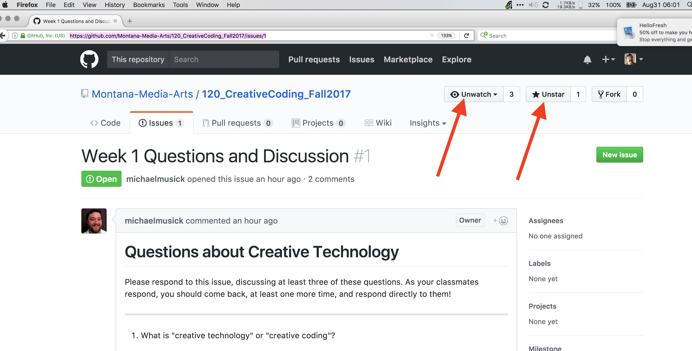

<!-- Consider moving to week 2. Instead, replace with Moodle forum info. -->

# GitHub.com

We will discuss [GitHub.com](https://github.com) more next week. In the mean time, I would you like you to know that GitHub is a web service which is used for storing git repositories by developers. (Much of that statement is still likely jargon to you. That is ok. It will all come)

In order for the Instructors to know that you have successfully completed week 1, you are going to create a GitHub.com account and respond to an “issue” in the class repository.

<iframe class="embed-responsive-item" src="https://www.youtube.com/embed/2brgqqt4Olw" frameborder="0" allowfullscreen></iframe>

## Create a GitHub.com Account

First, visit [GitHub.com](https://github.com/) and create a new user account.

**NOTE:** Please choose a username that you are comfortable with being part of your publicly visible URL. For grading purposes, this should be a derivate of your name (make it easy on us please). Your username will be publicly available and used often for many things throughout this course (ie. All homework and projects) and your entire time on GitHub.

- Fix any problems the signup engine informs you about.

- On Step 2: Keep “Unlimited public repositories for free.” selected. Then select “Continue”.

- Finally, go to the mail account you used during account creation and verify your e-mail address.

- After your account is created, select the avatar in the upper-right hand corner. This should produce a dropdown menu. From there select the “Settings” option.

- From here feel free to fill in as much or little of the public profile information as you want. (Filling in your name and Profile Pic is encouraged)

## Follow and Star The Course Resource Repository

- Next, navigate to [https://github.com/Montana-Media-Arts/120_CreativeCoding](https://github.com/Montana-Media-Arts/120_CreativeCoding). This is the course resource repo. This site is also linked to from the "git" tab above in the nav-bar.
- In the upper right-hand corner, you should select both "watching" and "star".
    - This will allow GitHub to e-mail you about notifications and issues in the course repo.
    - **Part of your grade for this course is based on _participation_. This is how you participate.**
        - When you have problems, post them here.
        - If you get an email about a new issue, try to help the person out.
        - Your participation grade will be based on how active you were on the GitHub issues forum, as well as comments to your classmates to their weekly homework assignments.

## Create a new “Issue”

Go to the [course repo](https://github.com/Montana-Media-Arts/creative-coding-1)

TODO: Add a comment to the [“HW 1 Issue Response”](https://github.com/Montana-Media-Arts/120_CreativeCoding/issues/71).

You are to;

1. Respond to _at least_ two of the questions from Issue #1.
2. Respond to your fellow classmates _at least_ twice.

NOTE: You should not repeat a comment that has already been added by anyone from your class or the other class. However, if you would like to further a comment already there, “@mention” the classmate/user and continue their discussion.

As the semester goes on you will be expected to open issues here when you are having problems. You will also be graded on your involvement in the course issue board and your responses provided to fellow classmates throughout the semester.

<iframe class="embed-responsive-item" src="https://www.youtube.com/embed/NNBQ2Oe4orY" frameborder="0" allowfullscreen></iframe>

