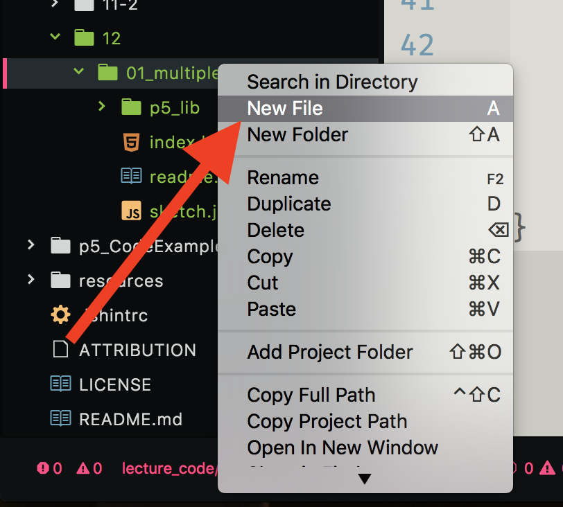
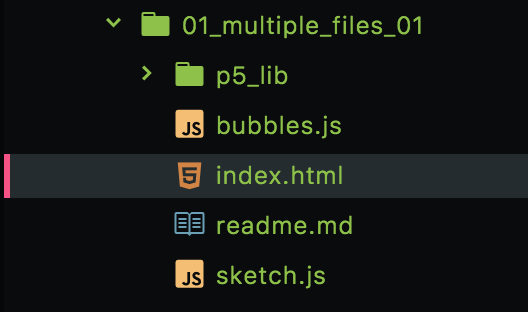

# Organization with Multiple JS Files

Before we learn more new coding techniques, first we need to spend a moment discussing code organization when utilizing OOP techniques. In the previous examples around OOP, you saw me placing my classes in the `sketch.js` file directly. _I will continue to do this for this course_. However, I am doing this to make it possible to keep using the interactive code tools built into the website.

You may, however, choose to split your classes into _separate_ files. By moving your classes into separate files, it becomes easier to organize your code, and to see what is occurring.

If you choose to organize your code into separate files, there are a number of steps you need to keep in mind.

## Class File Naming Conventions

Typically, it is considered _good practice_ to place classes into their _own_ file. This files name should mirror the class it contains.

As an example, let's examine this with the [Shiffman "bubbles" example]({{site.baseurl}}/modules/week-11/objects-arrays/#shiffman-on-arrays-of-object).

Originally, the code looked like;


// From Daniel Shiffman
// Coding Train - https://github.com/CodingTrain/Rainbow-Code/tree/master/Tutorials/P5JS/p5.js/07/7.3_p5js_Arrays_of_Objects
//

let bubbles = [];

function setup() {
    createCanvas(windowWidth, 400);
    let b = new Bubble(width/2, height/2, 10);
    bubbles.push(b);
}

function mouseDragged() {
    let r = random(10, 50);
    let b = new Bubble(mouseX, mouseY, r);
    bubbles.push(b);
}

function draw() {
    background(0);
    for (let i = 0; i < bubbles.length; i++) {
        bubbles[i].move();
        bubbles[i].show();
    }
}

class Bubble {
    constructor(x, y, r) {
        this.x = x;
        this.y = y;
        this.r = r;
    }

    move() {
        this.x = this.x + random(-5, 5);
        this.y = this.y + random(-5, 5);
    }

    show() {
        stroke(255);
        strokeWeight(4);
        noFill();
        ellipse(this.x, this.y, this.r * 2);
    }
}


To organize this code a bit more, we might move the class into its own file. If we did this, we should then name that file something like `bubbles.js`.

> Remember to include the JavaScript extension at the end of the file since it is a JavaScript file. (.js)

If you are working in Atom, you can create a new file by right-clicking or cntrl/alt-clicking in the folder where you want the file, then selecting "New File".

You can then name it accordingly. In our case, we will create a new file called `bubbles.js`. We are naming it that, because we will cut and paste the `Bubble` class into this file.

After creating the blank file, you can then select it and write your class in this new file. For our example, I will simply cut and paste the class from the `sketch.js` file into the `bubbles.js` file.

## Tell the Browser to Load the File

In addition to creating the file, you also need to tell the browser to load and reference the file. We will do this in the `index.html` file.

You may or may not remember at this point what the `index.html` file does. As we talked about it [quite some time ago]({{site.baseurl}}/modules/week-3/discussionOnIndex/).

As a refresher, browsers display HTML files. These files typically contain the text that is displayed when a web page loads, along with information for other resources to use for the page. Common resources would be metadata describing the page, CSS that makes the page look "_pretty_", and JavaScript files. If we look at the default `index.html` file for a basic p5 sketch, we notice that it is what references the `sketch.js` and main p5 library file. (Look at lines 5 and 8).


<!DOCTYPE html>
<html>

    <head>
        
        <!--  -->
        <!--  -->
        
        
    </head>

    <body>
    </body>

</html>


So, if we have _another_ JavaScript file, we also need to tell the browser to load it in the `index.html` file.

The easiest way to do this is to copy line 8, and replace `sketch.js` with the new file's name, in our case `bubbles.js`.

The directory structure, with this additional file, should now look like;

The contents of the files should look like the following;

- Note: Please notice the addition of the `bubbles.js` script line within the `index.html`. This is how the extra JavaScript document gets loaded.
- Please also notice how the `class Bubble {}` has been moved its own file and removed from the `sketch.js` file.

index.html


<!DOCTYPE html>
<html>

    <head>
        
        <!--  -->
        <!--  -->
        
        
        
    </head>

    <body>
    </body>

</html>


bubbles.js


class Bubble {
    constructor(x, y, r) {
        this.x = x;
        this.y = y;
        this.r = r;
    }

    move() {
        this.x = this.x + random(-5, 5);
        this.y = this.y + random(-5, 5);
    }

    show() {
        stroke(255);
        strokeWeight(4);
        noFill();
        ellipse(this.x, this.y, this.r * 2);
    }
}


sketch.js


let bubbles = [];

function setup() {
    createCanvas(windowWidth, 400);
    let b = new Bubble(width/2, height/2, 10);
    bubbles.push(b);
}

function mouseDragged() {
    let r = random(10, 50);
    let b = new Bubble(mouseX, mouseY, r);
    bubbles.push(b);
}

function draw() {
    background(0);
    for (let i = 0; i < bubbles.length; i++) {
        bubbles[i].move();
        bubbles[i].show();
    }
}


Please also feel free to download and examine these files to see how they work together.

- [**[Code Download]**](https://github.com/Montana-Media-Arts/120_CreativeCoding_Fall2017/raw/master/lecture_code/12/01_multiple_files_01/01_multiple_files_01.zip)
- [**[View on GitHub]**](https://github.com/Montana-Media-Arts/120_CreativeCoding_Fall2017/raw/master/lecture_code/12/01_multiple_files_01/)
- [**[Live Example]**](https://montana-media-arts.github.io/120_CreativeCoding_Fall2017/lecture_code/12/01_multiple_files_01/)
