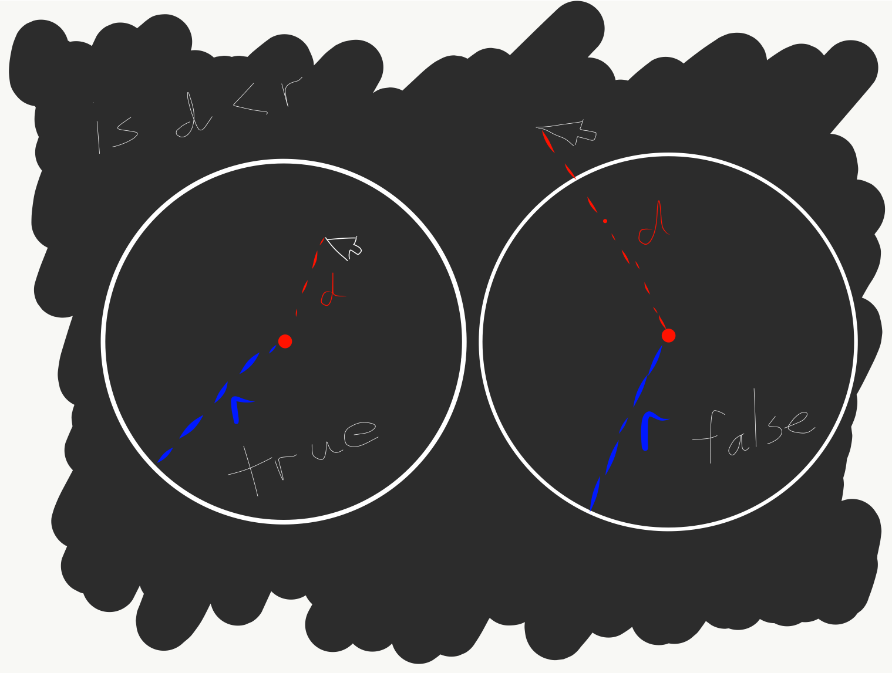
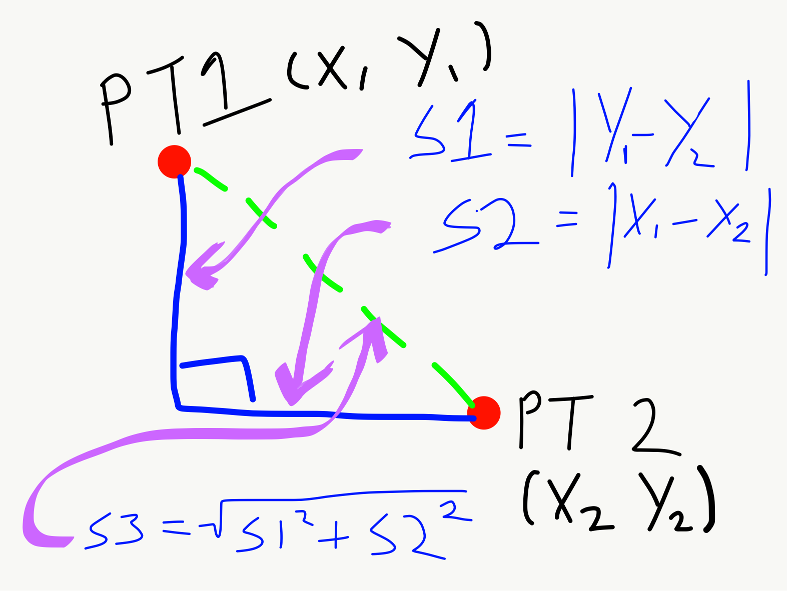
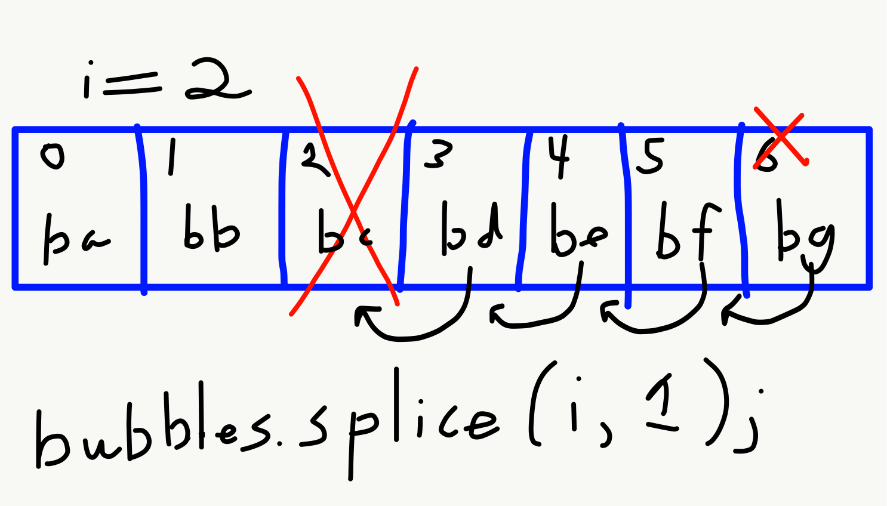

# Interacting with Objects

Since objects are self-contained data structures, it is rather simple to find out if other _things_ are interacting with an object. The first _thing_ that we are going to get our objects to interact with is the mouse.

As an example, let's create a simple game where you "destroy" bubbles that are created at random intervals.

## Step 1 - Create the Basics

Before we begin to consider the interaction of the mouse with the bubbles, let's do everything else.

> Please note: In order to facilitate the in-site code demos, the Ring Class will be placed within the `sketch.js` file. But you are welcome (even encouraged) to start creating separate files for your JS classes.

To start, we will create another iteration of the bubbles class example we have been examining. The initial code looks like;


<div id="jotted-demo-1" class="jotted-theme-stacked"></div>

<script>
    new Jotted(document.querySelector("#jotted-demo-1"), {
    files: [
        {
            type: "js",
            hide: false,
            url:"https://raw.githubusercontent.com/Montana-Media-Arts/120_CreativeCoding/master/lecture_code/12/02_object_mouse_01/sketch.js"
        },
        {
            type: "html",
            hide: true,
            url:"../../../p5_resources/index.html"
        }
    ],
    showBlank: false,
    showResult: true,
    plugins: [
        { name: 'ace', options: { "maxLines": 150 } },
        // { name: 'console', options: { autoClear: true } },
    ]
});
</script>

| [**[ Code Download ]**](https://github.com/Montana-Media-Arts/120_CreativeCoding/raw/master/lecture_code/12/02_object_mouse_01/02_object_mouse_01.zip) | [**[ View on GitHub ]**](https://github.com/Montana-Media-Arts/120_CreativeCoding/raw/master/lecture_code/12/02_object_mouse_01/) | [**[ Live Example ]**](https://montana-media-arts.github.io/120_CreativeCoding/lecture_code/12/02_object_mouse_01/) |

## Step 2 - Random Timer

Next, let's build a timer that will create bubbles. To do this, we will use the JavaScript function `setTimeout()`, which executes a function or statement after a specified amount of time.

- [w3schools | setTimeout() Method](https://www.w3schools.com/jsref/met_win_settimeout.asp)

```js
setTimeout( functionToEvaluate, timeInMillisecondsToWait );
```

In this case, we will create a new function called `bubbleTimer()`, which will create a new bubble, then call the `setTimeout()` function.

The `setTimeout()` function then calls the `bubbleTimer()` function with a new random amount of time to wait.

```js
function bubbleTimer() {
    let b = new Bubble(random(width), random(height), random(200));
    bubbles.push(b);
    // this has the effect of calling itself every x-milliseconds
    // notice how we do not include `()` after `bubbleTimer`.
    // Due to the way this function works, this is how you must call the other function.
    setTimeout(bubbleTimer, random(2000));
}
```

> Note in the above code how `bubbleTimer` does not include parentheses `()`. These are left off of functions when passed to `setTimeout()`.

To start this process, we simply need to call the `bubbleTimer()` function once from the p5 `setup()` function. This is possible, because the `bubbleTimer()` function will continue calling itself via `setTimeout()`.

Our updated code now looks like;

<div id="code-heading">sketch.js</div>


let bubbles = [];

function setup() {
    createCanvas(windowWidth, 600);
    let b = new Bubble(width/2, height/2, 10);
    bubbles.push(b);
    bubbleTimer();
}

function draw() {
    background(0);
    for (let i = 0; i < bubbles.length; i++) {
        bubbles[i].move();
        bubbles[i].show();
    }
}

function bubbleTimer() {
    let b = new Bubble(random(width), random(height), random(200));
    bubbles.push(b);
    // this has the effect of calling itself every x-milliseconds
    setTimeout(bubbleTimer, random(2000));
}


///////////////////////////////////////////////////
// Bubble Class
///////////////////////////////////////////////////
class Bubble {
    constructor(x, y, r) {
        this.x = x;
        this.y = y;
        this.r = r;
    }

    move() {
        this.x = this.x + random(-5, 5);
        this.y = this.y + random(-5, 5);
    }

    show() {
        stroke(255);
        strokeWeight(4);
        noFill();
        ellipse(this.x, this.y, this.r * 2);
    }
}



## Step 3 - Mouse Interaction

The last, and most crucial step of this exercise is to get each bubble object to;

1. Recognize whether the mouse is over it?
2. Recognize if the mouse clicks while it is over it?
3. Destroy itself if clicked.

To solve the first problem, we need to determine how to tell if the mouse is over, or worded another way, within the bubble. To do this, let's first go over what we know.

- We know the position of the mouse via the `mouseX` and `mouseY` variables.
- We know the position of the bubbles via
    - `this.x` and `this.y`, if we are inside the class or
    - `bubbles[i].x` and `bubbles[i].y`, if we are in the main p5 functions.
- We know the size of the bubbles via
    - `this.r` or
    - `bubbles[i].r`

In order to keep this OOP approach going, let's keep as much as possible of the bubble's functionality encapsulated within the bubble class.

#### Is the Mouse in the Bubble?

Based on the mouse position and the center of the bubble's position, we can figure out the distance between the two points. Then we simply need to test if the distance between the center of the bubble and the mouse if less than the radius of the bubble. If the distance (`d`) of the mouse to the bubble's center is less than the bubbles's radius (`this.r`), the mouse is within the bubble.



To determine the distance between the mouse and the center of the bubble, we could use the pythagorean theorem (a<sup>2</sup> + b<sup>2</sup> = c<sup>2</sup>), as we can create a right-angle triangle between any two points, then simply need to solve for the hypotenuse. To determine the length of the two sides, we can take the absolute value of the difference of the two `x` values and two `y` values. ( side1 = \|x<sub>1</sub> - x<sub>2</sub>\| & side2 = \|y<sub>1</sub> - y<sub>2</sub>\| )



However, in p5 the distance function can solve this problem for us without needing to program the algorithm ourselves.

- [distance functions (`dist()`)](https://p5js.org/reference/#/p5/dist)

As you can see from the documentation, for 2-dimensional space, this function takes 4 input parameters, corresponding to (x<sub>1</sub>, y<sub>1</sub>) and (x<sub>2</sub>, y<sub>2</sub>).

Therefore, we can find the distance of the mouse to the center of an object with;

```js
let d = dist( this.x, this.y, mouseX, mouseY );
```

We simply then need to check whether this value is less than the bubble's radius (`this.r`), if it is then the mouse is within the bubble.

```js
if( d < this.r ) {
    // do something, mouse is in bubble
}
```

For the moment, let's encapsulate this functionality as a method inside the Bubble class. We will assume that this new method will only get called once, whenever a mouse button event occurs. Furthermore, let's make the method return either `true` if the mouse is _within_ the bubble and `false` if the mouse is not.

```js
// check if the mouse if within this bubble
mouseCheck() {
    // get the distance between the mouse and the center of the bubble
    let d = dist( this.x, this.y, mouseX, mouseY );
    // check if that distance is less than the bubble radius
    // if it is, then the mouse if within
    if( d < this.r ) {
        return true;
    } else {
        return false;
    }
}
```

#### Do Something When the Mouse is Pressed

The next sub-problem is to get every existing bubble to check whether _it_ is the one _being pressed_ when a mouse press event occurs. To do this, we somehow need to get every bubble object to check itself when a mouse-click event registers.

Since the p5, [`mousePressed()`](https://p5js.org/reference/#/p5/mousePressed) function is called whenever a mouse press event occurs, we can place code inside of it to make the bubbles check themselves.

```js
function mousePressed() {
    // when a mouse press event occurs
    // make the bubbles check themselves
    // to see if the mouse is within them.
}
```

#### Destroy the Object if the Mouse is Inside

The next step is to get this function to get each bubble object to check itself in relation to the mouse. To do this, we will use a _for loop_. We will also call the new bubble `mouseCheck()` method we defined above.

```js
function mousePressed() {
    // make the bubbles check themselves
    // to see if the mouse is within them.
    for( let i=0; i < bubbles.length; i++ ){
        let destroyMe = bubbles[i].mouseCheck();
        // if destroyMe is true, then delete the bubble here...
    }
}
```

Finally, if `destroyMe` is true, then we need to remove the bubble object from the bubble array. To do this, we can use the []`Array.splice()` method we talked about in week 9]({{site.baseurl}}/modules/week-9/manipulating-arrays/#splice), to remove the bubble. Once it is removed from the array, it will no longer be drawn, or asked to check itself against the mouse position. This has the effect of removing the bubble from the sketch.

```js
if( destroyMe ) {
    bubbles.splice( i, 1 );
}
```

We have run into one problem though. If we remove the bubble at `i`, the entire array will get shifted down.

As a demonstration, in the below example, there is an array, with 6 elements. `[ba, bb, bc, bd, be, bf, bg]`. If, we splice the element at index 2 (`bc`), it will be removed from the array. Every element then gets moved down, so that the array now looks like. `[ba, bb, bd, be, bf, bg]`. If we subsequently then also increase the value of `i` to `3`, the element (`bd`) that was just moved in to index `2` will be skipped in the check.



There are two ways of solving this problem. The first is to _not_ increment the index value when a bubble us spliced out of an array. The other option, is to instead work backwards through the array. Rather than starting at `index=0`, start the _for loop_ with `index=array.length-1`. This way, if an element is spliced out of the array, every element behind it has already been checked, and since the _for loop_ is working backwards, it does not effect the element's with lower index values.

So again, a quick fix for this problem is to work backwards in the array, through the for loop.

> Note: In order to work backwards, we change the conditional check to be `i>=0`, and we decrement `i` 1 every loop instead of incrementing.

```js
for( let i=bubbles.length-1; i>=0; i-- ) {
    let destroyMe = bubbles[i].mouseCheck();
    if( destroyMe ) {
        bubbles.splice( i, 1 );
    }
}
```

Altogether, our code now looks like;


<div id="jotted-demo-3" class="jotted-theme-stacked"></div>

<script>
    new Jotted(document.querySelector("#jotted-demo-3"), {
    files: [
        {
            type: "js",
            hide: false,
            url:"https://raw.githubusercontent.com/Montana-Media-Arts/120_CreativeCoding/master/lecture_code/12/02_object_mouse_03/sketch.js"
        },
        {
            type: "html",
            hide: true,
            url:"../../../p5_resources/index.html"
        }
    ],
    showBlank: false,
    showResult: true,
    plugins: [
        { name: 'ace', options: { "maxLines": 150 } },
        // { name: 'console', options: { autoClear: true } },
    ]
});
</script>

| [**[ Code Download ]**](https://github.com/Montana-Media-Arts/120_CreativeCoding/raw/master/lecture_code/12/02_object_mouse_03/02_object_mouse_03.zip) | [**[ View on GitHub ]**](https://github.com/Montana-Media-Arts/120_CreativeCoding/raw/master/lecture_code/12/02_object_mouse_03/) | [**[ Live Example ]**](https://montana-media-arts.github.io/120_CreativeCoding/lecture_code/12/02_object_mouse_03/) |
