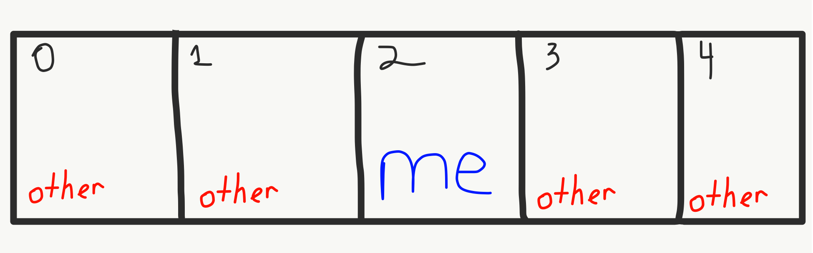
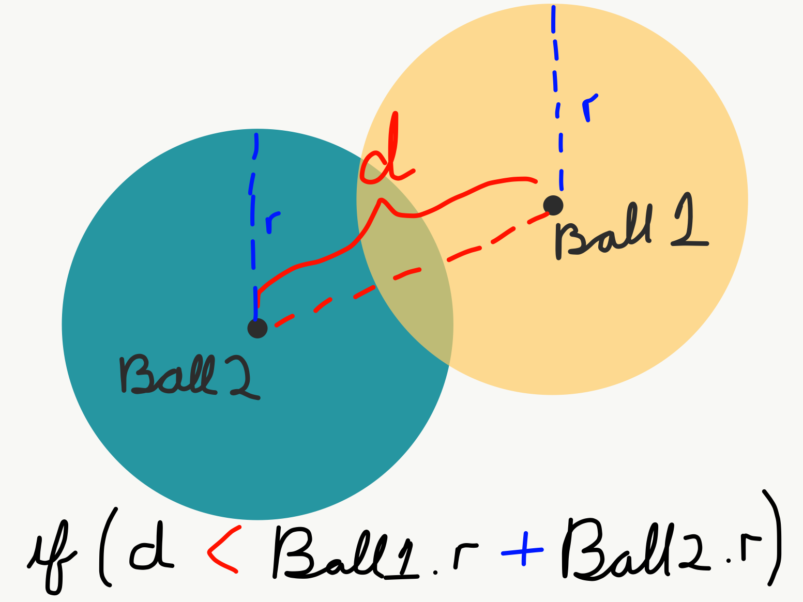

# Objects Interacting with Each Other

The next challenge to solve this week is;

- How do we make objects aware of each other?
- And how do we make objects interact with each other?

The basic technique if rather simple, to get an object to interact with, or rather have awareness about other objects in a sketch, that object needs to be given information about the _other objects_.

## Making it Happen

To work through how to do this, we are going to start with a slightly modified version of the bouncing ball code from the previous week. It has been modified to have an array of bouncing balls.

<div id="code-heading">sketch.js</div>


// create a variable for the ball object
let balls = [];
const numOfBalls = 20;

function setup() {
    createCanvas(windowWidth, windowHeight);

    // create a new ball object of class type "Ball"
    let init_x = 60;
    let init_y = 60;
    for ( let i = 0; i < numOfBalls; i++ ) {
        balls.push( new Ball( init_x, init_y ) );
        // move the starting position over
        // This is to ensure that the balls do not start
        // "on top" of each other
        init_x += 100;
        if( init_x > width ) {
            init_x = 60;
            init_y += 100;
        }
    }
}

function draw() {
    background( 'rgb(66, 57, 66)' );

    for (let i = 0; i < balls.length; i++) {
        // call the ball's methods
        balls[i].move();
        balls[i].edgeCheck();
        balls[i].display();
    }
}


//////////////////////////////////////////////////
//      BALL CLASS DEFINITION
//////////////////////////////////////////////////
class Ball {
    constructor(x, y, size) {
        this.color = 'red';
        this.size = random(20, 80);
        this.rad = this.size / 2;
        this.posX = x;
        this.posY = y;
        this.deltaX = random(-10, 10);
        this.deltaY = random(-10, 10);
    }

    display() {
        push();
        // remove the balls outer stroke
        noStroke();
        // set the balls fill color
        fill(this.color);
        // set the position of the ball
        translate(this.posX, this.posY);
        ellipse(0, 0, this.size);
        pop();
    }

    move() {
        this.posX += this.deltaX;
        this.posY += this.deltaY;
    }

    edgeCheck() {
        // check if the ball has hit a vertical wall (left or right walls)
        if (this.posX + this.rad >= width || this.posX - this.rad <= 0) {
            this.deltaX *= -1;
            this.color = 'rgb(110, 240, 158)';
        }
        // check if the ball has hit a horizontal wall (top or bottom walls)
        if (this.posY + this.rad >= height || this.posY - this.rad <= 0) {
            this.deltaY *= -1;
            this.color = 'rgb(110, 240, 158)';
        }
    }
}




<div id="jotted-demo-1" class="jotted-theme-stacked" style="height:600px;"></div>
</div>
<script>
    new Jotted(document.querySelector("#jotted-demo-1"), {
    files: [
        {
            type: "js",
            url:"https://raw.githubusercontent.com/Montana-Media-Arts/120_CreativeCoding/master/lecture_code/12/03_objects_w_objects_01/sketch.js"
        },
        {
            type: "html",
            url:"../../../p5_resources/index.html"
    }],
    // plugins: [ "codemirror", "console" ]
    plugins: [ "codemirror" ]
});
</script>

| [**[ Code Download ]**](https://github.com/Montana-Media-Arts/120_CreativeCoding/raw/master/lecture_code/12/03_objects_w_objects_01/03_objects_w_objects_01.zip) | [**[ View on GitHub ]**](https://github.com/Montana-Media-Arts/120_CreativeCoding/raw/master/lecture_code/12/03_objects_w_objects_01/) | [**[ Live Example ]**](https://montana-media-arts.github.io/120_CreativeCoding/lecture_code/12/03_objects_w_objects_01/) |


## Check Other Objects

In this example we are building, let's say that _"if, a ball touches another ball, then, it should go in the opposite direction."_ Since we are going to stay with an OOP approach, let's encapsulate this functionality in the ball class. We will create a new method called, `ballCheck()`, that will check all of the other balls, to determine if `this.` will/is touching another ball.

In order to check a ball's relationship of itself to the other balls, it needs information about the other balls. This means we need to pass our new method the information about the other balls. One way of solving this, and the one we explore right now, is to pass in the entire ball array. To do this, we will call the new `ballCheck()` method every `draw()` loop, passing in the reference to the array.

```js
function draw() {
    background( 'rgb(66, 57, 66)' );

    for (let i = 0; i < balls.length; i++) {
        // call the ball's methods
        balls[i].ballCheck(balls, i);
        balls[i].move();
        balls[i].edgeCheck();
        balls[i].display();
    }
}
```

This will allow the ball to check itself against every other ball. HOWEVER, we have one more problem, this ball also needs to know which ball _**it**_ is, so that it does not try and check itself against itself.



To solve this, we will simply also pass in the index of the current ball.

```js
ball.ballCheck( balls, i );
```

In the `ballCheck()` method that we are writing in the class, we will take these two pieces of data, and use them to check whether the ball is touching another ball. To do this, the code needs to check each of the _other_ balls that exist, skipping itself.

```js
ballCheck( otherBalls, myId ) {
    // for loop touches each of the balls in the array
    for (let n = 0; n < otherBalls.length; n++) {
        // if n != myId, then check for touching
        // otherwise, its ME and we need to skip
        if( n != myId ) {
            // check for touching here!
        }
    }
}
```

> Note how the input parameter names are different in the line of code above that foes in the `draw()` loop, from the class file.

To find out if the balls are touching, we need to employ a similar method as was used to check if the mouse was touching a bubble. If the distance between the center points for each ball is _less than_ the combined radius of both balls.



```js
ballCheck( otherBalls, myId ) {
    // for loop touches each of the balls in the array
    for (let n = 0; n < otherBalls.length; n++) {
        // if n != myId, then check for touching
        // otherwise, its ME and we need to skip
        if( n != myId ) {
            let d = dist( this.posX, this.posY, otherBalls[n].posX, otherBalls[n].posY );
            let combinedR = this.rad + otherBalls[n].rad;

            if( d <= combinedR ) {
                this.deltaX *= -1;
                this.deltaY *= -1;
            }
        }
    }
}
```

> I am also adding in some color changes that display if the ball has most recently; 1.) Been created; 2.) Hit a wall; 3.) Hit another ball.

Altogether the code now looks like;

<div id="code-heading">sketch.js</div>


// Bouncing Balls
// Week 12


// create a variable for the ball object
let balls = [];
const numOfBalls = 20;

function setup() {
    createCanvas(windowWidth, windowHeight);

    // create a new ball object of class type "Ball"
    let init_x = 60;
    let init_y = 60;
    for (let i = 0; i < numOfBalls; i++) {
        balls.push(new Ball(init_x, init_y));
        // move the starting position over
        // This is to ensure that the balls do not start
        // "on top" of each other
        init_x += 100;
        if (init_x > width) {
            init_x = 60;
            init_y += 100;
        }
    }
}

function draw() {
    background('rgb(66, 57, 66)');

    for (let i = 0; i < balls.length; i++) {
        // call the ball's methods
        balls[i].ballCheck(balls, i);
        balls[i].edgeCheck();
        balls[i].move();
        balls[i].display();
    }
}


//////////////////////////////////////////////////
//      BALL CLASS DEFINITION
//////////////////////////////////////////////////
class Ball {
    constructor(x, y, size) {
        this.color = 'red';
        this.size = random(20, 80);
        this.rad = this.size / 2;
        this.posX = x;
        this.posY = y;
        this.deltaX = random(-5, 5);
        this.deltaY = random(-5, 5);
    }

    display() {
        push();
        // remove the balls outer stroke
        noStroke();
        // set the balls fill color
        fill(this.color);
        // set the position of the ball
        translate(this.posX, this.posY);
        ellipse(0, 0, this.size);
        pop();
    }

    move() {
        this.posX += this.deltaX;
        this.posY += this.deltaY;
    }

    edgeCheck() {
        // check if the ball has hit a vertical wall (left or right walls)
        if (this.posX + this.rad >= width || this.posX - this.rad <= 0) {
            this.deltaX *= -1;
            this.color = 'rgb(110, 240, 158)';
        }
        // check if the ball has hit a horizontal wall (top or bottom walls)
        if (this.posY + this.rad >= height || this.posY - this.rad <= 0) {
            this.deltaY *= -1;
            this.color = 'rgb(110, 240, 158)';
        }
    }


    ballCheck(otherBalls, myId) {
        // for loop touches each of the balls in the array
        for (let n = 0; n < otherBalls.length; n++) {
            // if n != myId, then check for touching
            // otherwise, its ME and we need to skip
            if (n != myId) {
                let d = dist(this.posX, this.posY, otherBalls[n].posX, otherBalls[n].posY);
                let combinedR = this.rad + otherBalls[n].rad;

                if (d <= combinedR) {
                    this.deltaX *= -1;
                    this.deltaY *= -1;

                    // flip the color
                    if( this.color == 'rgb(237, 36, 232)') {
                        this.color = 'rgb(16, 224, 231)';
                    } else {
                        this.color = 'rgb(237, 36, 232)';
                    }
                }
            }
        }
    }
}



<div id="jotted-demo-3" class="jotted-theme-stacked" style="height:600px;"></div>
</div>
<script>
    new Jotted(document.querySelector("#jotted-demo-3"), {
    files: [
        {
            type: "js",
            url:"https://raw.githubusercontent.com/Montana-Media-Arts/120_CreativeCoding/master/lecture_code/12/03_objects_w_objects_02/sketch.js"
        },
        {
            type: "html",
            url:"../../../p5_resources/index.html"
    }],
    // plugins: [ "codemirror", "console" ]
    plugins: [ "codemirror" ]
});
</script>

| [**[ Code Download ]**](https://github.com/Montana-Media-Arts/120_CreativeCoding/raw/master/lecture_code/12/03_objects_w_objects_02/03_objects_w_objects_02.zip) | [**[ View on GitHub ]**](https://github.com/Montana-Media-Arts/120_CreativeCoding/raw/master/lecture_code/12/03_objects_w_objects_02/) | [**[ Live Example ]**](https://montana-media-arts.github.io/120_CreativeCoding/lecture_code/12/03_objects_w_objects_02/) |

> Can you figure out why the balls sometimes get "stuck" on each other?
