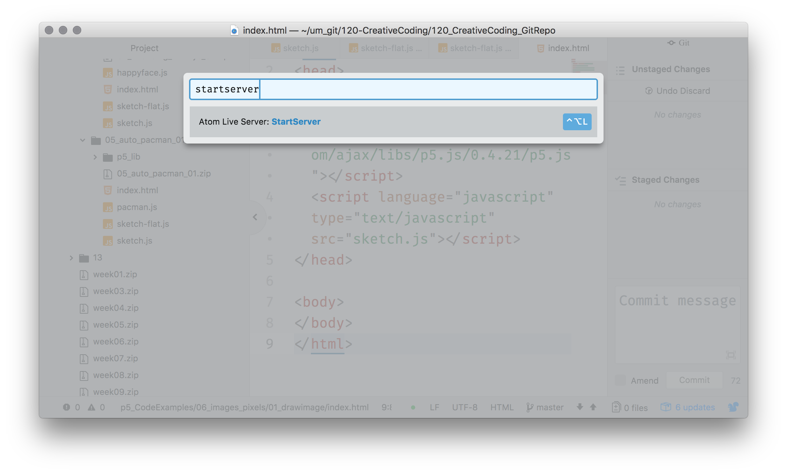
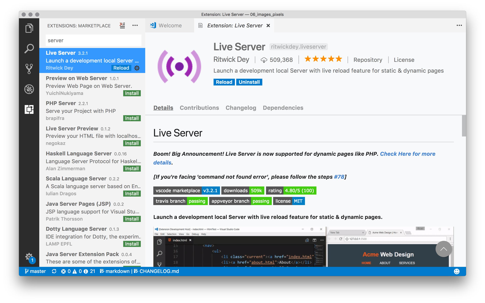
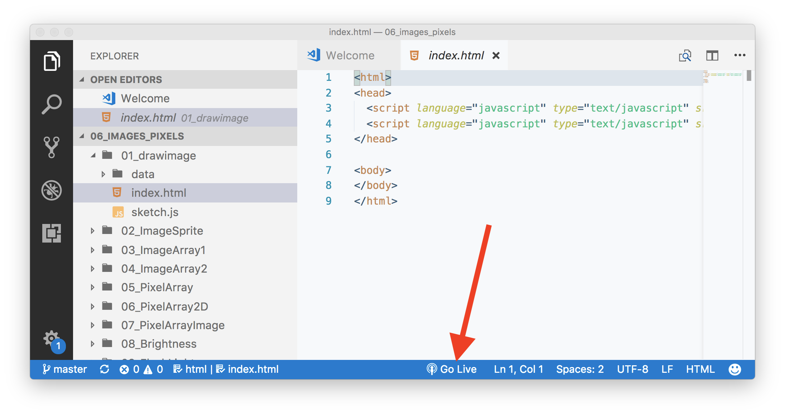

# Local Servers

When a user visits a website on their _local computer_, their browser requests additional data and files based on the html document from the server the site is hosted on. This server then _"serves"_ these files back to the requesting browser on the local computer. When you upload your files to GitHub, the GitHub Pages server, serves your files to requesting computers.

Up to this point in the semester, you have not needed a true server in order to work on your p5.js projects. Instead, because you have only been requesting a few static text files (i.e. `index.html`, `script.js`, `classFile.js`). However, this week, we want to start including additional content and media files, such as images, movies, and sound files. These will require you to run a local server in order to successfully "serve" these files to your browser during development. When you are done developing and push your files to GitHub, the GitHub pages server will take care of serving the sites to requesting computers.

## So What Will Happen if You Do Not Run a Server

You could do all of your work this week without running a local server during development. However, media files you try to use may not load, therefore, you will not know if your site is working. Alternatively, you could simply load all changes to GitHub, wait for GitHub to update its server, and then check the work, but this will slow down your development process significantly.

Soooo....., you just need to use a local server. Luckily, there are numerous options for running a local server. I will present two options to you. The first, is the easiest, and if it works for you, I suggest you utilize it until you find it failing. The second is not hard, but will require you to load extra software and interact with that software through the a command line program like Terminal or Git-Bash.

# Use a Text Editor Server Package

#### Atom

Atom has a package that runs a live server from Atom. To install this package;

1. Open up "preferences"
2. Click the "Install Tab"
3. Search for "atom-live-server"
4. Select this package, and then click install.

To start the Atom Server;

1. Open Command Panel (`shift+Cmd+p` on Mac)
2. Type `startserver`
3. Select "Atom Live Server: StartServer"

This will launch the server automatically in your default browser. In Atom, the server launches at the top level of your opened project. So, you may have to navigate to the `index.html` you want to view.

#### Visual Studio Code

Visual Studio Code has a "Live Server" extension. This will allow you to serve local sites directly from VSCode. To do this;

1. Search for "Live Server".
2. Select the appropriate extension titled "Live Server".
3. Click "Install".
4. After it has finished installing, you should click the "reload" button. This will reload VSCode so that the extension can be used.

To use the server extension, do the following;

1. Select the associated `index.html` file you want to serve.
2. In the bottom info bar for VSCode, select the "Go Live" button.

3. This should automatically start the server and launch it in your default web browser.

## Stop Your Servers

Regardless of whether you use the Atom of VS Code Server, you should remember to stop it when you are finished with development. In Atom, simply open the Command Palate and type `stopserver`. In VS Code, you should click the "stop button" in the info bar, which is in the same place you pressed the "start server" button.

# Use A Node Package Based Server

Another method for using a server is from the command line. To do this, you will need to install Node.js, and JavaScript engine for use outside of browsers. You can then also install a package called `http-server` which allows you to launch a server from the command line.

Instructions for this method are maintained from the p5.js wiki, and as such, you should follow these instructions if you choose to go this route.

- [p5.js local server info](https://github.com/processing/p5.js/wiki/Local-server#node-http-server-2nd-option)

# Shiffman on Local Servers

<iframe class="embed-responsive-item" src="https://www.youtube.com/embed/UCHzlUiDD10" frameborder="0" allowfullscreen></iframe>

