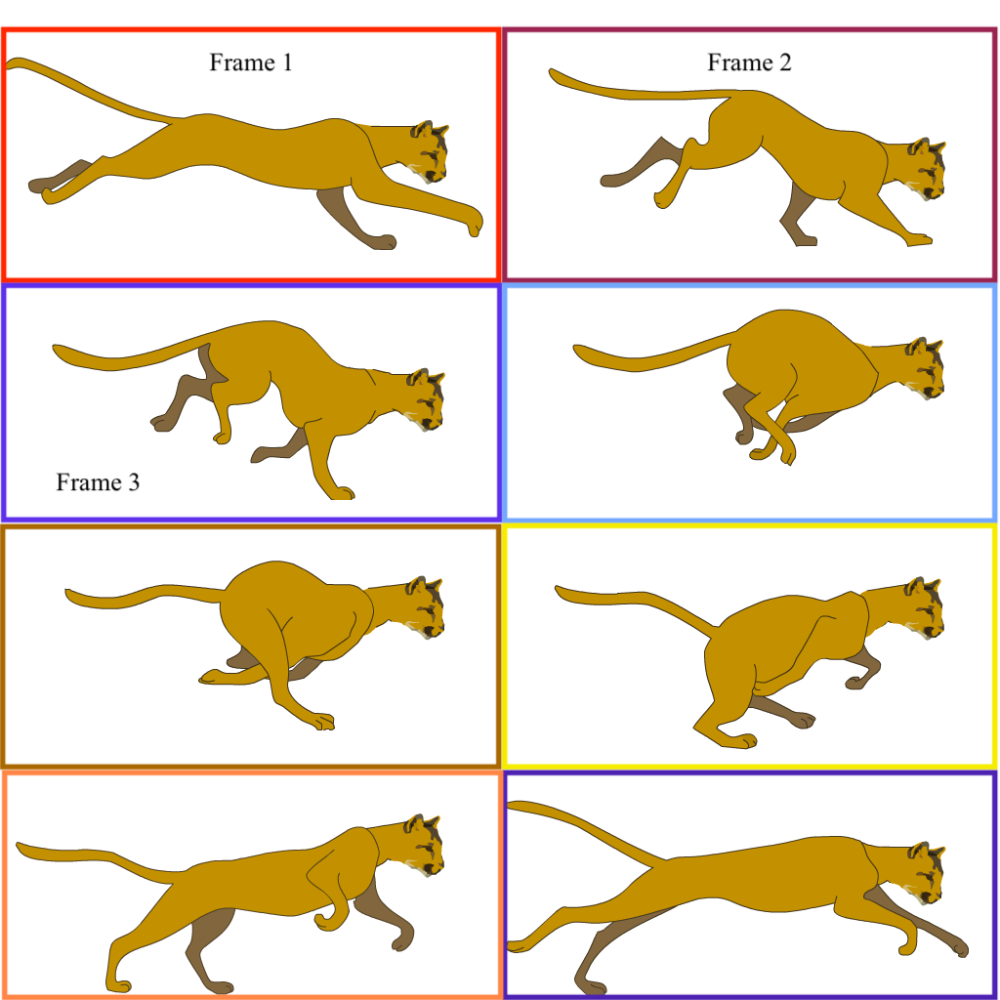

# Sprites

With images, we can now also start to develop more complex animation by leveraging sprite sheets.

A sprite sheet is a collection of rectangular images of a single subject or character, all collected in sequence on a single sheet. This allows an application to load a single image, grabbing sub-rectangles from this larger image to display. By iterating these sub-rectangles quickly enough, we can achieve a sense of animation.

As an example, the following image is a sprite sheet of a large cat running.


By moving an imaginary rectangle, the size of each cat frame, around the rectangle, we can grab sequential frames of the cat animation.




## Traversing a Sprite Sheet

The key to accomplishing this technique, is to figure out how to traverse the sprite sheet. First, you need to know the size of the rectangle that each sub-image will come from. Then, you need to know the top-left corner position for each image.

For the cat sprite sheet in question, each sub-rectangle is 512px wide, and 256px heigh.

Depending on the size of the sheet and the layout of sub-frames, you may want to mathematically increment through sub-frames, or simply hard code an array containing the coordinates to use for each frame.

For the cat sprite sheet, I created a class with this information hard coded as follows;

```js
// sub-rectangle size
this.size = {
    w: 512,
    h: 256
};
// The number of the sprite image we are on
// used to traverse the sub-rectangle position array
this.sprite_num = 0;
// sub-rectangle position array
// The top-left corner of each sub-rectangle
this.subRect = [
    [0, 0],
    [512, 0],
    [0, 256],
    [512, 256],
    [0, 512],
    [512, 512],
    [0, 768],
    [512, 768],
];
```

## Using sub-frames with `image()`

In order to display the cat sub-frames, the location of the sub-frame, along with its size is passed to the `image()` function, which is wrapped in the classes `display()` method.

```js
display() {
    push();

    translate(this.pos.x, this.pos.y);

    if (this.orientation === 0) {
        scale(1,1);
    } else if (this.orientation === 1) {
        scale(-1,1);
    }

    image(
        // reference to image in memory
        this.image,
        // placement of image on canvas
        // (handled by translate())
        0, 0,
        // The display size of the image
        this.size.w, this.size.h,
        // The top left corner of the sub rectangle
        this.subRect[this.sprite_num][0], this.subRect[this.sprite_num][1],
        // the size of the subrectangle
        this.size.w, this.size.h
    );

    pop();
}
```

## Speed

The speed of the animation is dependent on how quickly you change through the sub-frames. For the cat, I created a method `animate()` that deals with updating the sprite sub-rectangle pointer number. This method also handles the animation speed with a simple modulo function inside of a conditional statement. (For this example, `this.speed = 4`, which means the sub-frame updates every fourth frame.)

```js
animate() {
    // update the sprite num
    // This adjusts the subrectangle positions
    if (frameCount % this.speed === 0) {
        this.sprite_num++;
        this.sprite_num %= 8;
    }
}
```

> Note: In order to use an image in a class, you still need to load the image from the `preload()` function. However, you should then pass a reference of the image via variable to the constructor method. 

# Example

Altogether, the sprite animation looks like;


<div id="jotted-demo-1" class="jotted-theme-stacked" frameheight="600px" ></div>

<script>
    new Jotted(document.querySelector("#jotted-demo-1"), {
    files: [
        {
            type: "js",
            hide: false,
            url:"https://raw.githubusercontent.com/Montana-Media-Arts/120_CreativeCoding/master/lecture_code/13/03_sprites_01/sketch-site.js"
        },
        {
            type: "html",
            hide: true,
            url:"../../../p5_resources/index.html"
        }
    ],
    showBlank: false,
    showResult: true,
    plugins: [
        { name: 'ace', options: { "maxLines": 150 } },
        // { name: 'console', options: { autoClear: true } },
    ]
});
</script>

| [**[ Code Download ]**](https://github.com/Montana-Media-Arts/120_CreativeCoding/raw/master/lecture_code/13/03_sprites_01/03_sprites_01.zip) | [**[ View on GitHub ]**](https://github.com/Montana-Media-Arts/120_CreativeCoding/raw/master/lecture_code/13/03_sprites_01/) | [**[ Live Example ]**](https://montana-media-arts.github.io/120_CreativeCoding/lecture_code/13/03_sprites_01/) |
