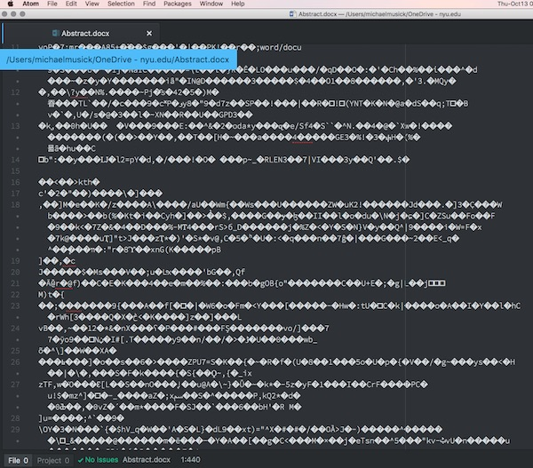

# Text Documents

## What is a text document?

Hopefully, you can answer this question to some degree. However, to ensure we are on the same page we will define a text document as one containing only standard characters, such as the [ASCII character set](https://en.wikipedia.org/wiki/ASCII), which is the most common format for the English-language.


## What types of files are text documents?

The simplest and most common text document is a "text file", which will bare the `.txt` extension. This generic document type contains only ASCII characters. These are the common characters you use for writing and reading (A-Z, a-z, 0-9), and special characters (such as #, %, !, ., etc.). These files also include carriage returns (new line), tabs, spaces, and an end-of-file (eof) designation that lets a program know where the file finishes. This last group of characters are there, but are not displayed in basic text editors.

> What other files do you work with on a daily basis that are text documents?

You might be tempted to say Microsoft Word Document files (`.doc` or `.docx`). However, these are actually containers of many smaller files that are ZIP-compressed together into the `.docx` file. This complex file that Microsoft uses allows them to store images, objects, text, and complex formatting instructions all in a single file, which can then be easily saved, shared, or sent between users of the Microsoft productivity applications. The downside to this format though is that you cannot open this file in a basic text editor to change it. The below image shows a Microsoft Word Document (`.docx`) opened in the Atom text editor. As you can see, this file does not present itself in a way that offers you much understanding of its contents.



So what are other types of plain text based file types?
Well, as you might guess, most computer languages are saved as plain text or ASCII files. However, they often have different extensions. These extensions provide information to the computer, as well as to the user as to ‘how’ the file may be used or *compiled*. In this class, we will be using the following text file types;


- Markdown; `.md`
- JavaScript; `.js`
- HyperText Markup Language (HTML); `.html`


### { TODO: }

- Create a new file via the command prompt called `test1.txt`. You can place this file anywhere you want on your computer for the moment. (macOS: `touch test1.txt`  windows: `new-item test1.txt`)
- Open this file in the default text editor for your operating system (OS). (For macOS this is textEdit.app and for Window this is Notepad.exe)
- Add the following to this document;

```text
Name: {Your Name}
Date: {Todays Date}

This is my first text document for one of Dr. Musick's Media Arts courses. 
```

- Save the document somewhere easy to find.
