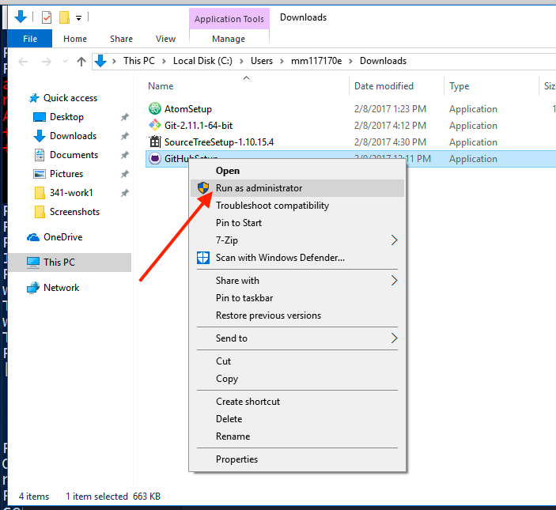
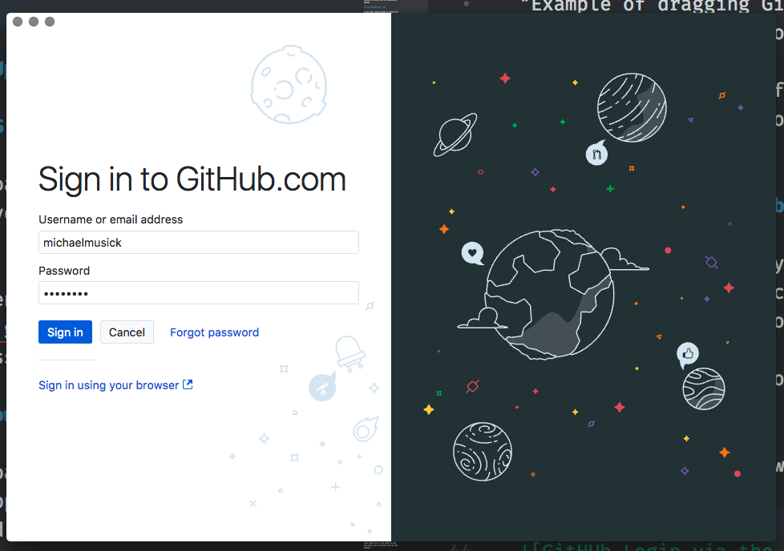

# Git GUI Applications - GitHub Desktop

Working with Git via the command line offers the user the full power of Git. However, I find it easier to start with GUI-based git app. This application will serve as a front-end for Git. You are free to use a command line based program if you want or the following application.

The two applications I would suggest are;

- [GitHub Desktop](https://desktop.github.com) (recommended)
- [SourceTree](https://www.sourcetreeapp.com)

Both of these work on macOS and Windows.

I suggest GitHub Desktop, as this is a more streamlined, and simpler application to use. It also has nice integration to GitHub.com and the Atom text editor, as all three products are from GitHub.

NOTE: For windows users, there have been reports that Source Tree does not work on earlier versions of the Windows OS. If you want to use the software taught by this course, you may need to update your OS to a modern version, such as Windows 10 ( NOTE: That will be true throughout the course, for most situations I would suggest you work on a machine with either a current version of macOS or Window's OS ).

I will show you how to use GitHub Desktop, but the process of using SourceTree is virtually the same. To see explicit directions for SourceTree, please navigate to the next section (_Git GUI Applications (Sourcetree)_).

**{ TODO: }**

Download the GitHub Desktop application from their site.
[https://desktop.github.com](https://desktop.github.com)

## on macOS

After downloading the application, simply drag it to your `/Applications` directory for macOS.

When you open the app for the first time, you will be guided through an additional setup process.

## on Windows

After downloading the application, right-click (or control + click) the application in the Downloads folder from the file explorer and select "run as administrator".

This will cause the installer to run and do its thing.

The install process will take quite a few minutes on most Windows machines.

## Setting up GitHub Desktop

#### 1. Login to GitHub

The following assumes you successfully created a GitHub.com account last week. If you have not, please do that first.

First, click "Sign into GitHub.com".

Then, login to GitHub with your username & password.

#### 2. Configure Git

On the "Configure Git" screen, enter your name and email, if they are not already there.

Then click "continue" again.

Finally click finish on the last screen.

#### 3. Add your Repo

To add a local repository, navigate to the "File" menu, and select "Add Local Repository...".

Click "choose", and then navigate to the top level of your git repo we created earlier.

You can then click "Open" and when you return to the "add repo" window, click "Add Repository".

## Making Commits with GitHub Desktop app

Since GitHub Desktop is nearly identical between mac and PC, I will only be including one set of instructions for this section. If you get confused, please email your instructor.

Let's now learn how to make commits of our file changes with GitHub Desktop. The first thing we should do is open our repo in Atom. Assuming Atom was able to perform a normal, full-permission install, you should be able to select "Open in Atom" from the "Repository" menu in GitHub.

Make a change to any file you want within your repo. Just make sure you save it from Atom.

Then move back to the GitHub Desktop App. You should now see that the left tab labeled "Changes" now has a blue dot next to it. This indicates that there are changes we need to commit. Below this, you should see the name of the file that you changed. If you select that file, you will see a summary of its changes to the right.

Make sure this button is select by clicking it. You will see near the bottom left of the window a "Commit" section.  In here you can select/un-select files to group in a single commit. This is the equivalent of "adding" files in the terminal.

When you select a file, it will show the differences since the last commit of that file on the right side of the window.

Where it says "Summary" is where you enter commit messages. You must enter a commit message with every commit, or the program will prevent you from saving your commit.

Below the commit message box is the button to actually create the commit.

#### { TODO: }

- Practice changing files, saving them, and making commits in GitHub Desktop Application.
- Click on both the "Uncommitted Changes" and the "History" buttons to explore the different types of information shown.
- In the History view, click on different commits to see what files changed and how.
