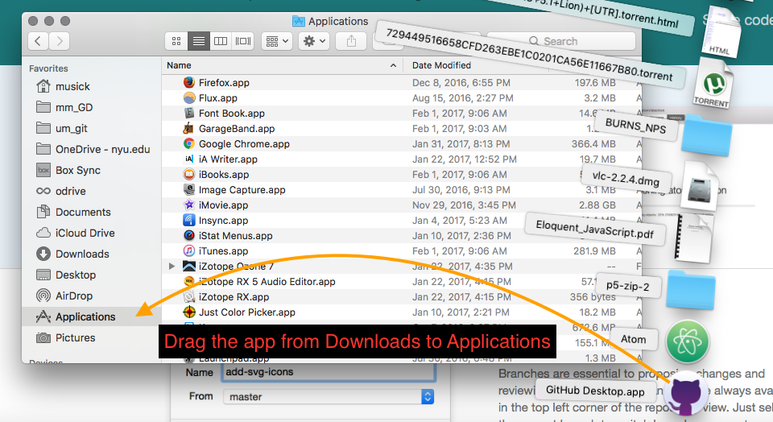

# Git GUI Applications - GitHub Desktop

Working with Git via the command line offers the user the full power of Git. However, I find it easier to start with GUI-based git app. This application will serve as a front-end for Git. You are free to use a command line based program if you want or the following application.

The two applications I would suggest are;

- [GitHub Desktop](https://desktop.github.com) (recommended)
- [SourceTree](https://www.sourcetreeapp.com)

Both of these work on macOS and Windows.

I suggest GitHub Desktop, as this is a more streamlined, and simpler application to use. It also has nice integration to GitHub.com and the Atom text editor, as all three products are from GitHub.

NOTE: For windows users, there have been reports that Source Tree does not work on earlier versions of the Windows OS. If you want to use the software taught by this course, you may need to update your OS to a modern version, such as Windows 10 ( NOTE: That will be true throughout the course, for most situations I would suggest you work on a machine with either a current version of macOS or Window's OS ).

I will show you how to use GitHub Desktop, but the process of using SourceTree is virtually the same. To see explicit directions for SourceTree, please navigate to the next section (_Git GUI Applications (Sourcetree)_).

**{ TODO: }**

Download the GitHub Desktop application from their site.
[https://desktop.github.com](https://desktop.github.com)

## on macOS

After downloading the application, simply drag it to your `/Applications` directory for macOS.

When you open the app for the first time, you will be guided through an additional setup process.

## on Windows

After downloading the application, right-click (or control + click) the application in the Downloads folder from the file explorer and select "run as administrator".

This will cause the installer to run and do its thing.

The install process will take quite a few minutes on most Windows machines.

## Setting up GitHub Desktop

#### 1. Login to GitHub

The following assumes you successfully created a GitHub.com account last week. If you have not, please do that first.

First, click "Sign into GitHub.com".

Then, login to GitHub with your username & password.

#### 2. Configure Git

On the "Configure Git" screen, enter your name and email, if they are not already there.

Then click "continue" again.

Finally click finish on the last screen.

#### 3. Check Preferences

Finally, after GitHub Desktop opens up, you should open the applications preferences.

Under the first tab, "Accounts", you should see your GitHub.com account listed that you used during setup.

If you go to the "Advanced" tab, you will see a couple of options.

The first allows you to select a default "External Editor". If you have successfully installed Atom and/or Visual Studio Code, you should see these as options in the pulldown selection box. You should select the editor you intend to use (you can always change later if you want).

 

Finally, I would suggest you deselect the box for "Help GitHub Desktop improve by submitting anonymous usage data". I would also suggest you make sure the bottom two checkboxes _are_ selected that ask "confirmation dialog's".

When you are finished, select "Save".
