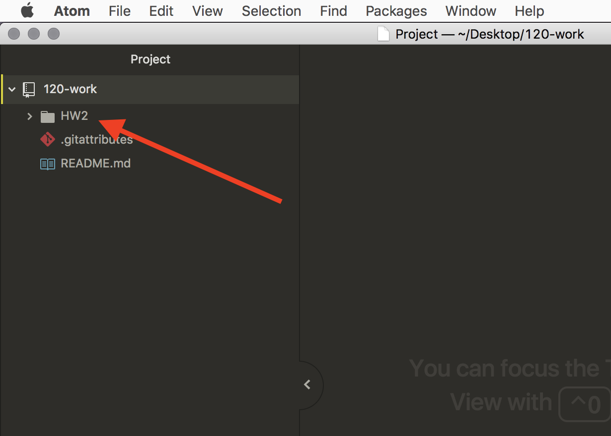

# Working with Git

Now that we have a Git GUI app setup, let's see how we can use it to work with Git and version control our files. This page assumes you are using the GitHub Desktop app and Atom. However, the procedures for other Git GUI apps (i.e., SoureTree) or text editors (i.e., Visual Studio Code) will be very similar.

## Create a New Repository

The first thing to do, is to create a new repository. As you learned on the original Git page, a repository is a any directory/folder whose contents are tracked for changes.

**The repository that we are about to create is where you will complete all of your assignments for this course.** So, when you create this repository, place it somewhere that you want all of your homework for this class going. After you create the repository, moving it can _break_ the git repo. Also, creating a new repository will create a new directory/folder for you.

<br />


To create a new local repository, navigate to the "File" menu, and select "New Repository...".


This will bring up a new window, where you can enter information about your new repository.

**Name**

The first box is where you will specify the name of your repo (short for repository). You can name it whatever you like, but I would suggest you name it "120-work".

_Important: DO NOT_ use spaces or special characters in the title of this repository. Instead, you should use hyphens (`-`) or underscores (`_`) in place of spaces. That is why I suggest you name your repo "120-work". (This is true for all files you create in this course. NO SPACES!)

**Description**

The second box is optional, but allows you to include a brief description about the purpose or intent of the repository.

**Local Path**

The Local Path box allows you to specify a location for the new repo. You are free to type in your path, or to use the "Choose..." button to navigate to a location via your file explorer/finder.

**Initialize this  repository with a README**

You should select the checkbox next to "Initialize this  repository with a README". This will create a new README file in your repository (discussed more later).

**Git Ignore & License**

You can ignore these pulldown boxes for the time being. Git Ignore allows you to create a file that specifies what files **not** to add to your repository (in our case, we have none at the moment). License allows you to specify a license type for new software or creative projects. We do not need a license for our time right now.


Finally, you should select the "Create Repository" button to finish up.


<br />

Now, you should navigate to your new repo via your OS's file explorer or finder. In the directory where you specified the repository be created will be a new directory with the name you assigned your repository.

Inside of your new repository will be the README.md file you told GitHub Desktop to create.


<hr />

## Making Commits with GitHub Desktop app

Now we will learn what a "commit" is, and how to make them using GitHub Desktop and your text editor application.

Since GitHub Desktop is nearly identical between mac and PC, I will only be including one set of instructions for this section. If you get confused, please post a query on the course ["Issues Forum"](https://github.com/Montana-Media-Arts/120_CreativeCoding/issues) email the TA or Lab Assistants instructor.

### Open Repo in a Text Editor

The first thing we should do is open our repo in a text editor. Assuming you successfully installed Atom or Visual Studio Code and selected a text editor during the initial setup of GitHub Desktop, you should be able to select "Open in Atom" or "Open in Visual Studio Code" from the "Repository" menu in GitHub.


This will open your repo in your text editor.

You can also open a directory in a text editor by simply dragging it from the explorer/finder to the app icon in your dock or app bar.


<br />


Regardless of which text editor you use, you should now see the directory and its contents in a bar on the left side of the editor.

<br />


<br />

Next, you should select the `README.md` file, so that you see it in your text editor.

It will have a single line, that is a pound sign, followed by the name of your repo.


### Make Some Changes

In this open README.md file, I want you to add a few new lines, then type a short description about what this repository is for. Then save the file. Something like;

```
This is Michael Musick's repo for course work related to Creative Coding 1.
```


<br />

If you look to the left of the line numbers in your text editor, you should see color (probably green) on each line that you just added. Additionally, after saving the file, it should have changed colors to an off-yellow in the file-viewer on the left-hand-side of the text editor.

These color changes signify that "changes have been made to the file, which have not yet been _committed_ to the repository."

### View File Changes in GitHub Desktop

Now, please go back to the GitHub Desktop app.

You will see that the "Changes" tab, now has a blue dot next to it. This also signifies that changes have been made to the repo, which have not yet been committed.

Under this tab, is a list of each file that has yet to be committed. You should see a listing for the `README.md` file we just changed. The yellow square to the right of the file name, means that this is a file with "changes".

Finally, on the right-hand-side of the GitHub Desktop app, is a detailed description of what has changed in the selected file. When you select a file on the left, the right shows the differences since the last commit of that file. The green indicates "new lines" which have been added to this file. In our case, these is the new line of text we added. (Changed lines would be indicated with _yellow_ and deleted lines with _red_.)


### Commit Changes

In order for the Git version control system to track these changes, we need to make a "commit" to the system. A "commit" is basically a snapshot of the repository in its current state.

Every commit in a Git repository requires a "commit message". In GitHub Desktop, you include this in the box labeled "Summary". You are also welcome to include a more detailed explanation in the following "Description" box. However, this latter box is _optional_.

> Commit messages are FOR YOU. These messages should be composed so as to let you know what type of work you have completed. Clear commit messages can help you understand your work process later on.

For this commit, let's say something like; "Added new lines to README".

After entering a commit message, you can finally select the blue "Commit to Master" button to make the commit.


After making the commit, GitHub Desktop should now say "0 changed files" where it used to show that README.md had been changed.


## Committing New Files

Let's now run through this process again, and add a new file to the repository.

### Add New Directory

First, we should create a new directory _inside_ of our repository. This will help keep us organized, as well as prepare your repository for the homework submission later this week. You should call this new directory `hw-2`. You can do this one of three ways;

1. You can navigate to the parent level repository directory (i.e. `120-work`) in your terminal or command line app. Then add a new directory (i.e. `mkdir hw-2`).
2. You can navigate to the parent level repository directory (i.e. `120-work`) in your Finder or Explorer app. Then right-click and create "New Folder". Then label it `hw-2`.
3. You can create a new folder via your Text Editor by right-clicking on the parent directory and selecting "New Folder". Then label it `hw-2`. (The last of these methods is shown in the images below.)


<br />

Regardless of the method you used to create a new folder, you should now see it in your text editor, in the left side-view.



<br />

### Move test1.txt

Next, I want you to _move_ the `test1.txt` file you created earlier, into this new `hw-2` folder (Feel free to use File Finder/Explorer or Terminal). Then click it in your text editor so you can see it and edit it.


One thing you should notice in Atom or Visual Studio Code is that both the added file and new folder are both green. This signifies that these are _new_ in the repository.

### Commit the New File and Folder

Go back to GitHub Desktop, it should now say "1 changed file". Under this is the `test1.txt` file we moved into the repository. This file is prepended by the new folder name, so that we know where it is located at.

Next to the file name is a "green plus" inside a square. This signifies that the file is "new to the repository".

On the right, where file changes are displayed, every line is highlighted in green, signifying the file is new.

You should now add a commit message (perhaps; "added test1.txt"), and press the blue button, committing the changes to the repository.


As a review, the three areas you are most concerned with are;

1. The "File Stage Area" where we can see what files have changed in our repository.
2. The commit message box, where we add descriptive commit messages.
3. And the commit button, where we finalize the commit.


## Viewing Commit History

In addition to allowing us to make commits, GitHub Desktop also allows you to see a repositories commit history.

Select the tab titled "History" in the GitHub Desktop App.


Now, the left-hand-side of the application shows a chronological list of commits, along with their commit message. If you select any of these, it will show the Detailed description (if one was provided) as well as all of the files associated with the commit to the right. If you select any of these files, you can see what changed in them at that moment in time in your repository.


## { TODO: }

- Practice changing files, saving them, and making commits in GitHub Desktop Application.
- Click on both the "Changes" and the "History" tabs to explore the different types of information shown.
- In the History view, click on different commits to see what files changed and how.
