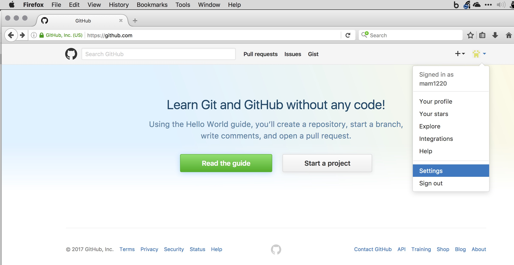
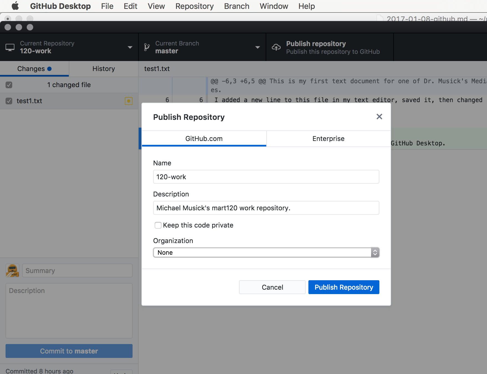
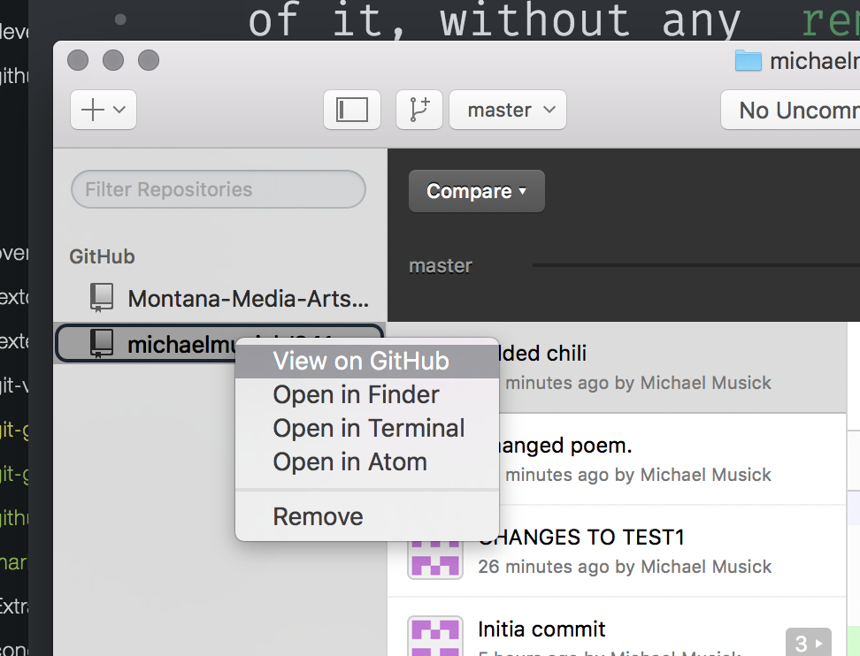

# GitHub.com

## Repository Hosting
[GitHub.com](https://github.com) is a web-based Git repository hosting service.

<!-- 
<iframe class="embed-responsive-item" src="https://www.youtube.com/embed/VUaBfYCmJls" frameborder="0" allowfullscreen></iframe>
 -->

GitHub allows users to have an unlimited number of *public* repositories under 2GB each. Meaning your source code is publicly available to the world for them to view and fork (copy). This is great, as it encourages “[open source](https://opensource.org/osd)” software projects. Open source software encourages the development of shared knowledge and progress within the open source community. It also means that all code is publicly viewable.

## Advanced Collaboration Tools
GitHub also provides advanced collaboration tools. This is not something you will use much this semester. However, it is important to know about and you will use it in future projects.

## Static Website Hosting
GitHub also provides a service known as GitHub pages. This service provides free static website hosting. This is what you will primarily use this semester to host your code sketches. (Did I mention it is free! This means you do not have to purchase server providers from another company.)

## Community Wiki Pages
Each repository also contains a community-editable wiki page, which can provide in depth information and how-to tutorials on a specific project.

## Issue Tracker
The Issues tracker serves as a place for people to create new “issue” or “feature requests”. This can then be used to assign people to work on these issues, ask for help from other users, or track the progress of a new feature.

# GitHub and This Course
This course, the one you are looking at right now, is being provided to you entirely through GitHub.

The website you are looking at now is hosted via GitHub pages.

Also, almost all of the resources for this course that you will need are available from a course repo. Eventually, I will show you how to “clone” the course repo to your own machine so that you can have easy access to these resources.

You will submit links to your homework assignments to the wiki page for the course repo. This will allow you to see each others work as well.

The wiki will also be somewhere that you can post resources

Finally, you will be expected to log “issues” which might be problems or questions. You will also be expected to respond to at least one issue every week.

# Getting Up & Running with GitHub

## Create an Account
First, visit [GitHub.com](https://github.com/) and create a new user account. (NOTE: This should have been completed during week-1, please feel free to skip ahead if you are all caught up)

**NOTE:** Please choose a username that you are comfortable with being part of your publicly visible URL. Ideally, this should be your name or something similar. Your username will be publicly available and used often for many things throughout this course and your entire time on GitHub.

- Fix any problems the signup engine informs you about.
- On Step 2: Keep “Unlimited public repositories for free.” selected. Then select “Continue”.
- Finally, go to the mail account you used during account creation and verify your e-mail address.
- After your account is created, select the avatar in the upper-right hand corner. This should produce a dropdown menu. From there select the “Settings” option.

- From here feel free to fill in as much or little of the public profile information as you want. (Although filling in your name and Profile Pic is encouraged)

# Link GitHub.com to GitHub Desktop

The process of linking GitHub Desktop to GitHub.com is a rather straight forward procedure.

From GitHub desktop this is done very easily by pressing the "Publish" button on the top-right of the application window.

When the publish window comes up, label the repository as you would like (probably, "120-work"), add a description, make sure your account is selected under "Account:" and press the "Publish Repository" button.

If you don't get an error message, you should be good to go. To check if all your files uploaded and the repo was created successfully, you should navigate to github.com. You can do this the normal way by opening your browser and simply typing in the site address, or you can right-click in the repo, from the repository browser on the left and select "View on GitHub".

(NOTE: It may sometimes take GitHub a number of minutes to show updates to your repository via its weh-interface. If this happens check again in 2, 5, or 10 minutes.)

The button that used to say "Publish" should now say "Sync". Whenever you commit new changes to your Git repo via GitHub Desktop, you need to remember to press "Sync" when you are done working. This "pushes" you changes to the remotely hosted version of your repository on GitHub.com.

# Success Pushing
To verify success in pushing the repo, go to GitHub.com. You should see “120-work” under “Your repositories”.

Select your 120-work repository. You should see the files you added to your repo on the GitHub.com site.

You can now select any of these files to view their contents.

Likewise, you can select the “commits” tab to see all of the commits you have made in your repo so far.
