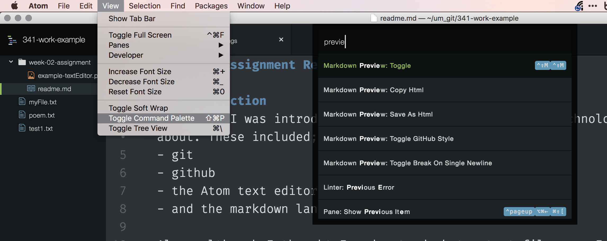
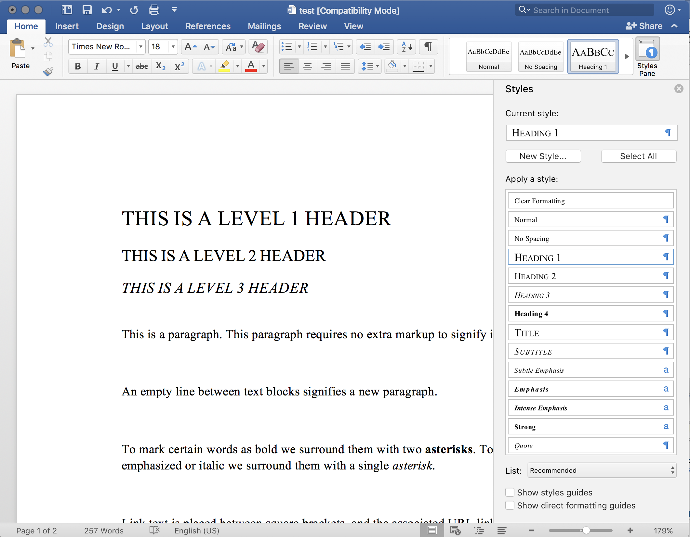

# Markup and the Markdown (`.md`) language.

A markup language is a system for annotating a document in a way that is syntactically distinguishable from the text.
Markup languages tend to encourage writers to focus on content and structure before concerning themselves with presentation.
Structure is defined for a processor through the use of tags embedded directly in the text.

One of the original markup languages, and one which is still used on a massive scale is HTML or HyperText Markup Language. This is one of the most basic languages used for web sites.  This week, and for the rest of this course, we are going to use another, slightly simpler, and very popular markup language known as [Markdown](https://en.m.wikipedia.org/wiki/Markdown).

Just as HTML, markdown files encourage the writer to focus on content and structure, as opposed to formatting. In fact, this entire course has been developed for the web [using markdown files](https://github.com/Montana-Media-Arts/creative-coding-1/blob/master/modules/week-2/_posts/2017-01-09-markup.md).

A markdown file typically uses the `.md` extension. This file type allows the writer to identify portions of the text as headers (at various levels), paragraphs, **bold**, _italic_, links, `code`, lists, and tables. It also allows the writer to easily include images through links in the document. Below is an example of markdown. There is also an image showing markdown text in the left of an Atom pane, and the markdown preview in the right Atom pane.

```markdown
# THIS IS A LEVEL 1 HEADER

## THIS IS A LEVEL 2 HEADER (note the space between the '#' and heading text)

### THIS IS A LEVEL 3 HEADER (That space is necessary)

#### THIS IS A LEVEL 4 HEADER (That space is necessary)


## Paragraphs 

This is a paragraph. This paragraph requires no extra markup to signify it as such.

An empty line between text blocks signifies a new paragraph.

Above these paragraphs are headers. Notice that there is a new-blank-line after each header before the proceeding content. The use of new lines is important in markup. 

## Inline Syntax Markup

To mark certain words as bold we surround them with two **asterisks**. To mark certain words as emphasized or italic we surround them with a single *asterisk* or _underline dashes_.


## Links 

Link text is placed between square brackets, and the associated URL link follows between parenthesis. [This is an example link](https://michaelmusick.com) Notice that there are no spaces between the square brackets and the parenthesis. When rendered only the text between the brackets will be shown, the URL or link between the paranthesis will be hidden. 

# Images

Similar to links, images are added with an exclamation mark, followed by square brackets with an image description, followed by the exact or relative url to the image in parenthesis. Again notice that there are no spaces between the exclamation mark, square brackets, or paranthesis. 


Do you see how the image URL is proceeded with two periods? This tells the system to go up one directory (or folder) relative to whereever _this_ file is stored. 

# Formatted Code

We can identify code in a paragraph using the back-tick character. As with other inline markups, the specified text is surrounded on both sides with a back tick mark. The back-tick is the leftmost key on the number line, below the esc key on most American keyboards. `var Der = 20`.

We can write code blocks by surrounding our lines of code witha line of three backticks on the top and bottom. After the opening set of backticks, you should write the language you are writing (ie. markdown, html, css, javascript). See [https://help.github.com/articles/creating-and-highlighting-code-blocks/] for more info. This code will maintain its formatting, including tabs, new lines, spaces, etc.

```html
<body>
	<h1>HTML Code Example</h1>
	<p>This is a Formatted HTML code block, within our markdown example document.<p>
</body>
```

## Lists

Lists are simply line items prepended with dashes to create an unordered list, or numbers to create an ordered list. (NOTE: you must add a blank line between the paragraph and the first list item. Also, you should not have blank lines between list items that belong to the same list.)

- list item 1
- list item 2


1. List item 1
2. List item 2

- this is a hierarchical list
	- it has multiple levels of list items
	- each level is distinguished through a tab
- lists can also be mixed together
	1. With ordered lists 
	2. inside unordered lists
		- and unordered lists 
		- inside ordered lists

## HTML inside Markdown

Lastly, you can further extend markdown with HTML. This is particularly useful for adding embedded videos from [YouTube](youtube.com). 
```


### { TODO: }
Copy the above code/text. Then paste it into a new Atom file that you save as `test2.md`. (It does not matter where you save this file, you are free to delete it immediately after this TODO example)

Now in Atom, open the Command Palette (macOS: Cmd + shift + p).



Then start to type “preview” until “Markdown Preview: Toggle” is seen. Select this option by clicking it or pressing return. This will show you the rendered version of the markdown code, as shown in the below image.


(NOTE: you may also want to open Atom preferences and tell the Markdown Preview Package to render using “Github Style”.)


## Difference between Microsoft Word and markdown?

As mentioned previously, one of the main differences between a markdown document (or more generally, text document) and a Microsoft Word file is that the former is stored as text, and the latter is stored as binary code. Microsoft does this for a number of reasons, one of these is to keep their product proprietary. This binary file also allows for syntax and structure to be stored within the document file, without the user having to see it in the text itself. Neither word or markdown is better than the other. They are both useful for different purposes. Word is great for creating Formatted, printer ready documents. Markdown is great when you just want to write, adding in syntax andtructure, without worrying about exactly how the text will look later. Many writers and developers prefer writing in markdown, and later exporting to word or some other format, because it encourages them to only worry about the writing. As mentioned earlier, markdown can also be used for writing that will end up on the web or other computer based platform (one of the reasons all the files for this course are written using markdown).

The image below shows a word document in which certain sections have been styled using Word’s builtin “styles”.



## Markdown Cheat Sheet

There are many markdown resources to make writing markdown files easier. In Atom there are numerous markdown packages, such as markdown-writer, which allows you to call instructions from the command palette (Cmd + Shift + P). One great thing about Atom is that you can preview what the rendered text will look like by opening the command palette and pulling up the ‘markdown preview’ (as in the above image). There are also specialized markdown writers such as [iA Writer](https://ia.net/writer), [Ulysses](https://www.ulyssesapp.com) and Byword, all of which include tools to simplify the writing process and preview the file. There are also applications that are only markdown renderers, like Marked 2, which excels at creating finished markdown documents and exporting these `.md` files to other formats. 

These tools are all wonderful, and you may find them useful. But, what you need first, is a simple markdown cheat sheet, which tells you what symbols you need to use to specify structure and syntax. A google search will return a number of useful results.  However, I would suggest you start with the;

- [GitHub cheat sheet](https://github.com/adam-p/markdown-here/wiki/Markdown-Cheatsheet), or
- [Mastering Markdown by GitHub](https://guides.github.com/features/mastering-markdown/)


## Markdown and GitHub.com

GitHub.com uses markdown extensively within its ecosystem for documentation, readme files, as well as allowing for issues to be written using markdown. For every homework assignment you submit, you will also write a short report in markdown. This report will need to discuss a number of things every week;

1. Summarize the work you did this homework cycle. Paying particular attention to the individual choices you made.
2. What steps did you take to complete the assignment?
3. Did you have any problems or issues? How did you solve these? Did you post about these to the class repo issue tracker? Did you receive any useful feedback from your classmates?
4. Is there anything in particular you learned that you would like to discuss further?
5. What issues did you help your fellow classmates out with this past homework cycle?

You will submit a link to this file in your GitHub repo via the class repo wiki page.


<h2 id="hw2todo">{ TODO: }</h2>

### 1: Write your `readme.md`

- On your development machine, create a new directory/folder in your course repo (i.e. the '120-work' directory/folder on your machine). Label this new directory as `hw-2`.
- In this directory, create a new document labeled `readme.md`. (This can be done in finder, explorer, command line, or your text editor) GitHub.com automatically renders readme.md files within individual directories.
- Open this file in a text editor application.
- The first line of text should be your name and class section. ie `Michael Musick 51`
- Using appropriate markup-syntax, discuss your work for the week according to the 5 prompts from the above section.
- You should have at least one of each of the following elements in this document (NOTE: One instance of some of these elements will be insufficient.)

- Header Level 1
- Header Level 2
- An un-ordered list
- An ordered list
- A link to another site
- Inline code (i.e. using single backticks [code quote example](https://help.github.com/articles/basic-writing-and-formatting-syntax/#quoting-code)) or a multi-line code block (i.e. using three backticks at the top and bottom. [Code block example](https://help.github.com/articles/creating-and-highlighting-code-blocks/)). ALSO, PLEASE NOTE: the backtick (on most keyboards) is the key located left of the "1" key and above "tab" key. It is different from the single apostrophe.
- Finally, you should include a picture of your markdown file within your text editor. To do this;
	- Take a screen shot of your editor from your computer. ([How to take a screen shot on macOS](https://support.apple.com/en-us/HT201361), [How to take a screen shot on Windows](https://www.cnet.com/how-to/how-to-take-a-screenshot-in-any-version-of-windows/))
	- Move the image to the `hw-2` directory.
	- Embed the image in your document using the following code; ``.

NOTE: Please edit, spell-check, and re-read your writing. Unfortunately, you will be marked down for poor writing.

### 2: Commit you changes and push them to the GitHub repo

First, when you are finished with your write up, I want you to move the `test1.txt` file from earlier in this weeks work to this same new child directory/folder (`/120-work/hw-2/test1.txt`).

When you are finished with your write up and moving the file, you should ‘stage’ this new `readme.md` file, along with the image file, and changed `test1.txt` in your Git repo via GitHub Desktop. Commit these files to the repo, then push your changes to the GitHub server.

(NOTE: If you are uncomfortable with this, review the steps from the previous page)

### 3: Add a Link

After pushing the commits, navigate to your repo on GitHub.com in your browser. You should see the new directory in the file list.


Click on the new directory (`/hw-2`) to see its contents. You should see the readme file and the image file. Additionally, below the file list, you should see the contents of the `readme.md` file rendered and presented.


In your browser, select and copy the entire URL for this page from the URL/Search field box.


To add your link you will do the following;

- Navigate to the [course repo](https://github.com/Montana-Media-Arts/120-work)
- Select the ‘[wiki](https://github.com/Montana-Media-Arts/120-work/wiki)’
- Open the [HW-2 Wiki Page](https://github.com/Montana-Media-Arts/120-work/wiki/Week-2-HW)
- Click the ‘edit’ button.
- Under the “## Student Submissions” section, add your name and a link to your readme page. (i.e. “`- Michael Musick [markdown readme](https://github.com/Montana-Media-Arts/341-work/tree/master/HW_Examples/week-02-assignment)`”

When you have finished this, you should also send me a link to your readme.md file via the moodle hw-2 assignment submission. I will check that the link exists and works from both your moodle submission and the course wiki page for hw-2. 
