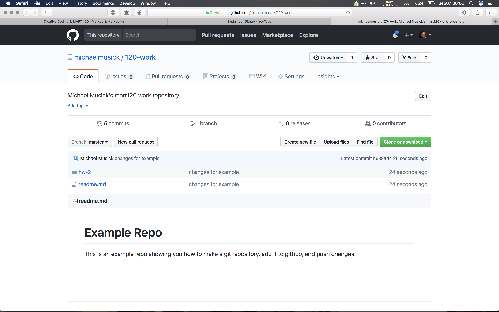
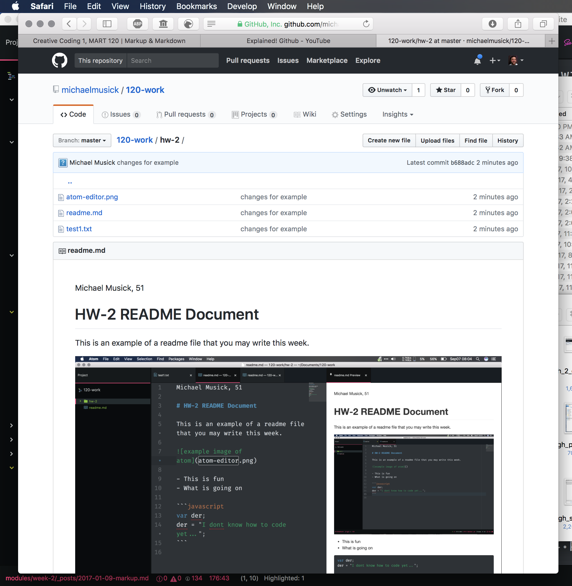

# Week 2 Homework

For your homework this week, you will;

1. write a "weekly response"
2. in a file titled `README.md`
3. sync it to GitHub.com
4. and submit the link to the Week 2 Homework forum on Moodle.

## Weekly Questions

The questions you should address in every week's response are;

1. Summarize the work you did this homework cycle. Paying particular attention to the individual choices you made.
2. What steps did you take to complete the assignment?
3. Did you have any problems or issues? How did you solve these? Did you post about these to the class repo issue tracker? Did you receive any useful feedback from your classmates?
4. Is there anything in particular you learned that you would like to discuss further?
5. What issues did you help your fellow classmates out with this past homework cycle?

# Step by Step Instructions

## 1: Write your `readme.md`

- On your development machine.
- Create a new document labeled `readme.md` inside of the `hw-2` directory, inside your git repo. (This can be done in finder, explorer, command line, or your text editor).
- Open this file in your text editor application (i.e., Atom or Visual Studio Code).
- The first line of text should be your name. ie `Michael Musick`
- Using appropriate markup-syntax, discuss your work for the week according to the 5 prompts from the above section.
- You should have at least one of each of the following elements in this document (NOTE: One instance of some of these elements will be insufficient. Such as headings, which you will likely need multiple of...)
    1. Header Level 1
    2. Header Level 2
    3. An un-ordered list
    4. An ordered list
    5. A link to another site
    6. Inline code (i.e. using single backticks [code quote example](https://help.github.com/articles/basic-writing-and-formatting-syntax/#quoting-code)) or a multi-line code block (i.e. using three backticks at the top and bottom. [Code block example](https://help.github.com/articles/creating-and-highlighting-code-blocks/)). ALSO, PLEASE NOTE: the backtick (on most keyboards) is the key located left of the "1" key and above "tab" key. It is different from the single apostrophe.
- Finally, you should include a picture of your markdown file within your text editor. To do this;
	- Take a screen shot of your editor from your computer. ([How to take a screen shot on macOS](https://support.apple.com/en-us/HT201361) --- [How to take a screen shot on Windows](https://www.cnet.com/how-to/how-to-take-a-screenshot-in-any-version-of-windows/))
	- Move the image to the `hw-2` directory.
	- Embed the image in your document using the following code; ``. (NOTE: Spelling, including capitalization are critical. Please also remember to _NOT USE_ spaces. Use dashes or underscores instead.)

NOTE: Please edit, spell-check, and re-read your writing. Unfortunately, you will be marked down for poor writing.

## 2: Commit you changes and push them to the GitHub repo

When you are finished with your write up, you should ‘stage’ this new `readme.md` file, along with the image file, and changed `test1.txt` in your Git repo via GitHub Desktop. Commit these files to the repo, then push your changes to the GitHub server.

(NOTE: If you are uncomfortable with this, review the steps from the previous page)

## 3: Copy the Link

After pushing the commits, navigate to your repo on GitHub.com in your browser. You should see the new directory in the file list.

Click on the new directory (`/hw-2`) to see its contents. You should see the readme file and the image file. Additionally, below the file list, you should see the contents of the `readme.md` file rendered and presented.

In your browser, select and **copy** the entire URL for this page from the URL/Search field box.

## 4. Submit This Link as Your Homework Assignment in Moodle

To submit this link, you will do the following;

1. Navigate to the [course Moodle page ](https://moodle.umt.edu/course/view.php?id=20155)
2. Select the appropriate week (i.e. "Week 2 - Basic Technologies").
3. Select the forum.
4. Create a new post in the forum.
5. Include the link to your hw-2 repo folder. (You should make sure this is a clickable link.)
