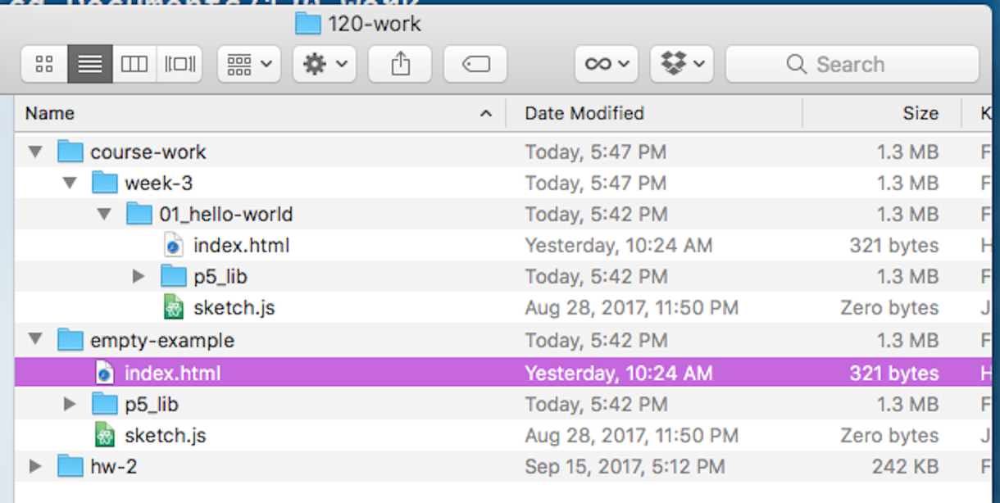

# Starting with p5

<div class="embed-responsive embed-responsive-16by9"><iframe class="embed-responsive-item" src="https://www.youtube.com/embed/vEAn9qyM3lw" frameborder="0" allowfullscreen></iframe></div>

To get started with p5.js, you first need to download the p5 library and some blank template files. Eventually, you will learn how to set up everything for yourself, but in the meantime, I will provide you with a folder containing everything you need. Please download the following zip'd ["empty p5 project"](https://github.com/Montana-Media-Arts/120_CreativeCoding/raw/master/_empty_example/empty-example.zip) directory from the course repo.

- [Empty p5 project](https://github.com/Montana-Media-Arts/120_CreativeCoding/raw/master/_empty_example/empty-example.zip)


## Move It To Your Repo

Next, unzip the directory, if your browser did not do this for you.

Then, move it to the top level of your course repository.


## Setup Your Repo For This Week

Create a new directory/folder in your repo labeled `course-work`.

In this directory, add a new directory labeled, `week-3`.

Finally, _COPY_ the `empty-example` directory into the newly created `week-3` directory. Then relabel it `01_hello-world`.

Regardless of whether you are on windows or mac, your course repo directory should now look like the following;




## What is Inside

Now that you have your repo setup for the lecture this week, lets look at what is inside the p5 "empty-example" directory.

Below, is a "tree view" of the contents of the directory.

```bash
  ─ empty-example/
    ├── index.html
    ├── p5_lib/
    │   ├── p5.dom.min.js
    │   ├── p5.min.js
    │   └── p5.sound.min.js
    └── sketch.js
```

<br />


You will notice that there are 2 files in the top level of `empty-example/`.

- `index.html`
    - This is the file necessary to view your p5 "sketch" in a browser. We will talk about this file later. For now, know that you should not alter it. You will use this file to "open" and view your p5 code sketch in action.
- `sketch.js`
    - This is the file that we will start editing in just a few moments. This is where you will start coding, and is arguably the most important file for you to worry about for the time being.

You will also notice, that inside of the `empty-example/` directory, there is another child directory, `p5_lib/`. This directory contains the p5.js library files to make everything work. These are huge files that I suggest you not open in the text editor on your computer. Instead, I want you to look at the main p5.js file over on GitHub, to get a sense of what is in it. (Do not worry about actually understanding it, I just want you to look at it to have some appreciation.)

- [main p5.js library file](https://raw.githubusercontent.com/Montana-Media-Arts/120_CreativeCoding/master/_empty_example/p5_lib/p5.js)


## Open it All Up in Atom

Let's get this all open in Atom now. You can accomplish this a number of ways. I would suggest we open our _entire_ repository directory in Atom. You can do this by;

1. Navigate to the GitHub Desktop application, then from the "Repository" tab in the menu bar, select "Open in Atom".

2. Drag the top level directory/folder from your finder or file browser to the Atom application icon.
3. From the Command Line program of your choice, navigate to the repo directory and type `atom .`. (NOTE: This presumes you have installed the "command line tools" for Atom).

You should now see your entire repo as a "Project" in the left bar of the Atom application. Open up the `course-work` directory, then the `week-3` directory, and finally the `01_hello-world` directory. Finally, select the `sketch.js` file from this open directory.


You should now see a blank document, with the associated tab reading "sketch.js" in Atom.


# One More Package

I want you to install one more package to you Atom install at the point.

- Open 'preferences' for Atom.
- Navigate to the 'install' tab.
- Search for `Open-in-browsers`.
- In the list of packages, find the one labeled "Open in Browsers".
- Install the package by clicking "Install"


When the package finished installing, you may close 'preferences'.
