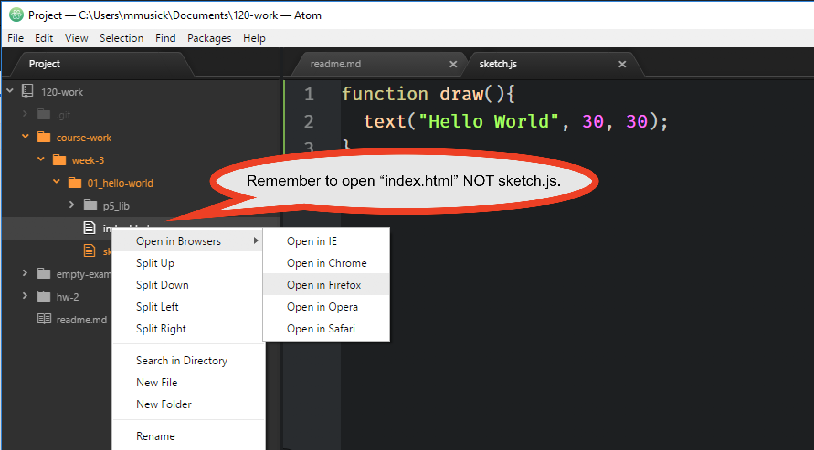
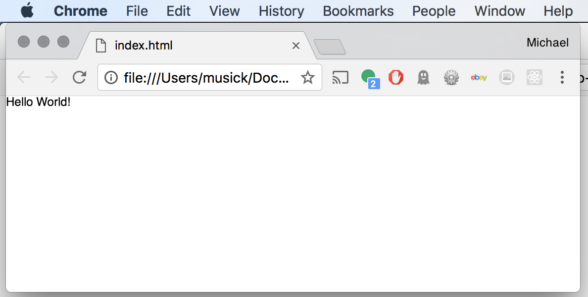
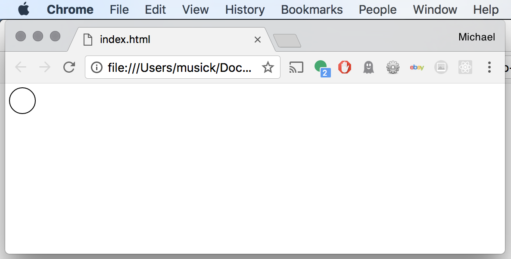

# "Hello World!"


<div class="embed-responsive embed-responsive-16by9"><iframe class="embed-responsive-item" src="https://www.youtube.com/embed/OVZYuJqZ1dY" frameborder="0" allowfullscreen></iframe></div>


The first thing you should do in any new coding language (let alone your _first!!!_) is a ["Hello World!" program](https://www.thesoftwareguild.com/blog/the-history-of-hello-world/). Typically this involves printing `Hello World` from the language. As boring as that is, and as amazing as the possibilities for p5 are, I think we should still start there.

#### So.... without further ado...

In that blank `sketch.js` file you opened on the previous page, I want you to type the following;

Then save your file.

<div id="code-heading">sketch.js</div>

```js
function setup(){
    text("Hello World!", 0, 10);
}
```


#### Now let's look at the results of our first p5 code sketch!

To open your sketch file, you actually need to open the `index.html` file that is in the same directory as the `sketch.js` file.

You can do this by;

1. Navigate in the Finder or File Explorer to your `01_hello-world/` directory. Then double click or drag the index file to your browser.
2. If you were able to install the "Open in Browsers" package successfully, you can more simply, right-click or cntrl-click the index.html file from the project browser in the left Atom. Then select the browser of your choice.



#### And the Results

If all went well, you should see a window in your browser that looks like the following;



<div class="displayed_jotted_example">
    <div id="jotted-demo-1" class=""></div>
</div>
<script>
    new Jotted(document.querySelector("#jotted-demo-1"), {
    files: [
        {
            type: "js",
            url:"https://raw.githubusercontent.com/Montana-Media-Arts/120_CreativeCoding_Fall2017/master/lecture_code/03/01_hello-world_01/sketch.js"
        },
        {
            type: "html",
            url:"../../../p5_resources/index.html"
    }],
    // plugins: [ "codemirror", "console" ]
    plugins: [ "codemirror" ]
});
</script>


#### Go Further

You should not change the text, or numbers in the second line of the example. At the moment, it is OK you do not know what is going on. You will learn more about that shortly.

So, change something with the quotes, for example, change `"Hello World!"` to `"Hello Michael!"`.

Then go back to your browser, and _refresh_ the page. You should see your changes reflected.


# A p5 "Hello World"

That is not the most exciting thing to do. But the "Hello World!" program is tradition. It is the first program almost every programmer makes!

Let's now make a "Hello World!" type program specific to p5. Since p5 is geared towards visual based art, we are going to make a simple circle.

In place of the second line, write `ellipse(20, 20, 30, 30);`.

Your `sketch.js` file should now look like;

<div id="code-heading">sketch.js</div>

```js
function setup(){
    ellipse(20, 20, 30, 30);
}
```

<br />


After changing you code, you should;

- Re-save the file.
- Navigate back to the browser.
- Re-load the page.

Your browser window should now look like the following;




<div class="displayed_jotted_example">
    <div id="jotted-demo-2" class=""></div>
</div>
<script>
    new Jotted(document.querySelector("#jotted-demo-2"), {
    files: [
        {
            type: "js",
            url:"https://raw.githubusercontent.com/Montana-Media-Arts/120_CreativeCoding_Fall2017/master/lecture_code/03/01_hello-world_02/sketch.js"
        },
        {
            type: "html",
            url:"../../../p5_resources/index.html"
    }],
    // plugins: [ "codemirror", "console" ]
    plugins: [ "codemirror" ]
});
</script>

| [**[Code Download]**](https://github.com/Montana-Media-Arts/120_CreativeCoding_Fall2017/raw/master/lecture_code/03/01_hello-world_02/01_hello-world_02.zip) | [**[View on GitHub]**](https://github.com/Montana-Media-Arts/120_CreativeCoding_Fall2017/raw/master/lecture_code/03/01_hello-world_02/) | [**[Live Example]**](https://montana-media-arts.github.io/120_CreativeCoding_Fall2017/lecture_code/03/01_hello-world_02/) |


<br />

Heck ya!

Congratulations on completing your first code sketch.
