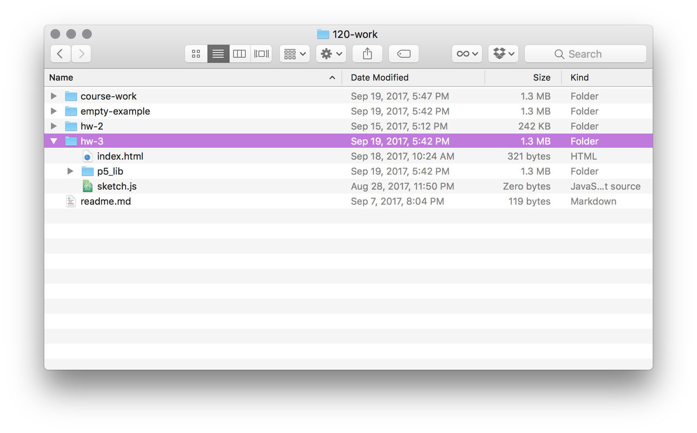
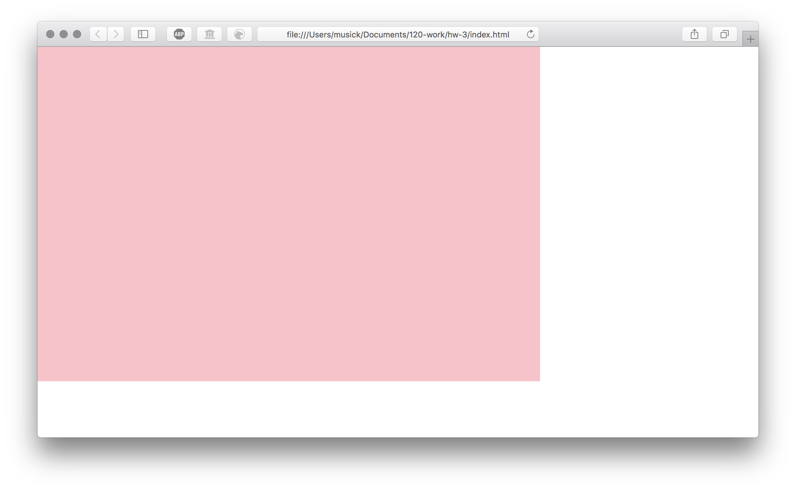

# "Hello World!" Homework Sketch

Now that you know the basics of p5 it is time to write and upload your own "Hello World!" sketch to the web! Please follow along the next few pages to complete your homework for the week.

## 1: Create a hw-3 Directory

In your `/120-work` directory, duplicate the `empty-example/` directory and label it `/hw-3`.

Within that directory create a new html document labeled `index.html`. (NOTE: The `tree` command is used in the below images as an example. macOS users would need to install a separate script via homebrew to use this command. In other words, you are not expected to use tree. It is simply for demonstration purposes. All other commands however will work and should be used.)

Your `120-work/` directory should now look like the following;

## 2: Open the Directory

Open this new `hw-3/` directory in Atom. Then navigate to and open your blank `sketch.js` file within the `hw-3/` directory.

## 3: Write and Define the `setup()` Function

Now, in `sketch.js`, write and declare the `setup()` function. Remember, in this function you should;

1. create a canvas using the `createCanvas()` function.
2. specify a background for your canvas using the `background()` function.
3. Comment each line, so that you are writing what you are doing. This is for you and for me.

Your `setup()` function might look something like the following;


// Declare the setup function
function setup() {

    // create a canvas 600px wide and 400px high
    createCanvas( 600, 400 );

    // color the background 'pink'
    background( 'pink' );
}


## 4: Check That Your Sketch was Setup

You should now open your `sketch.js` file and make sure you successfully created a canvas and set the background of this canvas.

Your browser should show something like the following;

## 5: Declare a `draw()` Function and Add "Hello World!"

Finally, underneath the `setup()` function, you should write and declare a `draw()` function.

Inside this `draw()` function, I want you to write a command to print the text string "`Hello World!`" on the sketch canvas. You can do this using the `text()` function. (Remember to include comments!)

> I would suggest you read about the `text()` function to try and unsertand more about it and how it works. (It's OK that you don't unsertand it all right now. Just try to get use to reading reference pages.)
>
> - [`text()` function reference page](https://p5js.org/reference/#/p5/text)

 

Your code should look something like the following;


// Declare the draw function
function draw() {

    // tell p5 to print the text string "Hello World!"
    // This is going to be positioned at ( x: 20, y: 30 ).
    text( "Hello World!", 20, 30 );
}


## 6: Refresh the Browser and Check Your Work

After adding the `draw()` function declaration and saving your `sketch.js` file, you should;

- go back to the browser,
- refresh the page,
- and make sure everything looks like you think it should.

Mine, looks like the following;

 

Here is a live example, with the complete code under the JavaScript tab.

    

| [**[Code Download]**](https://github.com/Montana-Media-Arts/120_CreativeCoding_Fall2017/raw/master/hwExamples/hw-3/hw-3.zip) | [**[View on GitHub]**](https://github.com/Montana-Media-Arts/120_CreativeCoding_Fall2017/raw/master/hwExamples/hw-3/) | [**[Live Example]**](https://montana-media-arts.github.io/120_CreativeCoding_Fall2017/hwExamples/hw-3/) |

## 7: Commit and Push

Now that you have finished up Part 1 of your weekly homework assignment, you should;

- stage your file changes to your git repository
- commit these changes
- sync/push your changes up to the remote GitHub.com repository.

After pushing your changes, visit your repository on GitHub to insure that your changes and code was successfully sync'd.
