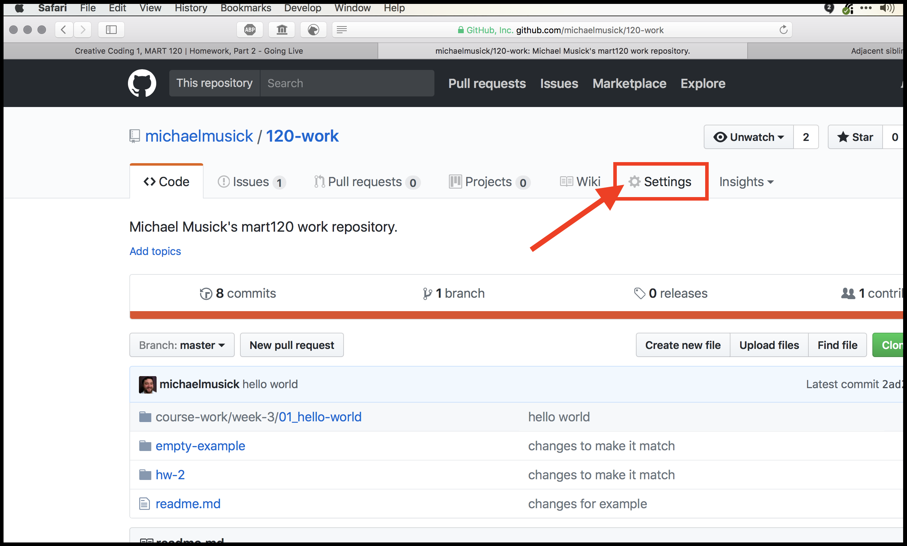

# Making it Go Live

<iframe class="embed-responsive-item" src="https://www.youtube.com/embed/bNR70K4BJbY" frameborder="0" allowfullscreen></iframe>

OK, congratulations on writing your first p5.js sketch.

As you may remember, one of the reasons we are using p5 is that it is browser friendly and allows you to post your art straight to the web. So, lets now figure out how to get it on the Internet for others to view.

For any website to work, you will need to acquire server space, this is where files get stored. Furthermore, this server actually “serves” these files to requesting host-computers. In addition to acquiring a server, we will need to get individual and unique URL’s where we can point other computers to (links to share with other people).

# Creating a website with GitHub Pages

Luckily, GitHub.com provides free web hosting for static websites. For this course, this means we can utilize them as a our server, and they will also provide us with URLs.

> A static site is one that does not involve server-side computational work beyond serving or delivering files to a requesting host-computer. That is all you need to know about that for this course.

GitHub assigns each user the following URL:
`username .github.io`

That string will be your _baseurl_, as was refernced on the previous page about `index.html`.

 

<iframe class="embed-responsive-item" src="https://www.youtube.com/embed/2MsN8gpT6jY" frameborder="0" allowfullscreen></iframe>

### { TODO: } Let GitHub know we want our repo to be a webpage

In order for our repo to be served, we need to tell GitHub that this is a “GitHub pages project site”. To do this, you will need to do the following;

1. Navigate to your GitHub.com account.
2. Navigate into your `/120-work` repository.
3. Select the Settings tab for the repo. 
4. Scroll down to the “GitHub Pages” section. And under “Source” select “master branch” then click save. 
5. You should then see this section change and say that your site is “ready to be published as …”. This means GitHub is processing your site and publishing it, assuming no errors popup. 
6. Wait a few minutes and reload that page. Eventually this section should turn green, meaning it is Live! 
7. Click on the link there. It of course will not work since we have not placed an `index.html` file in the root directory of the repo. Instead you should see a GitHub “404 error page”.
8. We simply need to add the directory where our new `index.html` file lives in our repo. Select the URL in the address bar, and add `hw-3/` to the end of the address. This should open up your `index.html` page at an address that looks like `https://yourusername.github.io/120-work/hw-3/`. 

For most of your future homework projects, the URL will be `https://yourusername.github.io/120-work/` + `the-directory` where you are placing that weeks homework assignments.

Finally, you should copy this address URL for your HW-3 sketch.
