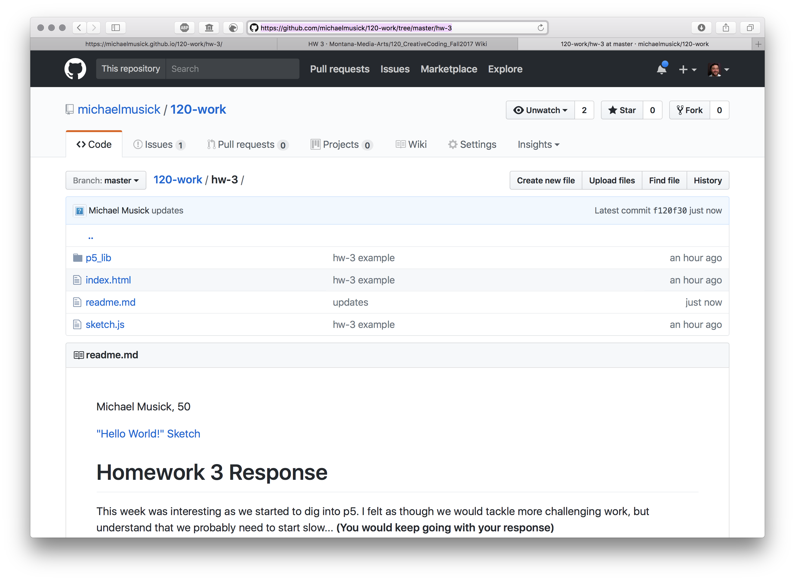

# Homework, Part 3 - Readme.md and a Submission

To finish up your homework assignment this week we need to complete a few more steps.

## 1: readme.md

The first thing you need to do is create and write your readme.md document. If you are using the "empty-project" from this course's website, there should already be a `readme.md` file in the project directory. You simply need to delete and replace the contents of this file.

If there is not a `readme.md` file in your sketch directory for some reason, please create the file, within your `hw-3/` directory, using one of the methods discussed in the first two weeks.


<br />

#### The First & Third Lines

The first line in your readme file should be your name, followed by your section number.

The third line of your readme file should be a link to your working "Hello World!" sketch.

As an example;

```text
Michael Musick, 50

["Hello World!" Sketch](https://michaelmusick.github.io/120-work/hw-3/)

or

Michael Musick, 51

["Hello World!" Sketch](https://michaelmusick.github.io/120-work/hw-3/)
```

#### The Rest of the File

In your readme, you should discuss your experiences this week, as well as your progress, problems, breakthroughs, and discoveries.

I would suggest you use the following questions as a guideline.

1. Summarize the work you did this homework cycle. Paying particular attention to the individual choices you made.
2. What steps did you take to complete the assignment?
3. Did you have any problems or issues? How did you solve these? Did you post about these to the class repo issue tracker? Did you receive any useful feedback from your classmates?
4. Is there anything in particular you learned that you would like to discuss further?
5. What issues did you help your fellow classmates out with this past homework cycle?

> NOTE: The above questions should serve as a guideline for your written readme. Please do not answer these questions as though they were part of a set of number questions. These readme's should be well thought out, and written documents.
>
> REMEMBER: As a reminder, you should include pictures when appropriate. You should also use structure markup (i.e. headings) to create a clean, easily readable document.


## 2: Commit Changes

After finishing your readme, commit your additional changes to your git repo and sync the changes with the remote repo on GitHub.com.

## 3: Submit Homework Links

Finally, we need to submit our homework links to the course repo.

- To do this, we need to first visit our repository on GitHub.com.
- You should then navigate to the top level of your `hw-3/` directory. When you are there, you should see all of your code files for this week, along with your readme down below.



- Copy the URL for this current webpage.
- In a new browser tab/window, open the ["HW 3" Wiki page on the Course Repo](https://github.com/Montana-Media-Arts/120_CreativeCoding_Fall2017/wiki/HW-3)
- Click the "Edit" button.
- Scroll to the end of the document.
- Add your
    - Name,
        - i.e. `- Michael Musick`
    - Section #,
        - `50`
    - Link to your `hw-3/` github repo directory,
        - [hw-3 readme](https://github.com/michaelmusick/120-work/tree/master/hw-3)
    - and a link to your live p5 "Hello World!" sketch
        - [Live "Hello World!" Sketch](https://michaelmusick.github.io/120-work/hw-3/)


My line looks like;

```markdown
- Michael Musick, 50 - [hw-3 readme](https://github.com/michaelmusick/120-work/tree/master/hw-3) - [Live "Hello World!" Sketch](https://michaelmusick.github.io/120-work/hw-3/)
```

> I would suggest you simply copy my line, and replace the contents (i.e. your name, section number, and relative URL's)

- Click "Save Page".
- Finally, check both of your links to make sure they work!


<br />


**That is it for HW-3!**
