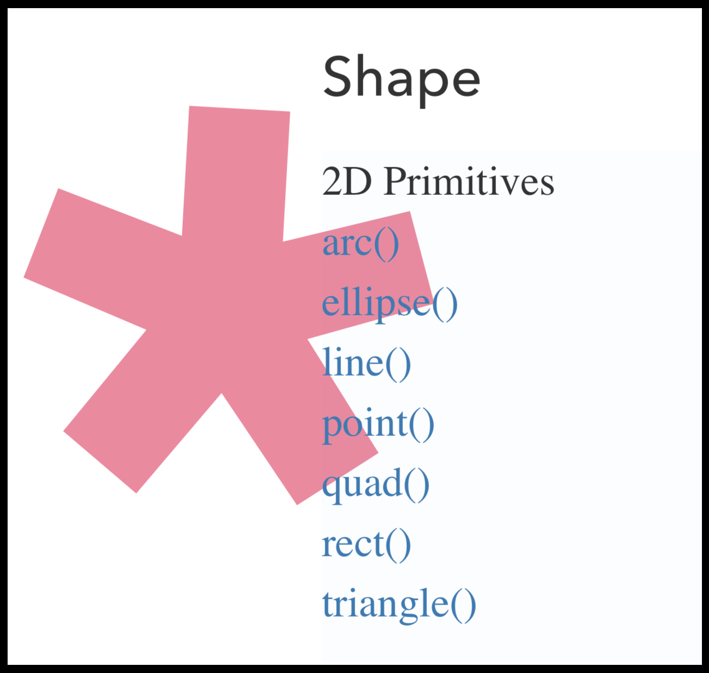
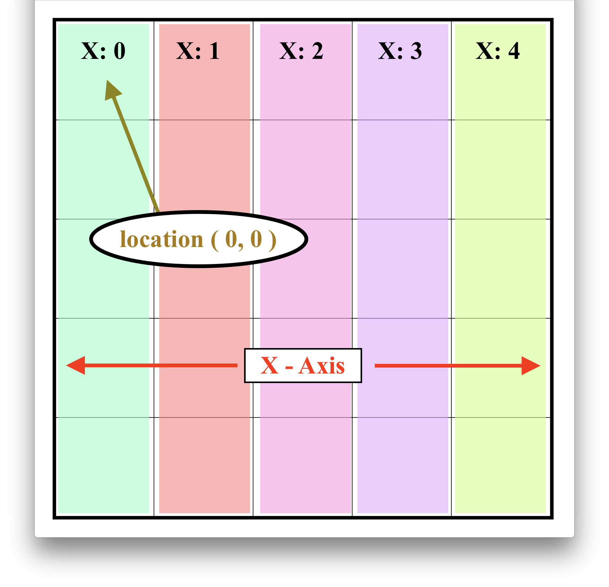
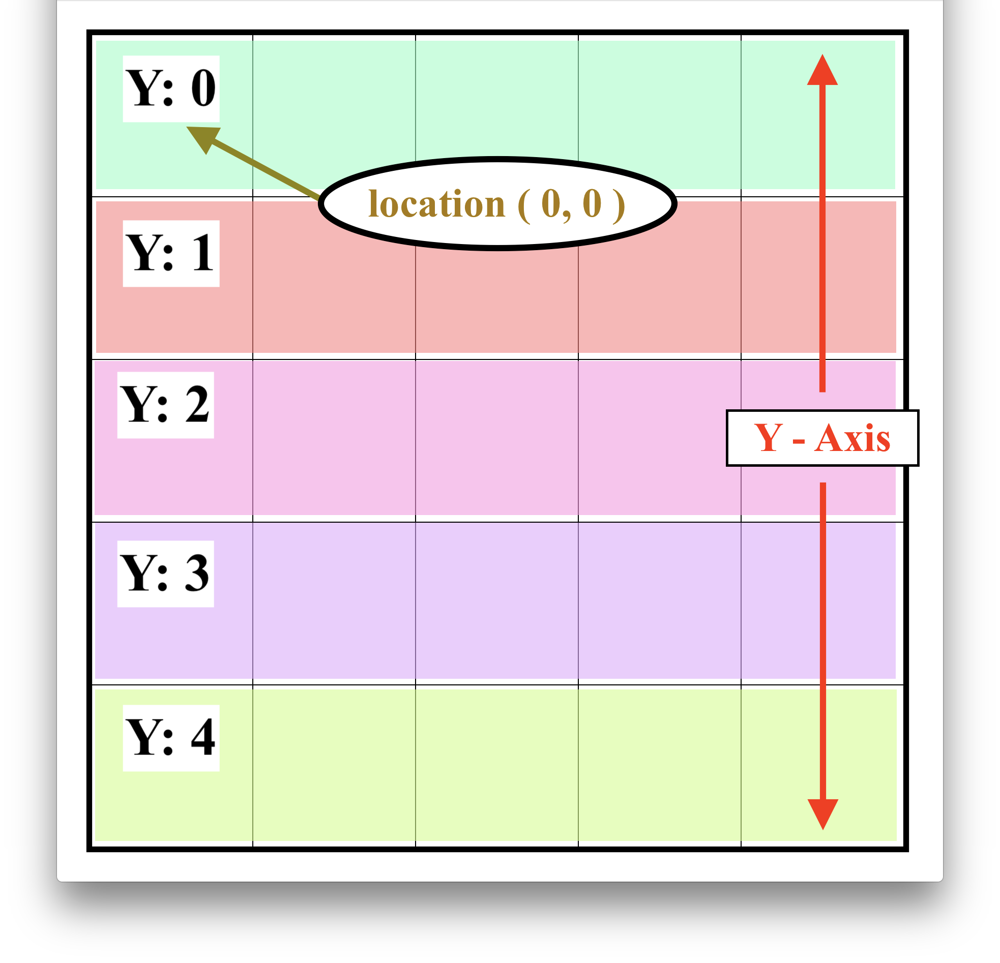
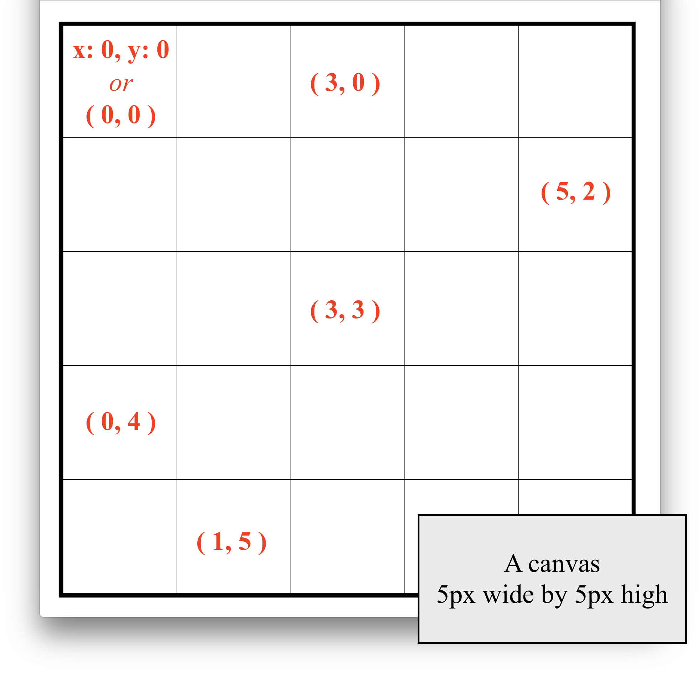
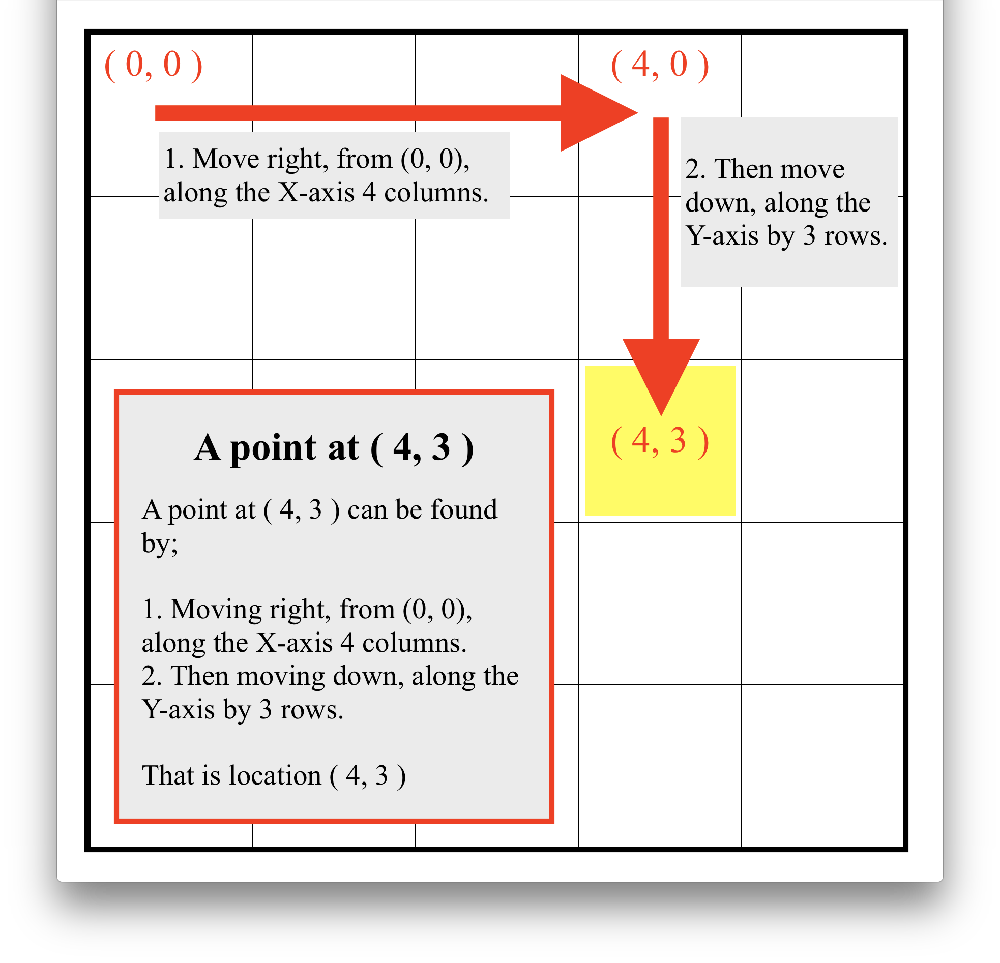
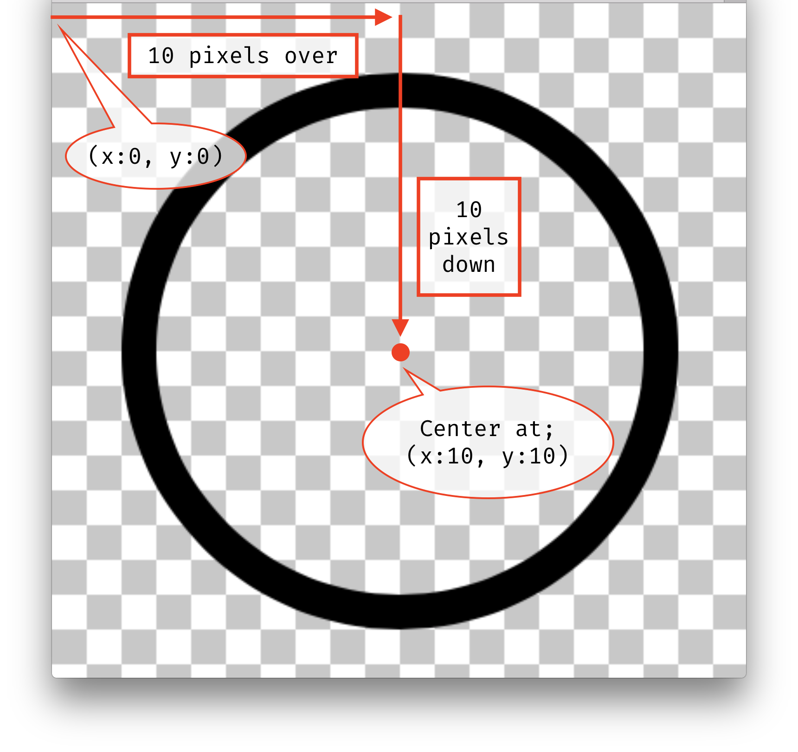
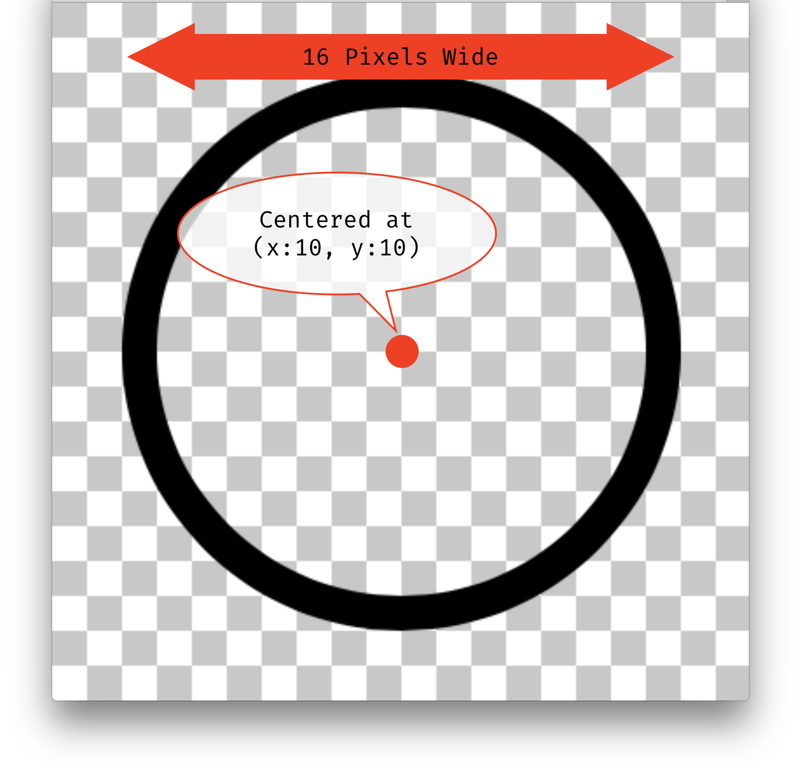

# Drawing in p5

OK, the last few weeks have been about technical information you needed to start working in p5. Enough with the technical nonsense. Let's get to actually making things and drawing.


<br />


So far we have learned;

1. What p5 is
2. How to download an empty example
3. How to create a basic sketch
4. How to open a sketch in the browser to view it
5. What a function is
6. What a parameter is
7. How to create a canvas of a specific size
8. How to change the background color of the canvas


<br />


That is a lot, but we still haven't even touched the surface of what is possible with p5 and coding. The goal for the rest of this week is to teach you how to draw primitive shapes, with the goal of having you create your own drawing.


If you remember back to the p5 "Hello World!" example, we drew a circle on the canvas. We did this using the `ellipse()` function, by specifying a location for the ellipse and size of the ellipse. If you went to the reference page on the p5 website like you were asked to do, you hopefully noticed that the `ellipse()` function belongs to the **Shape** group of functions. You might have even noticed, more specifically, that it belongs to the "_2D Primitives_" group.

[](https://p5js.org/reference/#group-Shape)

The 2D Primitives group of functions are used to draw basic shapes on to the canvas. We are now going to discuss qualities of the primitive shape group, along with a couple of the primitive shapes.

> After this lecture, you should visit, read, study, and practice using each of the primitive shapes. These are functions you will want knowledge and control over this semester. Remember, to learn more about a function, including; what it does, the expected input parameters, and how to use it, visit the functions associated documentation page from the [p5 documentation reference](https://p5js.org/reference/).


# The Grid, Location, and Sizes

Every function in the 2D Primitive Shape group will take at least one pair of Number parameters (`x` and `y`) that will help in defining the location of the shape. If we remember back to the `ellipse()` function, the first two parameters were used to define the "top-left" corner of the ellipse.

### Grid and Canvas Size

Location parameters will almost always come in a pair, in order to define both an `x` and `y` location on the canvas "_grid_". Our canvas is made up of pixels, that are laid out in a grid pattern. If we create a canvas that is 200 by 100 pixels ( `createCanvas( 200, 100 )` ), our resulting canvas and grid, will be 200 pixels in width and 100 pixels in height.


### Axes

The resulting grid of our canvas can be described with respect to its axes (_pronounced: AX-eez_). Just as in your geometry class from high school, there are two axes;

- _X-Axis_
- _Y-Axis_

Point _( 0, 0 )_ or X:0 - Y:0 for both axes is located in the top-left corner of the grid.

.")

<br />

##### X-Axis

The _X-Axis_ runs from left ( X: 0 ) to right. It is made up of columns. Every point on the grid in a vertical column will have the same `x` value.




##### Y-Axis

The _Y-Axis_ runs from top ( Y: 0 ) to bottom. It is made up of rows. Every point on the grid in a horizontal row will have the same `y` value.




#### Grid Points

Point on the grid are typically described as a comma separated pair wrapped in parentheses (i.e. (4, 3) ). In this notation, the first number is always the X coordinate, and the second the Y coordinate.




#### Navigating

At first, it can be tricky to navigate along the grid, or to start thinking in terms of a grid. But remembering a few key things will make it easier.

1. _The Top-Left corner is always ( 0, 0 )!_
2. _Since the first number is X, you should initially move from left-to-right, then find the Y position by moving from top-to-bottom.




# Return of the `ellipse()`

We have already talked about the `ellipse()` function. But, I want to revisit this function after out conversation about the canvas grid. As you remember, the `ellipse()` function takes 4 input parameters.

- `x` - the X location of the center of the ellipse.
- `y` - the Y location of the center of the ellipse.
- `w` - the width of the shape
- `h` - the height of the shape

Let's look at two images, explicitly showing the overlay of an ellipse on a grid.

The following p5 code would have been used to create this ellipse.

```js
function setup() {
    createCanvas( 20, 20 );
}

function draw() {
    ellipse( 10, 10, 16, 16 );
}
```

<br />

In this first image, we see explicitly how the "center" of the ellipse is located. From the top-left corner of the canvas grid at ( 0, 0 ), we would move 10 to the right, then 10 down, to get to ( 10, 10 ).




<br />

In this next image, we see that the ellipse is 16 pixels wide and 16 pixels high.




# `point()`

Let's now move on to some new shape functions. Perhaps the simplest of the primitive shape functions is the `point()` function.


- [Please read the `point()` functions documentation page.](https://p5js.org/reference/#/p5/point)


<br />


You should have discovered that the `point()` function draws a single point on the canvas, taking up 1 pixel.

This function also only accepts two parameters. These set the `x` and `y` coordinates of the point, respectively.


<br />

To place a point on the canvas, you simple need to provide the function name, along with two numbers for parameters, describing the X and Y locations of the point respectively.

In the following sketch, we create;

- a canvas that is 300px wide and 100px high
- color the background of the canvas a light blue
- place a single point at ( x: 100, y: 50 )

> NOTE: This point is a single pixel in size, so it more than likely looks like a little spec of dust on your screen.


```js
function setup() {
    createCanvas( 300, 100 );
    background( '#c8f1f9' );
}

function draw() {
    point( 100, 50 );
}
```

<div class="displayed_jotted_example">
    <div id="jotted-demo-1" class=""></div>
</div>
<script>
    new Jotted(document.querySelector("#jotted-demo-1"), {
    files: [
        {
            type: "js",
            url:"https://raw.githubusercontent.com/Montana-Media-Arts/120_CreativeCoding_Fall2017/master/lecture_code/03/01_point_01/sketch.js"
        },
        {
            type: "html",
            url:"../../../p5_resources/index.html"
    }],
    // plugins: [ "codemirror", "console" ]
    plugins: [ "codemirror" ]
});
</script>

| [**[Code Download]**](https://github.com/Montana-Media-Arts/120_CreativeCoding_Fall2017/raw/master/lecture_code/03/01_point_01/01_point_01.zip) | [**[View on GitHub]**](https://github.com/Montana-Media-Arts/120_CreativeCoding_Fall2017/raw/master/lecture_code/03/01_point_01/) | [**[Live Example]**](https://montana-media-arts.github.io/120_CreativeCoding_Fall2017/lecture_code/03/01_point_01/) |


#### Multiple Points

> What if you wanted to create more than one point? What do you think you would do?

To create more than one shape on a canvas, we simply need to write more commands that create more shapes. Following from the p5 `point()` documentation example; if we wanted to create 4 points, on the corners of a square, we would need to write 4 commands, each invoking the `point()` function with different locations for input parameters.

The following code demonstrates drawing four points, with each point on the corner of a square.

**Notice:** how every point has at least one X or Y coordinate in relation with another point.



function setup() {
    createCanvas( 300, 100 );
    background( '#c8f1f9' );
}

function draw() {
    point(30, 20);
    point(85, 20);
    point(85, 75);
    point(30, 75);
}


<div class="displayed_jotted_example">
    <div id="jotted-demo-2" class=""></div>
</div>
<script>
    new Jotted(document.querySelector("#jotted-demo-2"), {
    files: [
        {
            type: "js",
            url:"https://raw.githubusercontent.com/Montana-Media-Arts/120_CreativeCoding_Fall2017/master/lecture_code/03/01_point_02/sketch.js"
        },
        {
            type: "html",
            url:"../../../p5_resources/index.html"
    }],
    // plugins: [ "codemirror", "console" ]
    plugins: [ "codemirror" ]
});
</script>

| [**[Code Download]**](https://github.com/Montana-Media-Arts/120_CreativeCoding_Fall2017/raw/master/lecture_code/03/01_point_02/01_point_02.zip) | [**[View on GitHub]**](https://github.com/Montana-Media-Arts/120_CreativeCoding_Fall2017/raw/master/lecture_code/03/01_point_02/) | [**[Live Example]**](https://montana-media-arts.github.io/120_CreativeCoding_Fall2017/lecture_code/03/01_point_02/) |


# `rect()`

Another useful shape function, and one similar in behavior to the `ellipse()` is the `rect()` function. The `rect()` function is used to draw rectangles.

- [Please read the `rect()` reference page.](https://p5js.org/reference/#/p5/rect)


<br />

Just like the `ellipse()`, the `rect()` function can be invoked using 4 parameters;

- `x` - A number representing the x-coordinate of the rectangle. (By default, this is the top-left corner)
- `y` - A number representing the y-coordinate of the rectangle. (By default, this is the top-left corner)
- `w` - A number describing the width of the rectangle.
- `h` - A number describing the height of the rectangle.

Unlike the `ellipse()` function, by default, the `rect()` function's location is based off of the top-left corner of the rectangle.

The following code creates a rectangle that takes up 80% of the width and height of the specified canvas and places it in the middle of the canvas.



function setup() {
    createCanvas( 500, 600 );
    background( '#e3f9c8' );
}

function draw() {
    rect( 25, 30, 450, 540);
}


<div class="displayed_jotted_example">
    <div id="jotted-demo-3" class=""></div>
</div>
<script>
    new Jotted(document.querySelector("#jotted-demo-3"), {
    files: [
        {
            type: "js",
            url:"https://raw.githubusercontent.com/Montana-Media-Arts/120_CreativeCoding_Fall2017/master/lecture_code/03/02_rect_01/sketch.js"
        },
        {
            type: "html",
            url:"../../../p5_resources/index.html"
    }],
    // plugins: [ "codemirror", "console" ]
    plugins: [ "codemirror" ]
});
</script>

| [**[Code Download]**](https://github.com/Montana-Media-Arts/120_CreativeCoding_Fall2017/raw/master/lecture_code/03/02_rect_01/02_rect_01.zip) | [**[View on GitHub]**](https://github.com/Montana-Media-Arts/120_CreativeCoding_Fall2017/raw/master/lecture_code/03/02_rect_01/) | [**[Live Example]**](https://montana-media-arts.github.io/120_CreativeCoding_Fall2017/lecture_code/03/02_rect_01/) |

> Can you alter the above code, so that the rectangle becomes a square, that takes up 50% of the width of the canvas, and is still located in the middle?

#### Rounding It Out

As you hopefully also notice on the `rect()` function reference page, this function can accept a total of 4, 5, or 8 input parameters.

When 5 input parameters are present, p5 expects last parameter to be a number describing how "round" to make the corners of the resulting rectangle. This value represents the number of pixels to go in on each corner.

Below are rectangles with varying amounts of corner roundness.

```js
// a rectangle with 10px corners
rect( 20, 20, 300, 200, 10 );

// a rectangle with 90px corners
rect( 20, 240, 300, 200, 90 );
```

<div class="displayed_jotted_example">
    <div id="jotted-demo-4" class=""></div>
</div>
<script>
    new Jotted(document.querySelector("#jotted-demo-4"), {
    files: [
        {
            type: "js",
            url:"https://raw.githubusercontent.com/Montana-Media-Arts/120_CreativeCoding_Fall2017/master/lecture_code/03/02_rect_02/sketch.js"
        },
        {
            type: "html",
            url:"../../../p5_resources/index.html"
    }],
    // plugins: [ "codemirror", "console" ]
    plugins: [ "codemirror" ]
});
</script>

| [**[Code Download]**](https://github.com/Montana-Media-Arts/120_CreativeCoding_Fall2017/raw/master/lecture_code/03/02_rect_02/02_rect_02.zip) | [**[View on GitHub]**](https://github.com/Montana-Media-Arts/120_CreativeCoding_Fall2017/raw/master/lecture_code/03/02_rect_02/) | [**[Live Example]**](https://montana-media-arts.github.io/120_CreativeCoding_Fall2017/lecture_code/03/02_rect_02/) |


<br />

When 8 input parameters are present, the last 4 parameters each describe a roundness of a corner of the rectangle. The 5th parameter describes the top-left corner. The subsequent parameters describe the remaining corners clock-wise from the top-left.

```js
// a rectangle with various corner roundness
rect( 20, 20, 300, 300, 0, 90, 45, 130 );
```

<div class="displayed_jotted_example">
    <div id="jotted-demo-5" class=""></div>
</div>
<script>
    new Jotted(document.querySelector("#jotted-demo-5"), {
    files: [
        {
            type: "js",
            url:"https://raw.githubusercontent.com/Montana-Media-Arts/120_CreativeCoding_Fall2017/master/lecture_code/03/02_rect_03/sketch.js"
        },
        {
            type: "html",
            url:"../../../p5_resources/index.html"
    }],
    // plugins: [ "codemirror", "console" ]
    plugins: [ "codemirror" ]
});
</script>

| [**[Code Download]**](https://github.com/Montana-Media-Arts/120_CreativeCoding_Fall2017/raw/master/lecture_code/03/02_rect_03/02_rect_03.zip) | [**[View on GitHub]**](https://github.com/Montana-Media-Arts/120_CreativeCoding_Fall2017/raw/master/lecture_code/03/02_rect_03/) | [**[Live Example]**](https://montana-media-arts.github.io/120_CreativeCoding_Fall2017/lecture_code/03/02_rect_03/) |


# `triangle()`

The `triangle()` function is used to create and draw triangle shape objects.

- [Please read the `triangle()` functions reference page.](https://p5js.org/reference/#/p5/triangle)


<br />

The `triangle()` function takes exactly 6 input parameters. These can be more simply described as three pairs of X/Y points. These three point pairs are used to describe one of each of the triangle's own points.


The below code shows three triangles, with different positions on the screen.

```js
triangle( 50, 50, 250, 50, 150, 180 );
triangle( 350, 50, 550, 50, 450, 180 );
triangle( 10, 225, 590, 225, 375, 375 );
```

<div class="displayed_jotted_example">
    <div id="jotted-demo-6" class=""></div>
</div>
<script>
    new Jotted(document.querySelector("#jotted-demo-6"), {
    files: [
        {
            type: "js",
            url:"https://raw.githubusercontent.com/Montana-Media-Arts/120_CreativeCoding_Fall2017/master/lecture_code/03/04_triangle_01/sketch.js"
        },
        {
            type: "html",
            url:"../../../p5_resources/index.html"
    }],
    // plugins: [ "codemirror", "console" ]
    plugins: [ "codemirror" ]
});
</script>

| [**[Code Download]**](https://github.com/Montana-Media-Arts/120_CreativeCoding_Fall2017/raw/master/lecture_code/03/04_triangle_01/04_triangle_01.zip) | [**[View on GitHub]**](https://github.com/Montana-Media-Arts/120_CreativeCoding_Fall2017/raw/master/lecture_code/03/04_triangle_01/) | [**[Live Example]**](https://montana-media-arts.github.io/120_CreativeCoding_Fall2017/lecture_code/03/04_triangle_01/) |


# Additional Primitive Shape Functions

Now that we have gone over most of the 2D Primitive Shape functions, you should be capable of going over and understanding the three remaining functions.

On your own, please read through the documentation page for each of the remaining 2D Primitive Shape functions;

- [`line()` function](https://p5js.org/reference/#/p5/line)
- [`quad()` function](https://p5js.org/reference/#/p5/quad)
