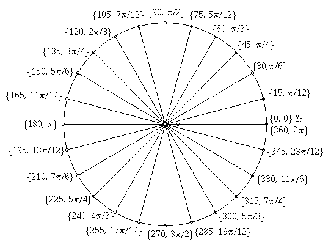
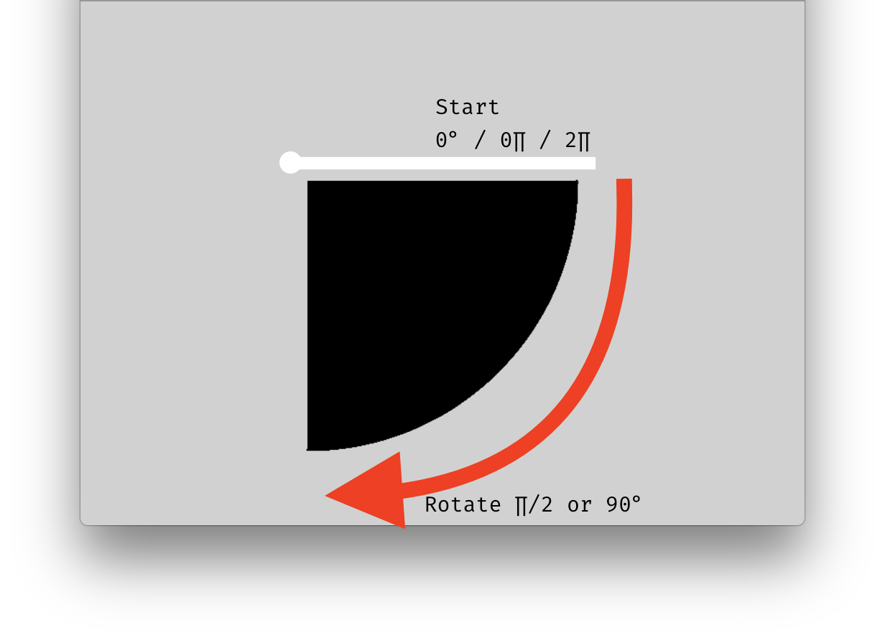

# `arc()` and Reviewing the Unit Circle

I want to specifically go over one more 2D Primitive Shape function with you. This is because it allows us the opportunity to discuss the "Unit Circle". The function is `arc()`. This function, as you will read, is used to draw, partial circles.

- [`arc()` function documentation](https://p5js.org/reference/#/p5/arc)

As you read, the `arc()` function requires 6 parameters, with an additional optional 7th. These would be best described as;

- `x` - the X location of the center of the arc.
- `y` - the Y location of the center of the arc.
- `w` - the width of the arc.
- `h` - the height of the arc.
- `start` - the starting position of the arc.
- `end` - the ending position of the arc.
- `mode` - Constant: _optional_ parameter to determine the way of drawing the arc. either CHORD or PIE.

Before we can discuss the `start` and `end` positions, we first need to review the unit circle and radians.

## Radians & a little bit of the Unit Circle

We are going to need to start thinking about rotation, and angles this week. By default, in p5, all angles are specified in "radians" as opposed to "degrees".

#### Radians

So, the first thing we need to do, is refresh our memories about radians vs. degrees. Please watch the following video, which goes into quite a lot of detail about the subject.

<div class="embed-responsive embed-responsive-16by9"><iframe class="embed-responsive-item" src="https://www.youtube.com/embed/wcfkDuFpbiM" frameborder="0" allowfullscreen></iframe></div>

<br />

The following figure shows the relationship between degrees and radians around the unit circle.



<br />


There are number of important take-aways from the above video and figure.

1. You must remember, that 0-rad/0° is at the right side of the unit circle, where 3 o'clock is on a clock's face.
2. 2∏  and 0 are at the same place. 2∏ signifies an entire rotation around the unit circle.
3. It is quite easy to convert between radians and degrees.

#### ONE MAJOR DIFFERENCE

There is one major difference, that you will notice in just a moment. In p5, 0 still starts at 3 o'clock, but the direction of travel is "clockwise", as opposed to the more traditional, counter-clockwise, as is seen on the unit circle.

## Drawing `arc()`

To use the `arc()` function, we need to specify the first 4 parameters, just as we would for `ellipse()`. The 5th and 6th parameters then specify how much of an arc to actually draw. More specifically, they specify where to start, and where to stop drawing. REMEMBER: the arc function goes clockwise.

If we wanted to draw a quarter arc, from 3 o'clock to 6 o'clock, we would specify a starting angle of `0` radians, and a ending angle of `∏` radians.



However, JavaScript does not recognize the `∏` symbol. Instead, there are a number of environment constants we will use for ∏. These are;

- ∏ = `PI`
- ∏ / 2 = `HALF_PI`
- ∏ / 4 = `QUARTER_PI`
- 2∏ = `TWO_PI`

Therefore, our ending angle would be `HALF_PI`.

> `PI` in p5, is an "environment constant". This means you can always use this word to return the value of ∏. Likewise, `TWO_PI` will always return the value of 2∏.
>
> For more info, please see the [`PI` reference page](https://p5js.org/reference/#/p5/PI)


In code, this might look like;

```js
arc( 300, 200, 300, 300, 0, HALF_PI );
```

Which would result in;


<div id="jotted-demo-1" class="jotted-theme-stacked"></div>
</div>
<script>
    new Jotted(document.querySelector("#jotted-demo-1"), {
    files: [
        {
            type: "js",
            url:"https://raw.githubusercontent.com/Montana-Media-Arts/120_CreativeCoding/master/lecture_code/04/04_arc_01/sketch.js"
        },
        {
            type: "html",
            url:"../../../p5_resources/index.html"
    }],
    // plugins: [ "codemirror", "console" ]
    plugins: [ "codemirror" ]
});
</script>

| [**[ Code Download ]**](https://github.com/Montana-Media-Arts/120_CreativeCoding/raw/master/lecture_code/04/04_arc_01/04_arc_01.zip) | [**[ View on GitHub ]**](https://github.com/Montana-Media-Arts/120_CreativeCoding/raw/master/lecture_code/04/04_arc_01/) | [**[ Live Example ]**](https://montana-media-arts.github.io/120_CreativeCoding/lecture_code/04/04_arc_01/) |


### Slice of Pie

Following from the above example, let's now make a small slice of pie, that is only 1/8<sup>th</sup> the rotation of the circle. To do this, we might start at `QUARTER_PI` and end at `HALF_PI`.


```js
arc( 300, 200, 300, 300, QUARTER_PI, HALF_PI );
```


<div id="jotted-demo-2" class="jotted-theme-stacked"></div>
</div>
<script>
new Jotted(document.querySelector("#jotted-demo-2"), {
    files: [
        {
            type: "js",
            url:"https://raw.githubusercontent.com/Montana-Media-Arts/120_CreativeCoding/master/lecture_code/04/04_arc_02/sketch.js"
        },
        {
            type: "html",
            url:"../../../p5_resources/index.html"
        }],
        // plugins: [ "codemirror", "console" ]
        plugins: [ "codemirror" ]
    });
</script>

| [**[ Code Download ]**](https://github.com/Montana-Media-Arts/120_CreativeCoding/raw/master/lecture_code/04/04_arc_02/04_arc_02.zip) | [**[ View on GitHub ]**](https://github.com/Montana-Media-Arts/120_CreativeCoding/raw/master/lecture_code/04/04_arc_02/) | [**[ Live Example ]**](https://montana-media-arts.github.io/120_CreativeCoding/lecture_code/04/04_arc_02/) |

# Using Degrees Directly With `radians()`

It is possible to convert between degrees and radians with a simple mathematical formula, as was discussed in the above video. I believe it is important for you to practice specifying angles using radians, as this will come up quite often within p5 and a lot of other creative coding applications.

However, if you would instead like to use degrees to specify angles, you can do so by passing the degree number to a function that will convert from degrees to radians. You can then pass the output of this function directly to any function parameter that requires an angle in radians.

This function is `radians()`, which takes as its sole parameter, a number representing degrees. This then returns the equivalent angle in radians.

So, for example, we could specify a pie slice, like in the above example, by passing a degree value to the `radians()` function, which we would pass directly to the angle parameters of the `arc()` function.

```js
arc( 300, 200, 300, 300, radians(260), radians(280) );
```


<div id="jotted-demo-7" class="jotted-theme-stacked"></div>
</div>
<script>
    new Jotted(document.querySelector("#jotted-demo-7"), {
    files: [
        {
            type: "js",
            url:"https://raw.githubusercontent.com/Montana-Media-Arts/120_CreativeCoding/master/lecture_code/04/04_arc_degrees_01/sketch.js"
        },
        {
            type: "html",
            url:"../../../p5_resources/index.html"
    }],
    // plugins: [ "codemirror", "console" ]
    plugins: [ "codemirror" ]
});
</script>

| [**[ Code Download ]**](https://github.com/Montana-Media-Arts/120_CreativeCoding/raw/master/lecture_code/04/04_arc_degrees_01/04_arc_degrees_01.zip) | [**[ View on GitHub ]**](https://github.com/Montana-Media-Arts/120_CreativeCoding/raw/master/lecture_code/04/04_arc_degrees_01/) | [**[ Live Example ]**](https://montana-media-arts.github.io/120_CreativeCoding/lecture_code/04/04_arc_degrees_01/) |


# `PIE` vs `CHORD`

The last parameter that we may _optionally_ pass to the `arc()` function determines whether the arc is drawn as a "PIE" or a "CHORD". This determines, how the arc is connected when greater than PI or 180° (You will immediately see the difference between the two of these "draw modes").

To set the specific draw mode of the `arc()` function, we must use another "environment constant", as the 7th parameter. Either;

- `PIE`
- `CHORD`

To demonstrate, let's draw an arc that goes from `HALF_PI` or 6 o'clock, to `0` or 3 o'clock. (This is essentially the inverse of our first example.)

We will also draw these next two each other, with the default `PIE` version on the left. To do this, we will only change the x-location parameter, and the drawing mode, between the two arcs.

```js
arc( 150, 200, 180, 180, HALF_PI, 0, PIE );
arc( 450, 200, 180, 180, HALF_PI, 0, CHORD );
```


<div id="jotted-demo-3" class="jotted-theme-stacked"></div>
</div>
<script>
    new Jotted(document.querySelector("#jotted-demo-3"), {
    files: [
        {
            type: "js",
            url:"https://raw.githubusercontent.com/Montana-Media-Arts/120_CreativeCoding/master/lecture_code/04/04_arc_03/sketch.js"
        },
        {
            type: "html",
            url:"../../../p5_resources/index.html"
    }],
    // plugins: [ "codemirror", "console" ]
    plugins: [ "codemirror" ]
});
</script>

| [**[ Code Download ]**](https://github.com/Montana-Media-Arts/120_CreativeCoding/raw/master/lecture_code/04/04_arc_03/04_arc_03.zip) | [**[ View on GitHub ]**](https://github.com/Montana-Media-Arts/120_CreativeCoding/raw/master/lecture_code/04/04_arc_03/) | [**[ Live Example ]**](https://montana-media-arts.github.io/120_CreativeCoding/lecture_code/04/04_arc_03/) |
