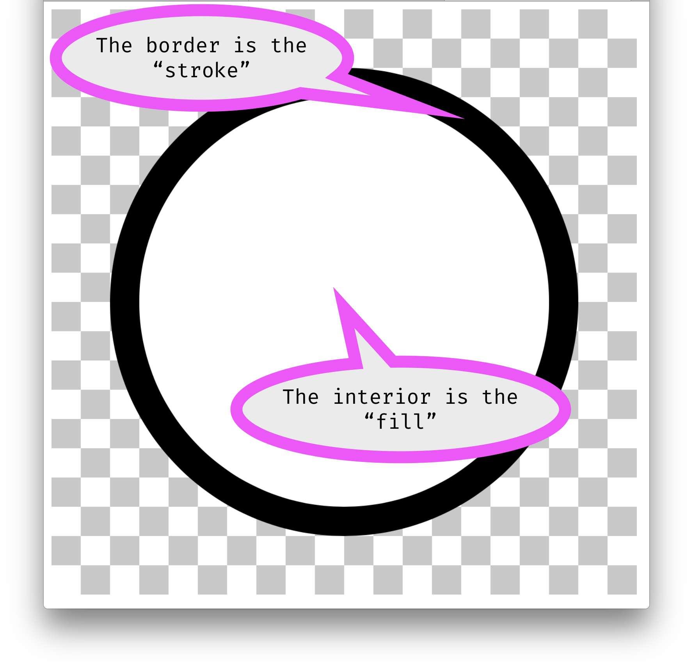

# Shape Color

So far, we have seen how to create 2D Primitive Shapes, and how to change the color of the background. But, all of our shapes have been filled with black. Obviously, there must be a way to change the color of shapes.

## The Parts of a Shape

Before we jump into functions to color shapes, we need to define the two parts of a shape that can be adjusted. These are the;

- border / stroke()
- interior / fill()




# Change The Interior Color with `fill()`

To change the interior color of a shape, or the fill, we need to call the `fill()` function. Just like the `background()` function, we pass this function a color as parameters. When called, this function will cause the colors of every shape below it have their interiors filled with the specified color.

> Just like `background()`, we will use "named color strings" with these new color functions. We will discuss 4 more ways to specify color on the next page.

<br />


In the below example, notice how the shapes take on different colors depending on the `fill()` function most closely above them.

```js
fill('blue');
rect( 20, 20, 480, 50 );
ellipse( 250, 105, 400, 50 );

fill('yellow');
ellipse( 250, 160, 300, 50 );

fill('orange');
triangle( 20, 205, 250, 255, 480, 255 );
rect( 60, 275, 120, 50 );
```

<div class="displayed_jotted_example">
    <div id="jotted-demo-1" class=""></div>
</div>
<script>
    new Jotted(document.querySelector("#jotted-demo-1"), {
    files: [
        {
            type: "js",
            url:"https://raw.githubusercontent.com/Montana-Media-Arts/120_CreativeCoding/master/lecture_code/04/05_fill_01/sketch.js"
        },
        {
            type: "html",
            url:"../../../p5_resources/index.html"
    }],
    // plugins: [ "codemirror", "console" ]
    plugins: [ "codemirror" ]
});
</script>

| [**[Code Download]**](https://github.com/Montana-Media-Arts/120_CreativeCoding/raw/master/lecture_code/04/05_fill_01/05_fill_01.zip) | [**[View on GitHub]**](https://github.com/Montana-Media-Arts/120_CreativeCoding/raw/master/lecture_code/04/05_fill_01/) | [**[Live Example]**](https://montana-media-arts.github.io/120_CreativeCoding/lecture_code/04/05_fill_01/) |

# `noFill()`

In addition to setting the interior color with the `fill()` function, the interior of shapes can also be set to "no-fill", using the `noFill()` function.

- [`noFill()` reference page](https://p5js.org/reference/#/p5/noFill)

The `noFill` function will leave a shape only with the border.

Since the `noFill()` function removes a shapes fill or interior color, there are no parameters to pass this function. Therefore, the parenthesis remain empty.

> NOTE: To fill subsequent shapes, below a no-fill shape, just call the `fill()` function again.

In the below example, two shapes are drawn with fills and two without.

Notice: How the order placement in the sketch causes shapes to stack on each other.

```js
fill('purple');
rect( 20, 20, 300, 100 );

noFill();
rect( 150, 70, 300, 150 );

fill('yellow');
ellipse( 250, 270, 300, 150 );

noFill();
triangle( 20, 330, 250, 20, 480, 330 );
```

<div class="displayed_jotted_example">
    <div id="jotted-demo-2" class=""></div>
</div>
<script>
    new Jotted(document.querySelector("#jotted-demo-2 "), {
    files: [
        {
            type: "js",
            url:"https://raw.githubusercontent.com/Montana-Media-Arts/120_CreativeCoding/master/lecture_code/04/05_fill_02/sketch.js"
        },
        {
            type: "html",
            url:"../../../p5_resources/index.html"
    }],
    // plugins: [ "codemirror", "console" ]
    plugins: [ "codemirror" ]
});
</script>

| [**[Code Download]**](https://github.com/Montana-Media-Arts/120_CreativeCoding/raw/master/lecture_code/04/05_fill_02/05_fill_02.zip) | [**[View on GitHub]**](https://github.com/Montana-Media-Arts/120_CreativeCoding/raw/master/lecture_code/04/05_fill_02/) | [**[Live Example]**](https://montana-media-arts.github.io/120_CreativeCoding/lecture_code/04/05_fill_02/) |


# Specifying a Border Color with `stroke()`

In addition to specifying the interior fill color, shapes can also have their border color specified with the `stroke()` function.

- [`stroke()` reference page](https://p5js.org/reference/#/p5/stroke)

Like the `fill()` and `background()` functions, for the moment, we will pass the `stroke()` function "named color strings" to specify color.

Also, like `fill()`, the `stroke()` function effects any shape objects that are below it. However, it can be overwritten by specifying new `stroke()` statements.

In the below example, we remove the fill of the first two shapes, so that the stroke color can be seen more clearly.

```js
noFill();

stroke('red');
rect( 20, 20, 300, 100 );

stroke('green');
triangle( 20, 330, 250, 20, 480, 330 );

stroke('pink');
fill('yellow');
ellipse( 250, 250, 280, 130 );
```

<div class="displayed_jotted_example">
    <div id="jotted-demo-3" class=""></div>
</div>
<script>
    new Jotted(document.querySelector("#jotted-demo-3"), {
    files: [
        {
            type: "js",
            url:"https://raw.githubusercontent.com/Montana-Media-Arts/120_CreativeCoding/master/lecture_code/04/06_stroke_01/sketch.js"
        },
        {
            type: "html",
            url:"../../../p5_resources/index.html"
    }],
    // plugins: [ "codemirror", "console" ]
    plugins: [ "codemirror" ]
});
</script>

| [**[Code Download]**](https://github.com/Montana-Media-Arts/120_CreativeCoding/raw/master/lecture_code/04/06_stroke_01/06_stroke_01.zip) | [**[View on GitHub]**](https://github.com/Montana-Media-Arts/120_CreativeCoding/raw/master/lecture_code/04/06_stroke_01/) | [**[Live Example]**](https://montana-media-arts.github.io/120_CreativeCoding/lecture_code/04/06_stroke_01/) |


# Specifying the Size of Stroke with `strokeWeight()`

As is clearly seen in the above example, the default stroke or border for shapes is only 1px in width. Many times, when specifying stroke to have well defined border, it will also be desirable to specify that the border be wider. This can be accomplished with the `strokeWeight()` function.

- [`strokeWeight()` reference page](https://p5js.org/reference/#/p5/strokeWeight)

This function takes a single input parameter that sets the stroke weight or thickness of a border. This function expects this parameter to be a number specifying the number of pixels to make the stroke weight.

> NOTE: In the below example notice the use of the `line()` and `point()` functions, which can only be used with `stroke()`-based functions as they have no interior.

```js
stroke('black');
strokeWeight(1);
line( 20, 20, 480, 20 );

strokeWeight(4);
line( 20, 40, 480, 40 );

strokeWeight(10);
line( 20, 70, 480, 70 );

strokeWeight(20);
line( 20, 100, 480, 100 );

stroke('pink');
strokeWeight( 6 );
point( 20, 130 );

stroke('magenta');
strokeWeight( 15 );
point( 50, 150 );

stroke('red');
strokeWeight( 30 );
point( 95, 180 );

stroke('orange');
strokeWeight( 60 );
point( 185, 220 );
```

<div class="displayed_jotted_example">
    <div id="jotted-demo-4" class=""></div>
</div>
<script>
    new Jotted(document.querySelector("#jotted-demo-4"), {
    files: [
        {
            type: "js",
            url:"https://raw.githubusercontent.com/Montana-Media-Arts/120_CreativeCoding/master/lecture_code/04/06_stroke_02/sketch.js"
        },
        {
            type: "html",
            url:"../../../p5_resources/index.html"
    }],
    // plugins: [ "codemirror", "console" ]
    plugins: [ "codemirror" ]
});
</script>

| [**[Code Download]**](https://github.com/Montana-Media-Arts/120_CreativeCoding/raw/master/lecture_code/04/06_stroke_02/06_stroke_02.zip) | [**[View on GitHub]**](https://github.com/Montana-Media-Arts/120_CreativeCoding/raw/master/lecture_code/04/06_stroke_02/) | [**[Live Example]**](https://montana-media-arts.github.io/120_CreativeCoding/lecture_code/04/06_stroke_02/) |

> The stroke weight is not bound by the "size" of an object. In other words, half other stroke's width will be inside where the size of the object specifies the outer edge, and the other half will be outside.
>
> This means that if you set an `ellipse()` to have a width of 20px, for example. And specify it also has a stroke weight of 10px. The total width of the ellipse will actually be 30px (20px + 10px).

# Shapes Without Borders, Using `noStroke()`

Just like the `noFill()` function, we can also specify a shape to have no border using the `noStroke()` function.

```js
// shape with fill and border
fill('purple');
stroke('black');
strokeWeight(8);
rect( 20, 20, 300, 100 );

// shape with no fill
noFill();
stroke('black');
strokeWeight(8);
rect( 150, 70, 300, 150 );

// shape with no border
fill('red');
noStroke();
ellipse( 180, 200, 300, 100 );
```

<div class="displayed_jotted_example">
    <div id="jotted-demo-5" class=""></div>
</div>
<script>
    new Jotted(document.querySelector("#jotted-demo-5"), {
    files: [
        {
            type: "js",
            url:"https://raw.githubusercontent.com/Montana-Media-Arts/120_CreativeCoding/master/lecture_code/04/06_stroke_03/sketch.js"
        },
        {
            type: "html",
            url:"../../../p5_resources/index.html"
    }],
    // plugins: [ "codemirror", "console" ]
    plugins: [ "codemirror" ]
});
</script>

| [**[Code Download]**](https://github.com/Montana-Media-Arts/120_CreativeCoding/raw/master/lecture_code/04/06_stroke_03/06_stroke_03.zip) | [**[View on GitHub]**](https://github.com/Montana-Media-Arts/120_CreativeCoding/raw/master/lecture_code/04/06_stroke_03/) | [**[Live Example]**](https://montana-media-arts.github.io/120_CreativeCoding/lecture_code/04/06_stroke_03/) |
