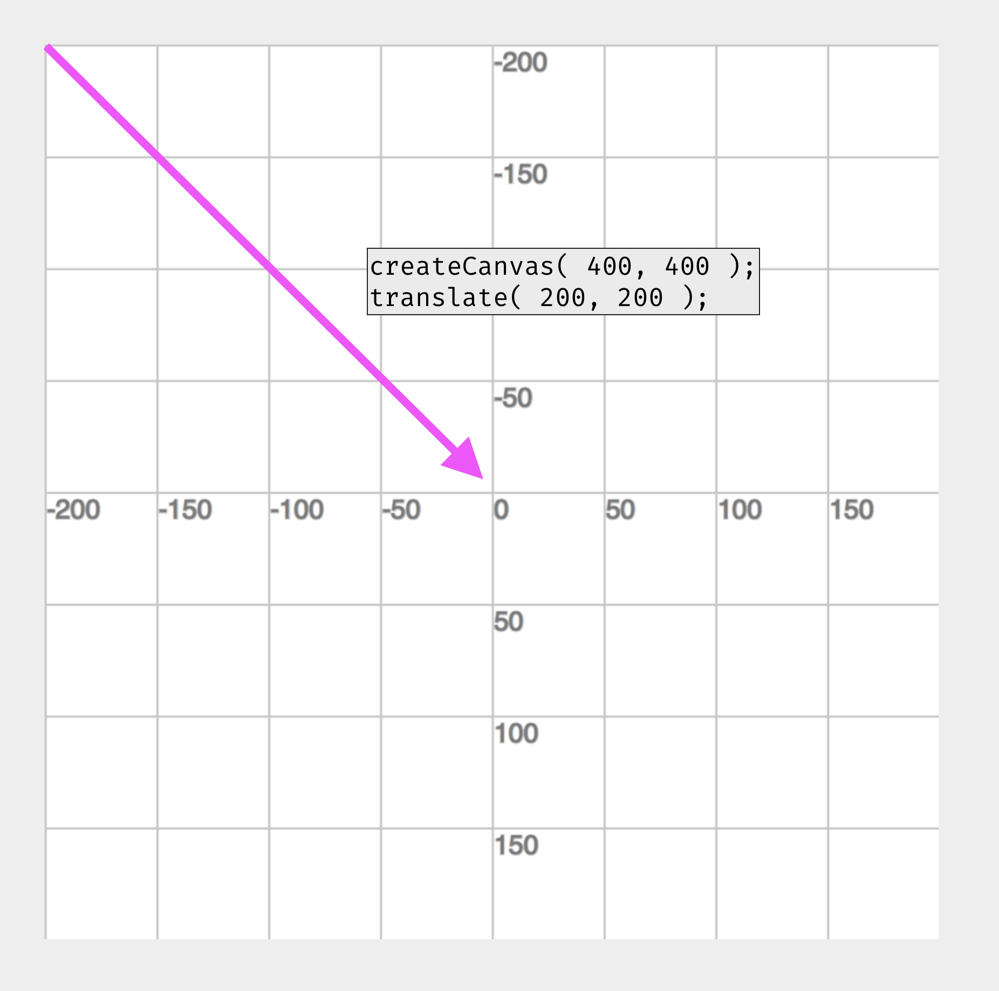
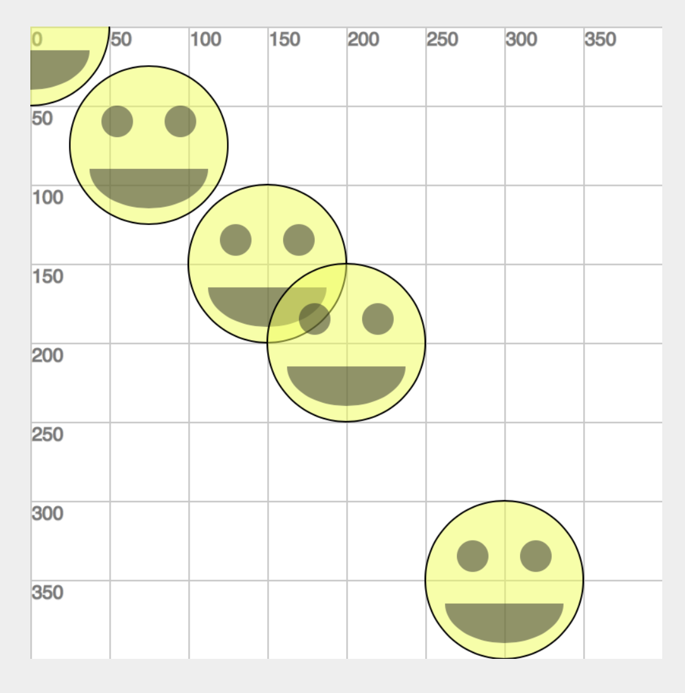

# Transformations

As I am sure you can imagine, with the tools and techniques presented so far, you could start to create pretty interesting drawing sketches. There are four more functions that I want you to work with this week. These functions will make the process of drawing and creating complicated sketched easier, as they will assist in transforming shapes. These functions are;

- `translate()`
- `rotate()`
- `scale()`
- `push()` & `pop()` (which are always used together)


# `translate()`

The first of these that we will look at is the `translate()` function.

- [`translate()` reference page](https://p5js.org/reference/#/p5/translate)


<br />

The translate function allows us to move the center, or the (0,0) point of the grid to somewhere else on the grid.

For example, in the first image, we see the default grid for p5, with (0,0) in the top-left corner, and grid lines every 50 pixels.

 in the top-left corner.")

Now, if the translate function is called, with parameters of (150, 100), the grid will be moved over 150 pixels from left-to-right, and down 100 pixels.

```js
translate( 150, 100 );
```

 in translated to 'translate(150, 100)'.")


Not only would this move the grid, but any shapes below the translate function will also be moved by x:150px and y:100px.

For example, an ellipse with coordinates (x:0, y:0), below `translate(150, 100);`, would now actually be drawn at (x:150, y:100).

Likewise, a rectangle, with coordinates (x:50, y:50), below this same translate would now actually be drawn at (x:200, y:150). We get this new value by adding the translate x value to the rectangle x value.

The below example attempts to demonstrate these relationships.

```js
translate( 150, 100 );

noStroke();
fill( 'rgba(89, 255, 91, 0.5)' );
ellipse( 0, 0, 50 );

fill( 'rgba(89, 210, 255, 0.5)' );
rect( 50, 50, 100, 100 );
```

")

<div class="displayed_jotted_example">
    <div id="jotted-demo-1" class=""></div>
</div>
<script>
    new Jotted(document.querySelector("#jotted-demo-1"), {
    files: [
        {
            type: "js",
            url:"https://raw.githubusercontent.com/Montana-Media-Arts/120_CreativeCoding_Fall2017/master/lecture_code/04/09_translate_01/sketch.js"
        },
        {
            type: "html",
            url:"../../../p5_resources/index.html"
    }],
    // plugins: [ "codemirror", "console" ]
    plugins: [ "codemirror" ]
});
</script>


| [**[Code Download]**](https://github.com/Montana-Media-Arts/120_CreativeCoding_Fall2017/raw/master/lecture_code/04/09_translate_01/09_translate_01.zip) | [**[View on GitHub]**](https://github.com/Montana-Media-Arts/120_CreativeCoding_Fall2017/raw/master/lecture_code/04/09_translate_01/) | [**[Live Example]**](https://montana-media-arts.github.io/120_CreativeCoding_Fall2017/lecture_code/04/09_translate_01/) |


# Use Case

Using translate can be particularly useful for sketches where you are drawing shapes in relationship to each other. For example, we could use translate to move the (x:0, y:0) point of the grid to the "center" of the canvas. Then use negative numbers to draw shapes above, below, left, and right of the "center".

For example, if we specify a canvas of (width:400, height:400),

```js
createCanvas( 400, 400 );
```

Then we could specify a translate of (x:200px, y:200px),

```js
translate( 200, 200 );
```

Thereby moving the (x:0, y:0) point of the grid, to the center of the canvas.




We could now create a smiley face very easily in the center of the canvas with the following code.

```js
createCanvas( 400, 400 );
// move center of grid (x:0, y:0), to center of canvas
translate( 200, 200 );

// ** draw the smily face head **
// This ellipse is centered at (x:0, y:0)
// which is possible due to the translate()
ellipse( 0, 0, 400 );

// ** draw the smiley face mouth **
// This is centered on the 0-point, of the x-axis
arc( 0, 50, 300, 200, 0, PI );

// ** draw smily face eyes **
// (notice the use of negative numbers to go "above" 0
// and to draw the left eye)
// In other words they have the same y-value (-15px)
// And the x-value is mirrored (left:-20px right:20px)
// ** left eye **
ellipse( -100, -75, 100 );
// ** right eye **
ellipse( 100, -75, 100 );
```

")

And the live example, with full code would look like...

<div class="displayed_jotted_example">
    <div id="jotted-demo-2" class=""></div>
</div>
<script>
    new Jotted(document.querySelector("#jotted-demo-2"), {
    files: [
        {
            type: "js",
            url:"https://raw.githubusercontent.com/Montana-Media-Arts/120_CreativeCoding_Fall2017/master/lecture_code/04/10_translateSmiley_01/sketch.js"
        },
        {
            type: "html",
            url:"../../../p5_resources/index.html"
    }],
    // plugins: [ "codemirror", "console" ]
    plugins: [ "codemirror" ]
});
</script>

| [**[Code Download]**](https://github.com/Montana-Media-Arts/120_CreativeCoding_Fall2017/raw/master/lecture_code/04/10_translateSmiley_01/10_translateSmiley_01.zip) | [**[View on GitHub]**](https://github.com/Montana-Media-Arts/120_CreativeCoding_Fall2017/raw/master/lecture_code/04/10_translateSmiley_01/) | [**[Live Example]**](https://montana-media-arts.github.io/120_CreativeCoding_Fall2017/lecture_code/04/10_translateSmiley_01/) |


# Translates Compound

One of the qualities about transformation functions, is that the are additive or compound. This means that they will add together.

So for example, if you specify a translate function of `translate( 40, 40 )`, and later in your code specify another translate of `translate( 30, 30 )`, everything below that second translate will actually be moved to be based off of (x:70, y:70). This is because ( x:40, y: 40 ) + ( x:30, y:30 ) = ( x: 70, y: 70 ).

Notice in the following code, that each smiley is moved further with each translate. (the smiley, for purposes of brevity, will be represented by `smiley()` in the below code example. Please look at the JavaScript tab of the Results section for the full code.)

```js
// no translate, smiley at true
// (x:0, y:0)
// ** draw the smily face **
smiley();

// translate to (x:75, y:75)
// smiley centered at (x:75, y:75)
translate( 75, 75 );
// ** draw the smily face **
smiley();

// translate to (x:75, y:75)
// smiley centered at (x:150, y:150)
// prev(x:75, y:75) + new(x:75, y:75)
translate( 75, 75 );
// ** draw the smily face **
smiley();

// translate to (x:50, y:50)
// prev(x:150, y:150) + new(x:50, y:50)
// smiley centered at (x:200, y:200)
translate( 50, 50 );
// ** draw the smily face **
smiley();

// translate to (x:100, y:150)
// prev(x:200, y:200) + new(x:100, y:150)
// smiley centered at (x:300, y:250)
translate( 100, 150 );
// ** draw the smily face **
smiley();
```



<div class="displayed_jotted_example">
    <div id="jotted-demo-3" class=""></div>
</div>
<script>
    new Jotted(document.querySelector("#jotted-demo-3"), {
    files: [
        {
            type: "js",
            url:"https://raw.githubusercontent.com/Montana-Media-Arts/120_CreativeCoding_Fall2017/master/lecture_code/04/10_translateSmiley_02/sketch.js"
        },
        {
            type: "html",
            url:"../../../p5_resources/index.html"
    }],
    // plugins: [ "codemirror", "console" ]
    plugins: [ "codemirror" ]
});
</script>

| [**[Code Download]**](https://github.com/Montana-Media-Arts/120_CreativeCoding_Fall2017/raw/master/lecture_code/04/10_translateSmiley_02/10_translateSmiley_02.zip) | [**[View on GitHub]**](https://github.com/Montana-Media-Arts/120_CreativeCoding_Fall2017/raw/master/lecture_code/04/10_translateSmiley_02/) | [**[Live Example]**](https://montana-media-arts.github.io/120_CreativeCoding_Fall2017/lecture_code/04/10_translateSmiley_02/) |
