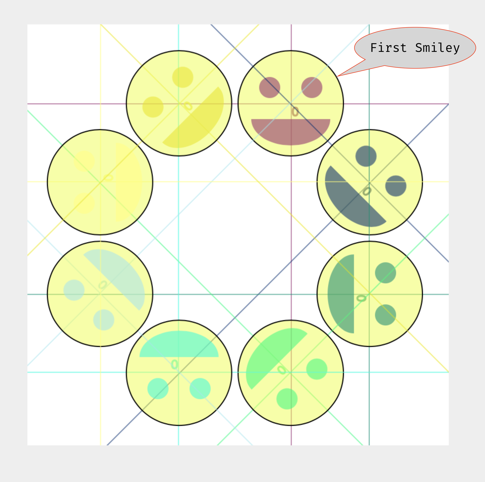

# Rotation with `rotate()`

The next transformation function we will look at is `rotate()` which, rotates a canvas around the (x:0, y:0) point of the grid.

- [`rotate()` reference](https://p5js.org/reference/#/p5/rotate)

<br />


Just like the `arc()` function, this function expects angles to be specified in radians. This means you can pass in values based off of ∏, or can use the `radians()` function to convert degree values to radian values.

The following example, shows the same grid from the last page. This grid is shown being rotated 15°, around the (x:0, y:0) point.

")

<br />


This means that if we had a rectangle drawn at (x:50, y:50), it would also be rotated 15° clockwise, around the center point of the grid (x:0, y:0).

")

<br />


The rotate function, rotates around the (x:0, y:0) point of the grid. Therefore, if we call the translate function first, the rotation will occur around this new point. If we translated (x:0, y:0) to the center of the canvas first, then rotated, the rectangle would be rotated around the center of the canvas.

```js
// assuming a canvas of (width:400, height:400)
translate( 200, 200 );
rotate( radians(15) );
rect( 50, 50, 50, 50 );
```

 and rotate() work together.")


<div id="jotted-demo-2" class="jotted-theme-stacked"></div>

<script>
    new Jotted(document.querySelector("#jotted-demo-2"), {
    files: [
        {
            type: "js",
            hide: false,
            url:"https://raw.githubusercontent.com/Montana-Media-Arts/120_CreativeCoding/master/lecture_code/04/11_rotate_01/sketch.js"
        },
        {
            type: "html",
            hide: true,
            url:"../../../p5_resources/index.html"
        }
    ],
    showBlank: false,
    showResult: true,
    plugins: [
        { name: 'ace', options: { "maxLines": 50 } },
        // { name: 'console', options: { autoClear: true } },
    ]
});
</script>

| [**[ Code Download ]**](https://github.com/Montana-Media-Arts/120_CreativeCoding/raw/master/lecture_code/04/11_rotate_01/11_rotate_01.zip) | [**[ View on GitHub ]**](https://github.com/Montana-Media-Arts/120_CreativeCoding/raw/master/lecture_code/04/11_rotate_01/) | [**[ Live Example ]**](https://montana-media-arts.github.io/120_CreativeCoding/lecture_code/04/11_rotate_01/) |


# Rotating Smiley Faces

Let's now use the rotate function to rotate a number of smiley faces on a canvas. Again, in the example code, we will replace the code for the smiley faces with a stand-in function `smiley()`. To see all of the code, view or download the code result output further down.

This will work quite nice, as we have built our smiley face around (x:0, y:0). Therefore, the smiley will rotate in place, dependent on the most recent translate.

In the following example, after the first smiley face is placed, each subsequent smiley face is translated by `translate(75,75);`, and rotated by `rotate( radians(45) );`.

Since rotate changes the orientation of the grid, when we call translate a second time, the grid is translated in relation to the new angle of rotation. This occurs 8 times, which results in a circle of smiley faces. The image below shows the 8 smileys, with a single set of grid lines behind each one, to demonstrate the "center" of the grid at that moment.

> Just like `translate()`, the `rotate()` function is cumulative. This means if you call rotate twice, these will add together.


```js
// no rotate
// translate to (x:200, y:75)
// place initial smiley on the canvas.
// all other smiley's are in relation to this one.
translate( 250, 75 );
smiley();

// rotate 45°
// translate to (x:75, y:75)
translate( 75, 75 );
rotate( radians(45) );
smiley();

// rotate 45°
// translate to (x:75, y:75)
translate( 75, 75 );
rotate( radians(45) );
smiley();

// rotate 45°
// translate to (x:75, y:75)
translate( 75, 75 );
rotate( radians(45) );
smiley();

// rotate 45°
// translate to (x:75, y:75)
translate( 75, 75 );
rotate( radians(45) );
smiley();

// rotate 45°
// translate to (x:75, y:75)
translate( 75, 75 );
rotate( radians(45) );
smiley();

// rotate 45°
// translate to (x:75, y:75)
translate( 75, 75 );
rotate( radians(45) );
smiley();

// rotate 45°
// translate to (x:75, y:75)
translate( 75, 75 );
rotate( radians(45) );
smiley();
```




<div id="jotted-demo-1" class="jotted-theme-stacked"></div>

<script>
    new Jotted(document.querySelector("#jotted-demo-1"), {
    files: [
        {
            type: "js",
            hide: false,
            url:"https://raw.githubusercontent.com/Montana-Media-Arts/120_CreativeCoding/master/lecture_code/04/12_rotateSmiley_01/sketch.js"
        },
        {
            type: "html",
            hide: true,
            url:"../../../p5_resources/index.html"
        }
    ],
    showBlank: false,
    showResult: true,
    plugins: [
        { name: 'ace', options: { "maxLines": 50 } },
        // { name: 'console', options: { autoClear: true } },
    ]
});
</script>

| [**[ Code Download ]**](https://github.com/Montana-Media-Arts/120_CreativeCoding/raw/master/lecture_code/04/12_rotateSmiley_01/12_rotateSmiley_01.zip) | [**[ View on GitHub ]**](https://github.com/Montana-Media-Arts/120_CreativeCoding/raw/master/lecture_code/04/12_rotateSmiley_01/) | [**[ Live Example ]**](https://montana-media-arts.github.io/120_CreativeCoding/lecture_code/04/12_rotateSmiley_01/) |
