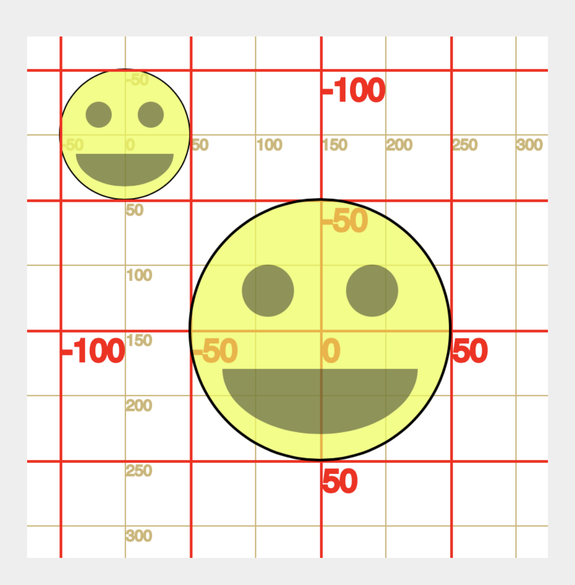

# Scaling with `scale()`

Another transformation that will be useful for you is the scale function (`scale()`). This function scales (proportionally grow or shrink) the grid and subsequent shapes underneath it.

- [`scale()` reference](https://p5js.org/reference/#/p5/scale)

<br />


Hopefully, this function is rather self-evident in how it can be used. The most important part to recognize initially, is that the expected input parameter is a decimal value (or "float"), where `1.0` = 100% or no change. Hence, `0.5` = 50%, and `2.0` = 200%.

To demonstrate this, we will use the same smiley face code from the past few pages. This smiley face is presented four times, once at its "normal" or unscaled size; a second time much larger, at 200%; a third time at 50%, which returns the size to "normal"; the last time we scale by 50% again, to create a "half-size" version.


```js
// NO SCALING
translate( 75, 75 );
smiley();

// scale by 200%
scale(2.0);
translate( 75, 75 );
smiley();

// scale by 50%
translate( -75, 75 );
scale(0.5);
smiley();

// scale by 50%
translate( 0, 125 );
scale(0.5);
smiley();
```

<div class="displayed_jotted_example">
    <div id="jotted-demo-1" class=""></div>
</div>
<script>
    new Jotted(document.querySelector("#jotted-demo-1"), {
    files: [
        {
            type: "js",
            url:"https://raw.githubusercontent.com/Montana-Media-Arts/120_CreativeCoding/master/lecture_code/04/13_scaleSmiley_01/sketch.js"
        },
        {
            type: "html",
            url:"../../../p5_resources/index.html"
    }],
    // plugins: [ "codemirror", "console" ]
    plugins: [ "codemirror" ]
});
</script>

| [**[ Code Download ]**](https://github.com/Montana-Media-Arts/120_CreativeCoding/raw/master/lecture_code/04/13_scaleSmiley_01/13_scaleSmiley_01.zip) | [**[ View on GitHub ]**](https://github.com/Montana-Media-Arts/120_CreativeCoding/raw/master/lecture_code/04/13_scaleSmiley_01/) | [**[ Live Example ]**](https://montana-media-arts.github.io/120_CreativeCoding/lecture_code/04/13_scaleSmiley_01/) |


> QUESTION: Why is the third version the same size as the first if it is scaled by 50%?
>
> ANSWER: Just like `translate()` and `rotate()`, `scale()` is cumulative. Therefore, scaling 200% by 50%, returns the scale value to 100%.


> NOTE: As with `rotate()`, order matters in relation to `translate()`. In the above code, because `scale()` is called before `translate()` in the second version, the entire grid is scaled. As is demonstrated in the below image. Not only that, but the translate function, acts according to the new scale.




# Scaling Axis Separately

The `scale()` function allows developers to provide 1 or 2 input parameters to the function. When two parameters are provided, they work to scale the X and Y axes separately.

The below code is used to scale the second smiley face in the provided example.

```js
// scale the x-axis by 25%
// scale the y-axis by 300%
scale( 0.25, 3.0 );
// ** draw the smily face **
smiley();
```

<div class="displayed_jotted_example">
    <div id="jotted-demo-2" class=""></div>
</div>
<script>
    new Jotted(document.querySelector("#jotted-demo-2"), {
    files: [
        {
            type: "js",
            url:"https://raw.githubusercontent.com/Montana-Media-Arts/120_CreativeCoding/master/lecture_code/04/13_scaleSmiley_02/sketch.js"
        },
        {
            type: "html",
            url:"../../../p5_resources/index.html"
    }],
    // plugins: [ "codemirror", "console" ]
    plugins: [ "codemirror" ]
});
</script>

| [**[ Code Download ]**](https://github.com/Montana-Media-Arts/120_CreativeCoding/raw/master/lecture_code/04/13_scaleSmiley_02/13_scaleSmiley_02.zip) | [**[ View on GitHub ]**](https://github.com/Montana-Media-Arts/120_CreativeCoding/raw/master/lecture_code/04/13_scaleSmiley_02/) | [**[ Live Example ]**](https://montana-media-arts.github.io/120_CreativeCoding/lecture_code/04/13_scaleSmiley_02/) |


# Using Scale to Flip Shapes

The last thing that you should know about the `scale()` function, is that it will also accept negative values for its scale parameters. When negative values are provided, the grid is flipped around the axis in question.

For example, we can flip the second smiley face, in the below example, upside-down, by providing a negative number to the y-axis parameter.

```js
// scale the x-axis by 250%
// scale the y-axis by 150%
// and flip around the y-axis
scale(2.5, -1.5);
```

<div class="displayed_jotted_example">
    <div id="jotted-demo-3" class=""></div>
</div>
<script>
    new Jotted(document.querySelector("#jotted-demo-3"), {
    files: [
        {
            type: "js",
            url:"https://raw.githubusercontent.com/Montana-Media-Arts/120_CreativeCoding/master/lecture_code/04/13_scaleSmiley_03/sketch.js"
        },
        {
            type: "html",
            url:"../../../p5_resources/index.html"
    }],
    // plugins: [ "codemirror", "console" ]
    plugins: [ "codemirror" ]
});
</script>

| [**[ Code Download ]**](https://github.com/Montana-Media-Arts/120_CreativeCoding/raw/master/lecture_code/04/13_scaleSmiley_03/13_scaleSmiley_03.zip) | [**[ View on GitHub ]**](https://github.com/Montana-Media-Arts/120_CreativeCoding/raw/master/lecture_code/04/13_scaleSmiley_03/) | [**[ Live Example ]**](https://montana-media-arts.github.io/120_CreativeCoding/lecture_code/04/13_scaleSmiley_03/) |
