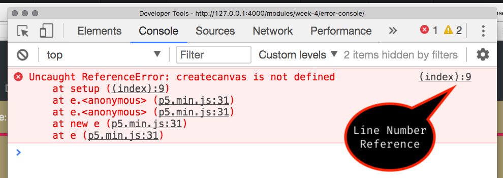

# Error Console

<div class="embed-responsive embed-responsive-16by9"><iframe class="embed-responsive-item" src="https://www.youtube.com/embed/MweuZekB2SE" frameborder="0" allowfullscreen></iframe></div>


This week you are going to be asked to complete your first significant homework assignment for this course. One thing, you will almost certainly run into, are syntax issues, or mis-naming issues, that literally "**_break_**" your code. This will result in nothing showing up in your browser window. When this happens, you need to know how to find the problem, so you can try and fix it.

To do this, you will most likely want to leverage your browsers JavaScript Console (just "console" from now). The console, displays errors, warnings, and other information that a developer tells it to.

## Opening the Console

The process of opening the console is similar in most browsers.

### Chrome

In Google's Chrome, you need to;

1. Select the "View" menu.
2. Select the "Developer" sub-menu.
3. Select "JavaScript Console".


### Safari

In Safari, you need to take an extra step one time, before you can easily view the JavaScript Console.

1. Open preferences.
2. Under the "Advanced" tab.
3. Select "Show Develop Menu in menu bar"


After doing this, you can then;

1. Select the "Develop" dropdown menu
2. Select "Show JavaScript Console"


### Firefox

In Firefox, to open the console;

1. Select the "hamburger menu" from the top-right corner of an open browser window. (This is three horizontal lines)
2. Select the "Developer" menu.
3. Select "Web Console"


# Various Errors

It will take you a little while to get used to "finding" and "fixing" errors. The first part of this process, will honestly not start to happen, until you start coding enough, that you have errors you need to find and fix.

In the following example, the code supplied to the "code result section" is as follows;

<div id="code-heading">sketch.js</div>

```js
function setup() {
    // the following function will "throw" an error
    // This is because there is no function called
    // -> createcanvas()
    //
    // It is technically misspelled
    // And needs the 'C' starting the word "canvas"
    // to be capitalized.
    createcanvas( 400, 400 );
    background( 'blue' );
}
```

As you can see from the comments in the code, `createcanvas()` is purposely misspelled.

If you open your JavaScript Console on this page, you will see something like the following error posted in it. (The following example is using Chrome, FYI.)

```console
Uncaught ReferenceError: createcanvas is not defined
    at setup ((index):9)

```



When you get an "Uncaught ReferenceError:", it means you have spelled something wrong. In our case, `createCanvas()` is misspelled as `createcanvas()`.

The other critical piece of information from this error, is a line number reference. Even if you do not understand the error, if you can at least see where to look, then you have some hope of fixing your code.

In this case, we see there is a reference to line `:9`. At the very minimum, this would allow you to look at line 9, and try to start figuring out what is wrong.

<br />


Now, down below;

- fix the error, by changing line 9, `createcanvas(`, to `createCanvas(`.
- You should now see a canvas with a blue background.


    <div id="jotted-demo-1" class=""></div>
</div>
<script>
    new Jotted(document.querySelector("#jotted-demo-1"), {
    files: [
        {
            type: "js",
            url:"https://raw.githubusercontent.com/Montana-Media-Arts/120_CreativeCoding/master/lecture_code/04/16_errors_01/sketch.js"
        },
        {
            type: "html",
            url:"../../../p5_resources/index.html"
    }],
    // plugins: [ "codemirror", "console" ]
    plugins: [ "codemirror" ]
});
</script>


# More Errors

The following link is a zip'd directory with three error problems. Each one is described in comments, within the sketch.js file. You should;

- open each sketch, by opening its index.html file.
- open the JavaScript Console in browser, so you can see the error produced.
- fix the code, as suggested in the file, so that the error goes away.

[Simple Error Examples](https://github.com/Montana-Media-Arts/120_CreativeCoding/raw/master/lecture_code/04/error_examples.zip)
