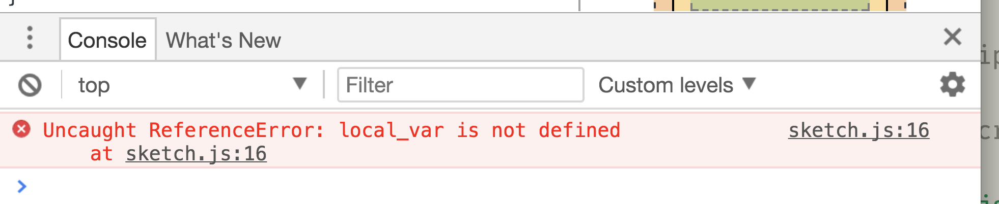

# Variable Scope

One critical concept for you to understand, is that of "variable scope." A variable's _scope_ is the area of code where a variable is available for referencing and using.

There are generally considered two levels of variable scope in JavaScript; _global scope_ and _local scope_.

## Local Scope

Let's start with _local scope_ with variables. A variable that is defined within a function, for example, your `setup()` functuion, will **ONLY** be available inside of that function.

For example,

<div id="code-heading">sketch.js</div>

```js
function setup() {
    var local_var = 3;
    // we can now use "local_var" in here.
    ellipse( local_var, local_var, local_var );
}

// however, if we try to use local var outside of the function
// we will run into an "Uncaught Reference" error.
console.log( local_var );
```

| [**[ Code Download ]**](https://github.com/Montana-Media-Arts/120_CreativeCoding/raw/master/lecture_code/05/06_variable_scope_01/06_variable_scope_01.zip) | [**[ View on GitHub ]**](https://github.com/Montana-Media-Arts/120_CreativeCoding/raw/master/lecture_code/05/06_variable_scope_01/) | [**[ Live Example ]**](https://montana-media-arts.github.io/120_CreativeCoding/lecture_code/05/06_variable_scope_01/) |


Again, the variable `local_var` which was declared inside of the `setup()` function, is **ONLY** available to the `setup()` function. This is the "variable's scope."

The above code, if executed, would return an error; saying something like, "`Uncaught ReferenceError: local_var is not defined at sketch.js:9`".



## Global Scope

Variables defined outside of a function, are said to have "Global Scope". That is, they are available anywhere in your JavaScript code, even between JavaScript files (we are not there yet, but keep this in mind for later).

In the following example, the variable `global_var` is available inside both the setup, and draw functions, as well as outside of all functions.

<div id="code-heading">sketch.js</div>


// a globally declared variable
var global_var = "I am a global variable";

function setup() {
   createCanvas( 400, 300 );
   text( global_var, 20, 20 );
}

// we can even reference the variable here,
// and we get no errors!
// NOTE: this is not doing anything,
// since we are not actually using the variable.
global_var;


<div class="displayed_jotted_example">
    <div id="jotted-demo-1" class=""></div>
</div>
<script>
    new Jotted(document.querySelector("#jotted-demo-1"), {
    files: [
        {
            type: "js",
            url:"https://raw.githubusercontent.com/Montana-Media-Arts/120_CreativeCoding/master/lecture_code/05/06_variable_scope_02/sketch.js"
        },
        {
            type: "html",
            url:"../../../p5_resources/index.html"
    }],
    plugins: [ "codemirror", "console" ]
    // plugins: [ "codemirror" ]
});
</script>


| [**[ Code Download ]**](https://github.com/Montana-Media-Arts/120_CreativeCoding/raw/master/lecture_code/05/06_variable_scope_02/06_variable_scope_02.zip) | [**[ View on GitHub ]**](https://github.com/Montana-Media-Arts/120_CreativeCoding/raw/master/lecture_code/05/06_variable_scope_02/) | [**[ Live Example ]**](https://montana-media-arts.github.io/120_CreativeCoding/lecture_code/05/06_variable_scope_02/) |


### Snooping on Global Variables

Since Global variables are available everywhere, we can access them using a browser's JavaScript console.

Notice in the above example, how there is a new tab, labeled, "JS Console". If you select that tab, there will be a carrot `> `, on a grey line. With you mouse, click in this grey area, then type `global_var` and hit "return". You will see the string "I am a global variable" printed in the console.

When working on your own sketches, you can do the same thing, by opening your [Browser's JavaScript Console]({{site.baseurl}}/modules/week-4/error-console/). Then working and "snooping" in there.


> You can read more about scope in JS from [Microsoft's JavaScript Documentation Page](https://docs.microsoft.com/en-us/scripting/javascript/advanced/variable-scope-javascript)


# Problems with p5

There are few problems with regard to scope, that we are going to run into frequently with p5. Specifically, there will be an issue that arises when you want to use p5 functionality, assigned to a global variable. You cannot access p5 functionality, outside of the scope of p5 functions.

#### What does this mean???

Say for example, you want to create a variable that stores a Number. This Number is suppose to be 25% of the width, as it is a location you want to draw an ellipse at.

Since we just learned about the p5 reserved name variable `width`, you might assume you could simply do something like the following;

```js
var quarter_width = width * 0.5;

function setup() {
    createCanvas(400, 200);
}

function draw() {
    ellipse( quarter_width, 20, 40 );
}
```

The problem is that we cannot reference the p5 variable width, outside of the `setup()` or `draw()` functions. (It would also cause a problem, as we are trying to use the variable `width` before we have set the "width" of the canvas with `createCanvas()`)


<br />

If we simply move it inside of the `setup()` function, we will be able to successfully assign it the value of `width * 0.5`. This might look like;

```js
function setup() {
    createCanvas(400, 200);
    var quarter_width = width * 0.5;
}

function draw() {
    ellipse( quarter_width, 20, 40 );
}
```


In this example, we will still get an error, as now, the variables scope will be limited to the `setup()` function only. It will not be available to the `draw()` function.


<br />

So, couldn't we just move the variable assignment to the `draw()` loop?

```js
function setup() {
    createCanvas(400, 200);
}

function draw() {
    var quarter_width = width * 0.5;
    ellipse( quarter_width, 20, 40 );
}
```

This could would work, and is completely legal. However, it is inefficient, as we are reassigning `quarter_width` every frame. There might also be a situation, where we want to be able to re-assign `quarter_width` later in the `draw()` function. In which case, we would need to have its assignment still occur outside of the `draw()` function.


<br />

To solve this problem, we simply need to separate our declaration statement from our assignment statement. If we declare the variable globally, we can then assign it within `setup()`. This gets around the issue of calling p5 functionality outside of p5 functions.

We can then also use the variable in `draw()` thereby getting around the scope issue. Since the variable is "global", we can assign its value in `setup()` and reference it in an entirely different function.

This would look like;

<div id="code-heading">sketch.js</div>

```js
// declare a variable named "quarter_width"
var quarter_width;

function setup() {
    createCanvas(400, 200);

    // assign "quarter_width" to have a value,
    // based on the p5 variable "width"
    quarter_width = width * 0.5;
}

function draw() {
    // use "quarter_width"
    ellipse( quarter_width, 20, 40 );
}
```

<div class="displayed_jotted_example">
    <div id="jotted-demo-2" class=""></div>
</div>
<script>
    new Jotted(document.querySelector("#jotted-demo-2"), {
    files: [
        {
            type: "js",
            url:"https://raw.githubusercontent.com/Montana-Media-Arts/120_CreativeCoding/master/lecture_code/05/07_globalVars_p5_01/sketch.js"
        },
        {
            type: "html",
            url:"../../../p5_resources/index.html"
    }],
    // plugins: [ "codemirror", "console" ]
    plugins: [ "codemirror" ]
});
</script>

| [**[ Code Download ]**](https://github.com/Montana-Media-Arts/120_CreativeCoding/raw/master/lecture_code/05/07_globalVars_p5_01/07_globalVars_p5_01.zip) | [**[ View on GitHub ]**](https://github.com/Montana-Media-Arts/120_CreativeCoding/raw/master/lecture_code/05/07_globalVars_p5_01/) | [**[ Live Example ]**](https://montana-media-arts.github.io/120_CreativeCoding/lecture_code/05/07_globalVars_p5_01/) |
