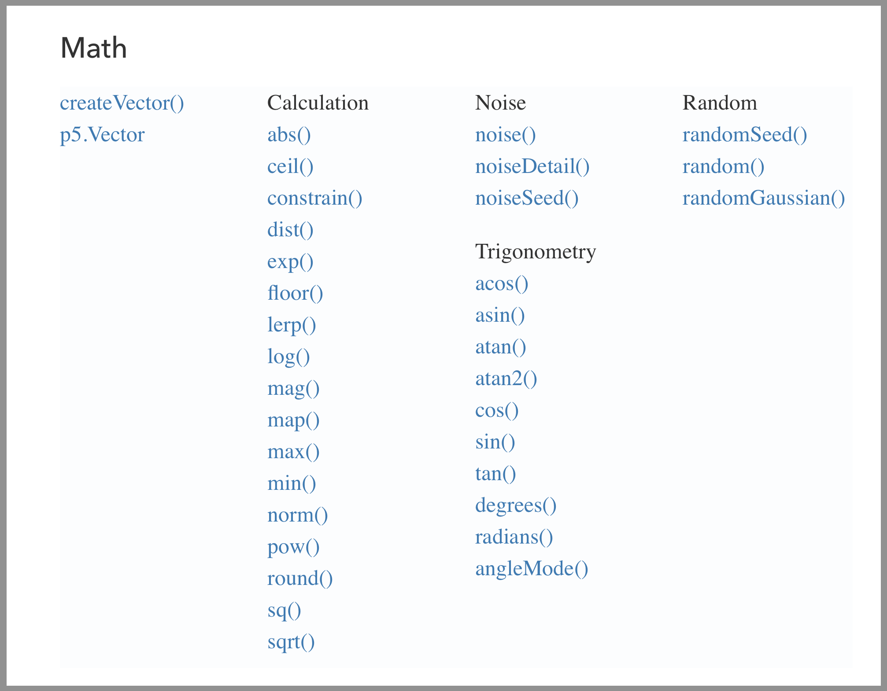

# Additional Math Functions

As we progress through the semester, you will encounter and require additional math functions that extend your ability to implement what you want to happen in code. These functions are collected under the "Math" section on the p5 reference page. Below is an screenshot of this section, showing all of the various available math functions.



We should examine a couple of these, that may prove useful this week and beyond.

## Absolute Value `abs()`

The absolute value of a number is always a positive value number.

The absolute value of both `4` and `-4` is `4`.  There are times when you will want to return, or ensure that a value is positive. In those cases, you should pass the value through the absolute value function, which will only return positive numbers.

This function accepts a single input parameter, the Number you would like to return the absolute value of.

```js
var value = abs(-20);
// value will be 20
```

## Round `round()`

The round function, `round()`, will return the nearest whole Number to the Number passed to its input. Numbers above 0.5 will be rounded up, and those below will be rounded down.

```js
var value1 = round(3.2);
// returns '3'

var value2 = round(3.7);
// returns '4'
```

## Floor `floor()`

There will be times that you always want to round a value _down_ to the nearest whole number. To accomplish this, use the floor function (`floor()`), which always rounds down and returns the nearest whole number to the input parameter Number.

```js
var value = floor(5.997);
// value will be set to '5'
```

## Ceiling `ceil()`

Likewise, in cases where you need to round _up_ to the nearest value, you should use the ceiling function (`ceil()`).

```js
var value = ceil(5.002);
// value will be set to '6'
```

## Square Root `sqrt()`

If you ever need to find the square root of a value, you can use the square root function. This value accepts only _non-negative_ Numbers as an input parameter. (NOTE: Negative Number values will return `NaN`, or "not a number", which will likely cause an error.)

This is demonstrated in the following code;

```js
eSize = 15;
x1 = mouseX;
y1 = height * 0.75;
x2 = sqrt(x1);
y2 = height * 0.25;

// Draw the non-squared.
line(0, y1, width, y1);
ellipse(x1, y1, eSize, eSize);

// Draw the squared.
line(0, y2, width, y2);
ellipse(x2, y2, eSize, eSize);
```

<div class="displayed_jotted_example">
    <div id="jotted-demo-1" class=""></div>
</div>
<script>
    new Jotted(document.querySelector("#jotted-demo-1"), {
    files: [
        {
            type: "js",
            url:"https://raw.githubusercontent.com/Montana-Media-Arts/120_CreativeCoding_Fall2017/master/lecture_code/06/05_sqrt_01/sketch.js"
        },
        {
            type: "html",
            url:"../../../p5_resources/index.html"
    }],
    // plugins: [ "codemirror", "console" ]
    plugins: [ "codemirror" ]
});
</script>

| [**[Code Download]**](https://github.com/Montana-Media-Arts/120_CreativeCoding_Fall2017/raw/master/lecture_code/06/05_sqrt_01/05_sqrt_01.zip) | [**[View on GitHub]**](https://github.com/Montana-Media-Arts/120_CreativeCoding_Fall2017/raw/master/lecture_code/06/05_sqrt_01/) | [**[Live Example]**](https://montana-media-arts.github.io/120_CreativeCoding_Fall2017/lecture_code/06/05_sqrt_01/) |
