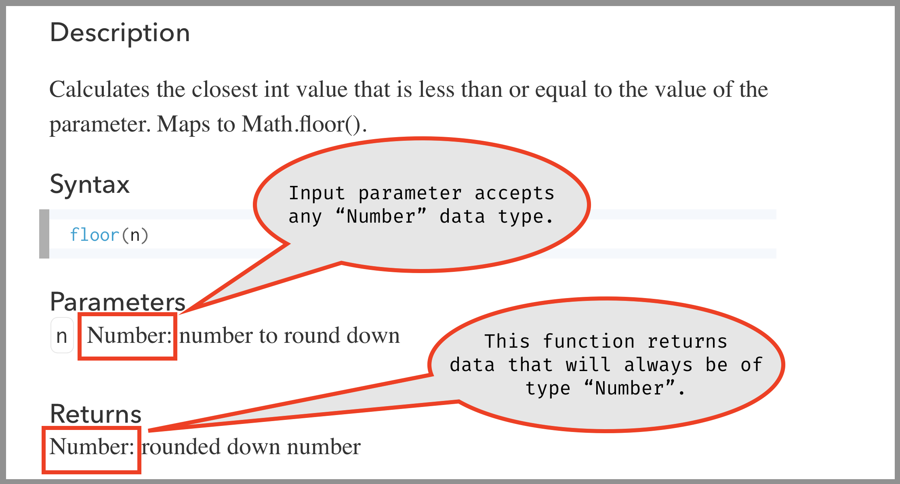

# The 'Number' Data Type

It was mentioned last week, that JavaScript is a "loosely-typed" language, which means that was a variable is declared it can store any type of data that we want. This has definite advantages and disadvantages, that you will learn about when you start working with "strongly-typed" languages. But for the most part, will serve as a benefit for us, as we learn to code.

However, it is still important to understand that there are different _data types_. A _data type_ is how data is actually stored and referenced. Data types can also effect how we can use certain data. More specifically, there are functions and situations, where not all data types will be valid. We have already started to experience this with functions. As you look at function definitions on the p5 reference page, each function specifies the data type that each input parameter will accept.

For example, if we look at the reference page for the floor function (`floor()`), we will see under both "Parameters" and "Returns" that the data type is specified. In both cases, the data type is _Number_.

 

## Integer and Floating Point Numbers

The _Number_ data type is used to store all numbers within the language in JavaScript. But you still need to be aware of a classic destination, which exists in other languages, and is relevant to our conversations about JavaScript. Most languages have at least two different data types to represent Numbers (some languages have more than 10 different data types to store different Numbers).

These two data types are;

- Integers or `int`
- Floating point or `float`

#### Integers

The integer data type is used to store any whole value number. That is, numbers without a decimal point. I.E.

- 0
- 1000
- -1
- -427539672983

#### Floating Point Numbers

The floating point data type (or more simply float) is used to store any number that requires a decimal point. I.E.

- 3.14
- 0.00000000001
- -1002937.2
- _and in some cases_ 1.0

#### Why does it matter?

This conversation is important for a couple of reasons. First, there are times, even in p5, when you want to treat Numbers as either integers or floats. This is one of the reason you may want to use a rounding function from time to time (`round()`, `floor()`, or `ceil()`). Such situations arise when trying to stick things to a very specific grid, using numbers as "switches", or simplifying math. As we progress through the course, we will run across a few of these instances.

Older computer languages specified ints vs floats for a two, far more practical reasons.

First, in most languages, integers take up less memory space to store. Now that computers tend to have at least 8GB of memory, memory management is not as much of a concern. But, since all data has to be stored as a series of "1's and 0's", (AKA. "Bits"), it takes fewer bits to store an integer.

Second, the way that floating point numbers were traditionally stored made them prone to small miscalculations when adding numbers with high-precision (that is, numbers with a lot of decimal places). The classic example of this becoming a problem is with banking software, where we need math to be perfect and exact, as small rounding errors may only account for a percentage of a penny on a single transaction. But millions of rounding errors occur, that can compile to huge sums of money that is misplaced, unaccounted for, etc. The solution to this problem use to be to do convert all numbers to integers, perform the calculations, and then convert back to floating point numbers.

# { TODO: } -- More on Numbers in JS

Please read the following on JS Numbers;

- [JavaScript Numbers](https://www.w3schools.com/js/js_numbers.asp)
- [JavaScript Number Methods](https://www.w3schools.com/js/js_number_methods.asp)

# Bits and Bytes

As mentioned above, all data is stored as a series of bits (1's and 0's) inside the computer. This is known as _binary_ numbers. The question then becomes, how do we store data as binary numbers?

#### 1 bit

Let's assume we have a single bit to store numbers within; that is a single bit, that can store a "1" or "0". In this case, how many possible values can be stored?

One way to figure this out is to write out all of the possible permutations, in this case;

- `0`
- or `1`

Therefore, we can see there are only "2" possible numbers that can be stores, "0" or "1".

#### 2 bits

So, how many values can be captured by a 2-bit binary number? Well, again, we could write out all of the possible permutations, as this is a fairly small number of bits still.

- `00`
- `01`
- `10`
- `11`

As we can see, there are 4 possible permutations, and therefore, a 2-bit binary number can store 4 integer values. (`0`, `1`, `2`, and `3`)

#### What about larger number of bits?

What about larger number of bits, like a 4-bit binary number. Well, following from the above, we could figure out the various permutations and associated values (assuming we start at `0`).

- `0000` - 0
- `0001` - 1
- `0010` - 2
- `0011` - 3
- `0100` - 4
- `0101` - 5
- `0110` - 6
- `0111` - 7
- `1000` - 8
- `1001` - 9
- `1010` - 10
- `1011` - 11
- `1100` - 12
- `1101` - 13
- `1110` - 14
- `1111` - 15

The above example, assumes that the 4-bit data value, is only going to store positive values, starting at 0.

Since we are working with "base-2" numbers, or the binary system, it is quite easy to determine how many values any x-bit number can store. To calculate this value, we find the result of "2" to the power of the number of bits.

So, a 2-bit number has 22 values or 4. Likewise, a 4-bit number has 24 values or 16.

 

Since this is an exponential system, the number of values that an x-bit number can store gets _exponentially_ larger with each additional bit. If we have an 8-bit number;

- `0000 0000`

That can hold up to 28 values or 256 values.

Likewise, a 16-bit number;

- `00000000 00000000`

Can store 216 values or 65,536 values.

A 32-bit number;

- `00000000 00000000 00000000 00000000`

Can store 232 values or 4,294,967,296 values.

As you can see, these numbers get huge, with each doubling of bit numbers. This is one of the reasons why computers have been moving to a "64-bit" architecture, as it allows for more precise storage of data.

## { TODO: } -- Videos on Binary Data

Please watch all three of the following videos on binary numbers.

<iframe class="embed-responsive-item" src="https://www.youtube.com/embed/TD6lcIIOeic" frameborder="0" allowfullscreen></iframe>

<iframe class="embed-responsive-item" src="https://www.youtube.com/embed/ry1hpm1GXVI" frameborder="0" allowfullscreen></iframe>

<iframe class="embed-responsive-item" src="https://www.youtube.com/embed/H4BstqvgBow" frameborder="0" allowfullscreen></iframe>

