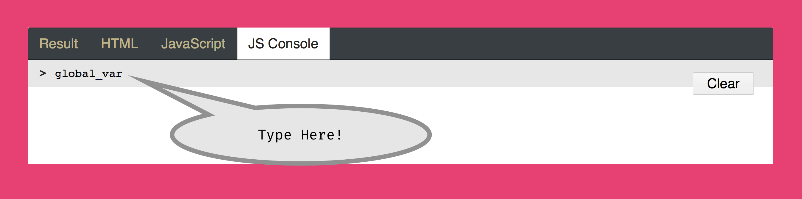
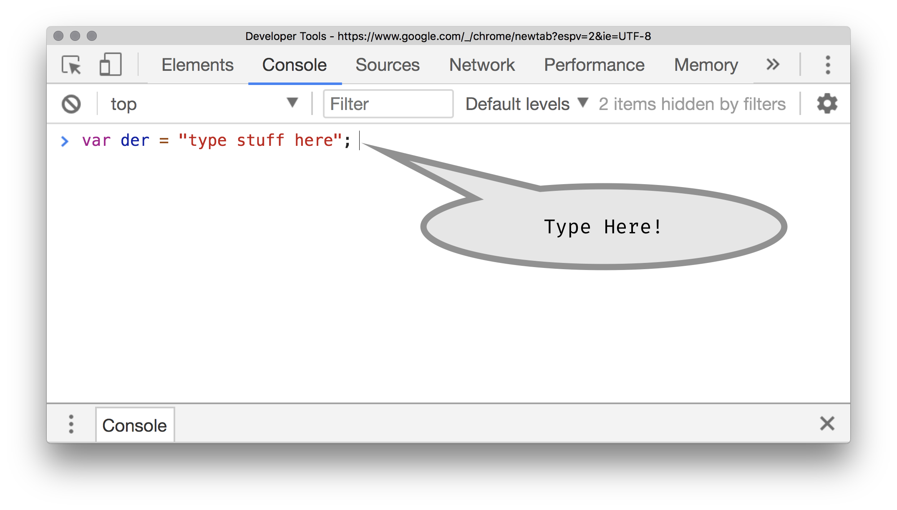

# Exposing Data

As you start to work with more math in your code, you will inevitably end up with more errors and problems to work through. When this happens;

1. Remember to stay calm, and to slowly work through your problem. You are not the first coder to have issues, errors, or problems understanding what is happening or how to make it happen.
2. Utilize the JavaScript Console to identify errors. If your code is not working as you expect, [check the console for errors]({{site.baseurl}}/modules/week-4/error-console/).
3. Post your calculation results somewhere, so that you can make sure you are actually producing results/values you expect.

## The Canvas with `text()`
With regard to #3, you have seen one way of doing this, even if it has not been explicitly presented. That is to use the `text()` function, which prints a _string_ of text to the p5 canvas.

- [`text()` function reference](https://p5js.org/reference/#/p5/text)

The first parameter to the text function is what will be printed to the canvas. You can pass any variable to this input parameter, and it will be printed, at the location specified in the second two input parameters.

In the below example, we pass the value of a position variable to the text function, so that we can see where the ellipse is being positioned.

These values are stored in the variables `x_pos` & `y_pos`. The following lines of code, exposes these variables to the p5 canvas.

```js
text( x_pos, 20, 80 );
text( y_pos, 20, 100 );
```

<div class="displayed_jotted_example">
    <div id="jotted-demo-1" class=""></div>
</div>
<script>
    new Jotted(document.querySelector("#jotted-demo-1"), {
    files: [
        {
            type: "js",
            url:"https://raw.githubusercontent.com/Montana-Media-Arts/120_CreativeCoding_Fall2017/master/lecture_code/06/06_exposing_data_01/sketch.js"
        },
        {
            type: "html",
            url:"../../../p5_resources/index.html"
    }],
    // plugins: [ "codemirror", "console" ]
    plugins: [ "codemirror" ]
});
</script>

| [**[Code Download]**](https://github.com/Montana-Media-Arts/120_CreativeCoding_Fall2017/raw/master/lecture_code/06/06_exposing_data_01/06_exposing_data_01.zip) | [**[View on GitHub]**](https://github.com/Montana-Media-Arts/120_CreativeCoding_Fall2017/raw/master/lecture_code/06/06_exposing_data_01/) | [**[Live Example]**](https://montana-media-arts.github.io/120_CreativeCoding_Fall2017/lecture_code/06/06_exposing_data_01/) |


## Console w/ Global Variables

You can "interact" with any browser's JavaScript console. To do this, simply type in the bottom area text area.

This can allow you interactively work on math, or reveal global variables current values.

For example, in the following p5 output, open the "Console" tab, and practice some math. You can do this by clicking next to the carrot and starting to type. The below image shows where you should type.



You can do the same thing in your browser's JavaScript Console. Similar to the p5 output console in this site, you want to find the text input on your browser's console.




In your browser's console, or the output example below, try putting in some of the following;

```console
> 20 % 6

> 3 ** 3

> der = 22;

> der

> der += 10;

> der
```

<div class="displayed_jotted_example">
    <div id="jotted-demo-2" class="" height="400px;"></div>
</div>
<script>
    new Jotted(document.querySelector("#jotted-demo-2"), {
    files: [
        {
            type: "js",
            url:"https://raw.githubusercontent.com/Montana-Media-Arts/120_CreativeCoding_Fall2017/master/lecture_code/06/06_exposing_data_02/sketch.js"
        },
        {
            type: "html",
            url:"../../../p5_resources/index.html"
    }],
    plugins: [ "codemirror", "console" ]
    // plugins: [ "codemirror" ]
});
</script>


## Console w/ `console.log()`

Another way of exposing data in JavaScript in general, is to "post" or "log" it to the console window. From you JavaScript documents (i.e. `sketch.js`), you can pass an value, variable, or string as a single parameter to the log function ( `console.log( )`). This will post information to the browser's JavaScript console. (Make sure you have the console set to "display all messages").

In the following example, you will see the use of `console.log()` to _log_ the same data as was revealed using the `text()` function up above.

If you open the "Console" tab in the output below, or open this example in a new window, and open your browser's console, you will see a set of two numbers being posted; these are the `x_pos` and `y_pos` variable values.

```js
console.log( x_pos );
console.log( y_pos );
```

<div class="displayed_jotted_example">
    <div id="jotted-demo-3" class=""></div>
</div>
<script>
    new Jotted(document.querySelector("#jotted-demo-3"), {
    files: [
        {
            type: "js",
            url:"https://raw.githubusercontent.com/Montana-Media-Arts/120_CreativeCoding_Fall2017/master/lecture_code/06/06_exposing_data_03/sketch.js"
        },
        {
            type: "html",
            url:"../../../p5_resources/index.html"
    }],
    plugins: [ "codemirror", "console" ]
    // plugins: [ "codemirror" ]
});
</script>

| [**[Code Download]**](https://github.com/Montana-Media-Arts/120_CreativeCoding_Fall2017/raw/master/lecture_code/06/06_exposing_data_03/06_exposing_data_03.zip) | [**[View on GitHub]**](https://github.com/Montana-Media-Arts/120_CreativeCoding_Fall2017/raw/master/lecture_code/06/06_exposing_data_03/) | [**[Live Example]**](https://montana-media-arts.github.io/120_CreativeCoding_Fall2017/lecture_code/06/06_exposing_data_03/) |
