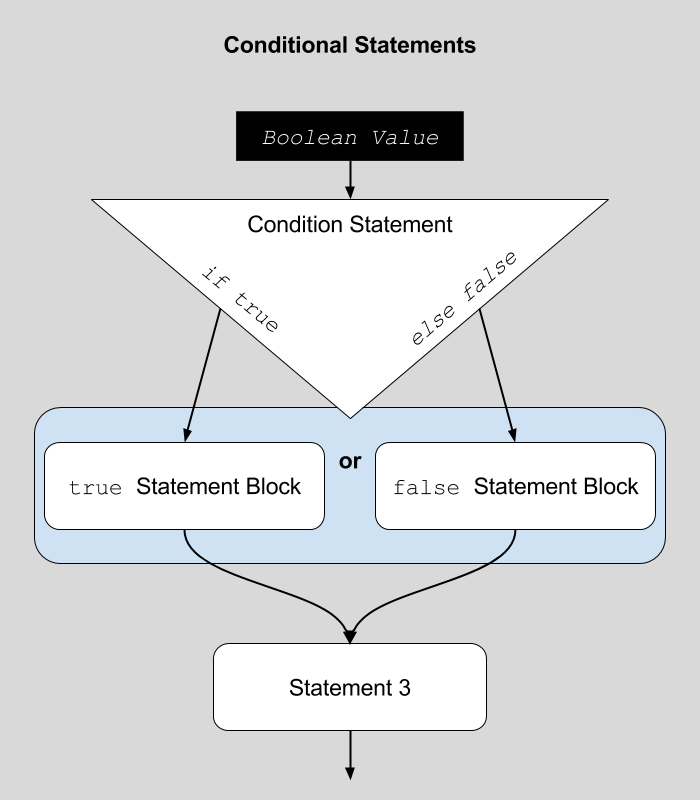

# if Statements

Now that we know about the Boolean data type and what conditional flow general is, let's look at how to program in _conditional statements_.

A _conditional statement_ is a statement or function that chooses one block of statements over another based on a Boolean value.

> In other words;
>
> - _if_ the condition statement receives a _true Boolean_
>   - it will then execute the _true statement block_.
> - _else_
>   - it will then execute the _false statement block_.



## A Note on Statement Blocks

A _Statement Block_ in JavaScript is any set of statements encapsulated within a set of curly-brackets (i.e. `{ }`). So, you have been writing statement blocks when you define the `setup()` and `draw()` functions. The code you write between their associated curly-brackets, _is their_ statement block. In other words, the code inside of the curly brackets is the statement block for the function.

```js
function draw(){
    // Everything in here (i.e. between the "{}")
    // is part of the "draw function" statement block.
}
```

## Writing `if` Statements

In JavaScript, _if statements_ are written like many other functions. We call the function, in this case `if` and attach a set of parenthesis to it where we pass the necessary parameter. In the case of an _if statement_, the parameter needs to be a Boolean value (i.e. `true` or `false`). This is then followed by a function block to execute _if_ the Boolean is true, and another function block to execute _else_ the Boolean was false. These two function blocks are separated by the `else` keyword. This will generally look like the following;

```js
if( Boolean ) {
    // some code to execute 'if' true
} else {
    // some code to execute 'else' false
}
```

**NOTE:** The 'else' function block is optional. _If_ you simply need something to execute, only when true, you can stop after the _true_ function block. In this case, the program will continue on without any additional executions, _if_ a statement was false.

```js
if( Boolean ) {
    // code to execute 'if' true
}

// additional code to execute 'after' the conditional 'if statement' finished execution.
// Regardless of whether it executes the true function block or not.
```

## In Practice

In the following example, the color of an ellipse is set through a conditional _if_ statement. In this example, the color of the ball will always be 'red'. This is the case because we are always passing the value `true` as a parameter value to the _if_ statement.

```js
function draw() {
    background('white');

    // set the fill color for an ellipse
    if( true ) {
        fill('red');
    } else {
        fill('blue');
    }

    ellipse( width/2, height/2, 40 );
}
```

| [**[ Code Download ]**](https://github.com/Montana-Media-Arts/120_CreativeCoding/raw/master/lecture_code/07/01_if_01/01_if_01.zip) | [**[ View on GitHub ]**](https://github.com/Montana-Media-Arts/120_CreativeCoding/raw/master/lecture_code/07/01_if_01/) | [**[ Live Example ]**](https://montana-media-arts.github.io/120_CreativeCoding/lecture_code/07/01_if_01/) |

<br />


If we instead passed the value `false` as a parameter to the if statement function, the ellipse would always be 'blue'. This is because the 'else' function block will always execute.

```js
if( false ) {
    fill('red');
} else {
    fill('blue');
}
```

| [**[ Code Download ]**](https://github.com/Montana-Media-Arts/120_CreativeCoding/raw/master/lecture_code/07/01_if_02/01_if_02.zip) | [**[ View on GitHub ]**](https://github.com/Montana-Media-Arts/120_CreativeCoding/raw/master/lecture_code/07/01_if_02/) | [**[ Live Example ]**](https://montana-media-arts.github.io/120_CreativeCoding/lecture_code/07/01_if_02/) |

### Using Variables

Obviously, we will want to be able to change the outcome of the if statement based on dynamic conditions of the program's execution. For this reason, you will _**likely never**_ pass a Boolean value directly to the if statement as we did above.

Instead you will do one of two things;

1. Pass in a variable, storing a Boolean value of `true` or `false`.
2. Pass in a statement that will execute to either `true` or `false`.

The following code, sets up a variable, which stores Boolean values. This is then passed as the parameter to the if statement. This variable can then be changed, by the program or user. In the following case however, the value is changed at the end of the `draw()` loop. When the draw loop comes back around a second time, it is then set to the new value.

<div id="code-heading">sketch.js</div>

```js
function setup() {
    createCanvas( windowWidth, windowHeight );
    // set a low frame rate so that you can see the change
    // frameRate is set to 0.5 frames per second
    // or 1 frame every 2 seconds.
    frameRate(0.5);
}

var conditionalValue = false;
function draw() {
    background('white');

    // set the fill color for an ellipse
    if( conditionalValue ) {
        fill('red');
    } else {
        fill('blue');
    }

    ellipse( width/2, height/2, 40 );


    // update the conditionalValue variable
    conditionalValue = true;
}
```

<div id="jotted-demo-1" class="jotted-theme-stacked" style="height:300px;"></div>
</div>
<script>
    new Jotted(document.querySelector("#jotted-demo-1"), {
    files: [
        {
            type: "js",
            url:"https://raw.githubusercontent.com/Montana-Media-Arts/120_CreativeCoding/master/lecture_code/07/02_if_vars_01/sketch.js"
        },
        {
            type: "html",
            url:"../../../p5_resources/index.html"
    }],
    // plugins: [ "codemirror", "console" ]
    plugins: [ "codemirror" ]
});
</script>


| [**[ Code Download ]**](https://github.com/Montana-Media-Arts/120_CreativeCoding/raw/master/lecture_code/07/02_if_vars_01/02_if_vars_01.zip) | [**[ View on GitHub ]**](https://github.com/Montana-Media-Arts/120_CreativeCoding/raw/master/lecture_code/07/02_if_vars_01/) | [**[ Live Example ]**](https://montana-media-arts.github.io/120_CreativeCoding/lecture_code/07/02_if_vars_01/) |


## A Note on Semicolons

Notice in the above examples, how semicolons are not used after an if statement or its function blocks. Although accidentally including one will likely not break you program, it is consider _poor_ practice to add them.

Also notice, that semicolons are still used to distinguish individual statements _within_, if statement function blocks.
