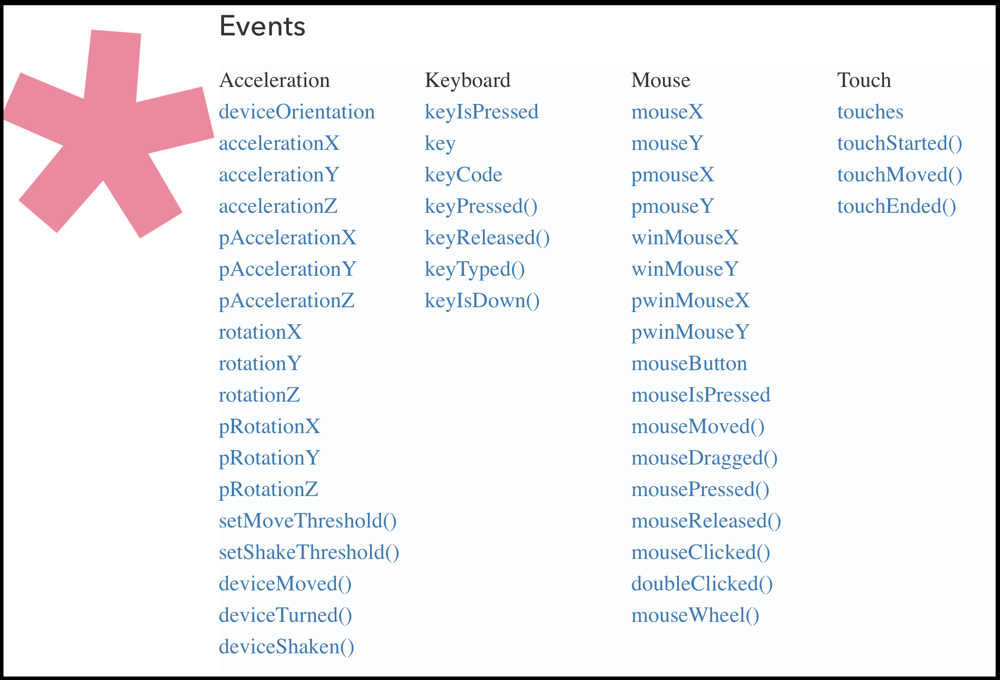

# More Mouse Events

There are a few more p5 events that we should discuss. This will make your work, potentially, more interesting.

A few details first; in p5, whenever a recognizable event occurs, the environment "does something". For example, when the mouse moves, the p5 environment updates the `mouseX` and `mouseY` variables. There are a number of events that p5 is capable of responding to. For a complete list, please look at the [p5 reference "events" section](https://p5js.org/reference/#group-Events).



# When the Mouse is Pressed

In addition to mouse position variables, p5 also has a reference to whether the mouse is currently pressed or not. This value is stored as a Boolean. It can be referenced from the p5 environment variable `mouseIsPressed`.

- [`mouseIsPressed` referenced page](https://p5js.org/reference/#/p5/mouseIsPressed)

Since this p5 variable stores a Boolean representing the mouse press state, we can pass it directly to conditional statements.

In the following example, we do just that. As a result, if the mouse is not pressed (i.e. `mouseIsPressed == false`), we see a drab brown canvas. However, when the mouse is pressed (`mouseIsPressed == true`), the background changes colors randomly, and a ellipses pop around!

<div id="code-heading">sketch.js</div>



function setup() {
    createCanvas( windowWidth, windowHeight );
}

function draw() {
    if ( mouseIsPressed ) {
        background( random(255), random(255), random(255) );

        noStroke();
        fill( random(255), random(255), random(255) );
        ellipse(
            random(width),
            random(height),
            random(width),
            random(height)
        );
    } else {
        background('rgb(180, 135, 99)');
        fill('rgb(116, 126, 91)');
        textSize(36);
        textAlign(CENTER);
        text("boring...", width/2, height/2);
    }
}



<div id="jotted-demo-1" class="jotted-theme-stacked" style="600px;"></div>

<script>
    new Jotted(document.querySelector("#jotted-demo-1"), {
    files: [
        {
            type: "js",
            hide: false,
            url:"https://raw.githubusercontent.com/Montana-Media-Arts/120_CreativeCoding/master/lecture_code/07/11_mouseIsPressed_01/sketch.js"
        },
        {
            type: "html",
            hide: true,
            url:"../../../p5_resources/index.html"
        }
    ],
    showBlank: false,
    showResult: true,
    plugins: [
        { name: 'ace', options: { "maxLines": 50 } },
        // { name: 'console', options: { autoClear: true } },
    ]
});
</script>

| [**[ Code Download ]**](https://github.com/Montana-Media-Arts/120_CreativeCoding/raw/master/lecture_code/07/11_mouseIsPressed_01/11_mouseIsPressed_01.zip) | [**[ View on GitHub ]**](https://github.com/Montana-Media-Arts/120_CreativeCoding/raw/master/lecture_code/07/11_mouseIsPressed_01/) | [**[ Live Example ]**](https://montana-media-arts.github.io/120_CreativeCoding/lecture_code/07/11_mouseIsPressed_01/) |


# An Event Function for When the Mouse Is Pressed

In addition to the p5 environment variable `mouseIsPressed`, p5 also includes an event function for the mouse, that is executed whenever the "mouse is pressed".

This is similar, in some ways, to p5's `setup()` and `draw()` functions, in that, we can define a `mousePressed()` function, which p5 will execute when the "mouse is pressed".

To use this function, you simply need to define the `mousePressed()` function somewhere in your sketch, **outside of* `setup()` and `draw()`.

```js
function mousePressed() {
    // statements to execute when the mouse pressed

    // always include the following line at the end
    return false;
}
```

- [`mousePressed()` p5 reference](https://p5js.org/reference/#/p5/mousePressed)


> Please be advised: per the p5 reference page, that some browsers have default behavior for `mousePressed()` functions. "Browsers may have different default behaviors attached to various mouse events. To prevent any default behavior for this event, add `return false` to the end of the method." JUST DO IT!

In the following example;

- There is an environment variable defined in the sketch, `mouseCounter`, which is initialized to `0`.
- At the bottom of the sketch (lines 20-24) is the `mousePressed()` function definition.
    - In this function, we specify that the `mouseCounter` variable should be incremented, each time the mouse is pressed.
- In the `draw()` function, the `mouseCounter` variable is added to a string of text, and displayed on the canvas. This shows the suer how many times the mouse button has been pressed.

<div id="code-heading">sketch.js</div>



function setup() {
    createCanvas( windowWidth, 400 );
}

var mouseCounter = 0;

function draw() {
    background( 'rgb(171, 93, 193)' );

    textSize(24);
    textAlign(CENTER);
    fill(255);

    // print the number of times
    // the mouse has been pressed.
    var str = "Mouse clicked " + mouseCounter + " times.";
    text( str, width/2, height/2 );
}

// mouse pressed event function
function mousePressed() {
    mouseCounter++;
    return false;
}



<div id="jotted-demo-2" class="jotted-theme-stacked"></div>

<script>
    new Jotted(document.querySelector("#jotted-demo-2"), {
    files: [
        {
            type: "js",
            hide: false,
            url:"https://raw.githubusercontent.com/Montana-Media-Arts/120_CreativeCoding/master/lecture_code/07/12_mousePressed_01/sketch.js"
        },
        {
            type: "html",
            hide: true,
            url:"../../../p5_resources/index.html"
        }
    ],
    showBlank: false,
    showResult: true,
    plugins: [
        { name: 'ace', options: { "maxLines": 50 } },
        // { name: 'console', options: { autoClear: true } },
    ]
});
</script>

| [**[ Code Download ]**](https://github.com/Montana-Media-Arts/120_CreativeCoding/raw/master/lecture_code/07/12_mousePressed_01/12_mousePressed_01.zip) | [**[ View on GitHub ]**](https://github.com/Montana-Media-Arts/120_CreativeCoding/raw/master/lecture_code/07/12_mousePressed_01/) | [**[ Live Example ]**](https://montana-media-arts.github.io/120_CreativeCoding/lecture_code/07/12_mousePressed_01/) |


## Differences between `mouseIsPressed` & `mousePressed()`

It is not apparent at first, but there are significant differences between the p5 environment variable `mouseIsPressed` and the function `mousePressed()`.

1. The obvious difference, is that one is a variable and the other is a function.
    - variable `mouseIsPressed`
        - p5 handles setting the environment variable `mouseIsPressed` to be either `true` or `false`.
        - The variable will simply return `true` or `false` when called.
    - function `mousePressed()`
        - p5 also makes sure that the function `mousePressed()` is called when ever the mouse is pressed.
        - Since it is a function, other statements can be embedded in the function definition, and will be executed whenever the mouse button is pressed.
2. The function only executes once.
    - The most significant difference is that the `mousePressed()` function is only executed once per each mouse click. The mouse has to be unpressed, and repressed, before the function will execute again.
    - Conversely, if the `draw()` function queries the variable `mouseIsPressed` and does something when it returns `true` that will occur every frame, _as long as the mouse is pressed_.

The following code demonstrates the differences in number 2.

- The sketch starts with 2 ellipses, drawn at `width * 1/4` and `width * 3/4`.
- Each ellipse has its own size variable.
    - The ellipse on the left will be assigned the variable `mouseIsPressed_SIZE`. This variable will be incremented in the `draw()` loop when `mouseIsPressed == true`.
    - The ellipse on the right will be assigned the variable `mousePressFunction_SIZE`. This variable will be incremented by the `mousePressed()` function.

<div id="code-heading">sketch.js</div>



function setup() {
    createCanvas( windowWidth, 400 );
}

var mouseIsPressed_SIZE = 10;
var mousePressFunction_SIZE = 10;

function draw() {
    background( 'rgb(171, 93, 193)' );

    // increment while mouse is pressed
    if( mouseIsPressed ) {
        mouseIsPressed_SIZE++;
    }

    fill(255);
    // mouseIsPressed based ellipse
    ellipse( width*1/4, height/2, mouseIsPressed_SIZE );
    // mousePressed() based ellipse
    ellipse( width*3/4, height/2, mousePressFunction_SIZE );
    mousePressFunction_SIZE );

    // show some text sizes
    textAlign(CENTER);
    textSize(24);
    fill(0);
    text(mouseIsPressed_SIZE, width*1/4, 20);
    text(mousePressFunction_SIZE, width*3/4, 20);
}

// mouse pressed event function
// executes only once per mouse press
function mousePressed() {
    mousePressFunction_SIZE++;
    return false;
}



<div id="jotted-demo-3" class="jotted-theme-stacked"></div>

<script>
    new Jotted(document.querySelector("#jotted-demo-3"), {
    files: [
        {
            type: "js",
            hide: false,
            url:"https://raw.githubusercontent.com/Montana-Media-Arts/120_CreativeCoding/master/lecture_code/07/13_mousePressed_02/sketch.js"
        },
        {
            type: "html",
            hide: true,
            url:"../../../p5_resources/index.html"
        }
    ],
    showBlank: false,
    showResult: true,
    plugins: [
        { name: 'ace', options: { "maxLines": 50 } },
        // { name: 'console', options: { autoClear: true } },
    ]
});
</script>

| [**[ Code Download ]**](https://github.com/Montana-Media-Arts/120_CreativeCoding/raw/master/lecture_code/07/13_mousePressed_02/13_mousePressed_02.zip) | [**[ View on GitHub ]**](https://github.com/Montana-Media-Arts/120_CreativeCoding/raw/master/lecture_code/07/13_mousePressed_02/) | [**[ Live Example ]**](https://montana-media-arts.github.io/120_CreativeCoding/lecture_code/07/13_mousePressed_02/) |

Notice, while you hold the mouse down, the left, `mouseIsPressed`-based ellipse continues to grow non-stop. Whereas, the right, `mousePressed()`-based ellipse only grows 1 pixel every time the mouse button is pressed. The right ellipse requires the user to lift their finger, and repress the mouse button in order to make it grow again. This is because the `mousePressed()` function only executes once every time the mouse is pressed.


# { TODO: } Go Further

If you look at the image up above, from the p5 reference site, there are many event-based functions and p5 environment variables. There is a set of keyboard based events, as well as events having to do with 'touch' and 'device orientation'. The latter two categories are for mobile phones of course.

Think about how you could compose a sketch that took advantage of mobile phone gestures or touch to alter a p5 sketch?
