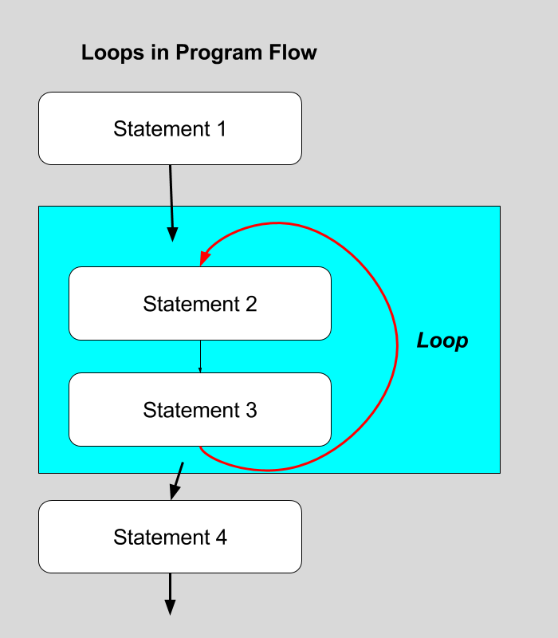

# for Loops

To eloquently accomplish the problem on the last page, we need an eloquent control structure to build our [_control flow_]({{site.baseurl}}/modules/week-7/program-logic/).

The name of this new control structure is the _for loop_.


<br />

Loops are not new to you. You have been working with loops since we started animating. The [`draw()` function is a loop]({{site.baseurl}}/modules/week-5/animation#the-draw-loop). p5 calls the `draw()` function, when it is done, it calls it again, and again, and again..... till we close the program. By updating variables within the draw loop, we are able to move things around the screen.

The _for loop_ that you are about to learn about is similar in some ways, and different in others from the `draw()` function.

1. Whereas, whenever the `draw()` function is called, and 'frame' occurs. We can have multiple loops occur, using a _for loop_ in a frame.
2. The _for loop_ needs to run a _finite_ number of times, unlike the `draw()` function. Therefor, we need to tell the computer when to stop executing the _for loop_.


## Loops in Program Flow

In general, loops in code, instruct the computer to run some series of statements, encapsulated in a _function block_, some number of times.



That loop will continue executing until told to stop. Thereby repeating some number of instructions, some number of times, in sequence.

## Writing _for Loops_

Basic _for loops_ in JavaScript (the kind we are about to learn) require 3 things to work;

1. The definition of a _Number variable_.
2. A _conditional statement_ to evaluate when to stop running the _for loop_.
3. A specification for _how to update_ the defined _Number variable_.

Unlike almost every other function in JavaScript, these three requirements are separated by semicolons (`;`), instead of commas. (You will just need to remember that.) Written in pseudo-code, these parameters are passed to a _for loop_ in the following way.

```js
for( numberVariable; conditionalStatement; incrementDetails ) {
    // function block
    // loop statements go in here!
}
```

As you can see, each of the required pieces of data are passed into the _for loops_ parenthesis, as you would normally do. However, notice that semicolon's are used to separate each parameter from each other.

#### Number variable

Now, let's talk about each of these parameters. The first statement passed to the _for loop_ is a _Number variable_ definition and initialization.

This is no different then how you normally define and initialize a _number variable_. This will typically take the form of something like;

```js
var i=0;
```

If passed as the first statement to a _for loop_, like follows...

```js
for( var i=0; )
```

...then the computer, at the start of the _for loop_, will create and initialize a variable, for use _within_ the for loop.

#### Condition Statement

The second statement passed to a _for loop_ is a _conditional statement_ that is evaluated at the _beginning_ of each loop iteration.

- If the conditional statement returns _true_ then the for loop executes the statements within the function block.
- If the conditional statement instead returns _false_, the computer skips the function block, exits the _for loop_ and goes on to execute the rest of the program.

The _conditional statement_ will look like the types of statements you learned how to compose last week. Typically though, this _conditional statement_ will test the variable you defined against some value. Usually, this will be a Number value representing the number of times the loop is to execute.

For example, in the following conditional statement, the loop would execute, as long as it is _less than_ 3.

```js
i < 10;
```

This statement is passed as the second statement to the _for loop_ and would look like;

```js
for( var i=0; i < 10; )
```

#### Update Statement

The final statement passed to a _for loop_ is the _update statement_. The update statement tells the computer _how to_ update the variable defined earlier on.

This statement is executed _**after**_ each iteration of the _for loop_.

If you wanted to create a _for loop_ that executed 2 times, as we have been creating, you would tell the loop to increment the variable by '1' every time.

This may look like;

```js
i++
```

Within the _for loop_, this would look like;

```js
for( vasr i=0; i < 2; i++ ) {
    // do something
}
```

_Again, the update statement will occur after the execution of the function block_.

In the example we have just built, the computer would;

1. Define and initialize a variable, `i`, to the value of `0`.
2. Test whether the value of `i` is less than `2`.
3. Since this condition test would return _true_, the function block would be executed.
4. After successfully execution of the function block, the _for loop_ would then execute the _update statement_, `i++`, thereby changing the value of `i` to `1`.
5. The _for loop_ would then execute the _condition statement_ again, thereby testing whether to keep going. Since `i=1` is still less than `2`, the _for loop_ would execute the function block again.
6. After the exec
7. After successfully execution of the function block a second time, the _for loop_ would then execute the _update statement_ again, `i++`, thereby changing the value of `i` to `2`.
8. The _for loop_ would then execute the _condition statement_ again, thereby testing whether to keep going. Since `i=2` is equal to `2`, the _condition statement_ would return _false_. The _for loop_ would therefor exit, and not execute the function block again.


## In Action

Let's [refactor](https://en.wikipedia.org/wiki/Code_refactoring) our example from the last page, where we created 10 ellipses, with this new _for loop_ capability.

Instead of writing out the code to create an ellipse 10 times, we will instead write a _for loop_ that will execute 10 times, thereby drawing 10 ellipses. To do this, the for loop will need to;

1. Define and initialize a variable (`i`) to the Number `0`.
2. Test whether this variable (`i`) is less than the `10`. (The number of times we want to execute the loop)
3. Increment the variable (`i`) every loop.

This would look like;

```js
for( var i=0; i < 10; i++ ){
    //draw circles
}
```

> Note how we test whether `i` is "less than" `10`, and **not** "less than or equal" to `10`.
> Since we start at `0`, as iteration 1, if we ran through `i` equalling `10`, we would actually execute the loop 11 times.
>
> - `i=0` first time
> - `i=1` second time
> - `i=2` third time
> - `i=3` forth time
> - `i=4` fifth time
> - `i=5` sixth time
> - `i=6` seventh time
> - `i=7` eighth time
> - `i=8` ninth time
> - `i=9` tenth time

#### Using `i`

It is _very common_ to the use variable defined in a _for loop_ within the loop's function block. Typically this variable is used make the code "do something" in relation to the loop's "iteration number".

So, in our refactor example, we are trying to draw 10 ellipses, across the canvas' width. In the procedural example in which we wrote each line of code, this was accomplished by hard coding the X position of each ellipse to be a ratio of the canvas width.

```js
var pos_x = width * 1/10;
```

Where, in the above code, '1/10' is the ratio of the ellipse to canvas width. In this specific case, one-tenth of the canvas' width.

Using a _for loop_ we can replace the number '1' with the _variable_ `i`. Thereby, changing this ratio with each loop iteration.

Our _for loop_ code might look like the following;

```js
for( var i=0; i < 10; i++ ) {
    // find the x_pos
    pos_x = width * i/10;
    // draw an ellipse
    ellipse( pos_x, pos_y, d );
}
```

The above code will iterate the _for loop_ ten times. Each iteration, the variable `pos_x` will be reassigned to a value that is in relation to the width of the canvas and the _for loop's_ variable `i`. Then the _for loop_ will draw the ellipse, using the updated `pos_x` variable.

Altogether, our refactored example might look like;

<div id="code-heading">sketch.js</div>



function setup() {
    createCanvas( windowWidth, 300 );
}


// using 'let' instead of 'var'
let pos_x = 0;
let pos_y = 0;
let d = 30;
let r = d/2;

function draw() {
    background( 'rgb(3, 78, 115)' );

    // define drawing parameters
    fill(255);
    noStroke();

    // USE A FOR LOOP

    for( var i=0; i < 10; i++ ) {
        // find the x_pos
        pos_x = width * i/10 + r;
        // draw an ellipse
        ellipse( pos_x, pos_y, d );
    }

    /*
    THE FOR LOOP IS EQUIVALENT TO THE FOLLOWING

    // circle 0
    pos_x = width * 1/10 + r;
    ellipse( pos_x, pos_y, d );
    // circle 1
    pos_x = width * 1/10 + r;
    ellipse( pos_x, pos_y, d );
    // circle 2
    pos_x = width * 2/10 + r;
    ellipse( pos_x, pos_y, d );
    // circle 3
    pos_x = width * 3/10 + r;
    ellipse( pos_x, pos_y, d );
    // circle 4
    pos_x = width * 4/10 + r;
    ellipse( pos_x, pos_y, d );
    // circle 4
    pos_x = width * 4/10 + r;
    ellipse( pos_x, pos_y, d );
    // circle 5
    pos_x = width * 5/10 + r;
    ellipse( pos_x, pos_y, d );
    // circle 6
    pos_x = width * 6/10 + r;
    ellipse( pos_x, pos_y, d );
    // circle 7
    pos_x = width * 7/10 + r;
    ellipse( pos_x, pos_y, d );
    // circle 8
    pos_x = width * 8/10 + r;
    ellipse( pos_x, pos_y, d );
    // circle 9
    pos_x = width * 9/10 + r;
    ellipse( pos_x, pos_y, d );
    */

    pos_y++;
    if (pos_y > height) {
        pos_y = 0;
    }
}



<div id="jotted-demo-1" class=""></div>
</div>
<script>
    new Jotted(document.querySelector("#jotted-demo-1"), {
    files: [
        {
            type: "js",
            url:"https://raw.githubusercontent.com/Montana-Media-Arts/120_CreativeCoding/master/lecture_code/08/02_for_correct_02/sketch.js"
        },
        {
            type: "html",
            url:"../../../p5_resources/index.html"
    }],
    // plugins: [ "codemirror", "console" ]
    plugins: [ "codemirror" ]
});
</script>

| [**[ Code Download ]**](https://github.com/Montana-Media-Arts/120_CreativeCoding/raw/master/lecture_code/08/02_for_correct_02/02_for_correct_02.zip) | [**[ View on GitHub ]**](https://github.com/Montana-Media-Arts/120_CreativeCoding/raw/master/lecture_code/08/02_for_correct_02/) | [**[ Live Example ]**](https://montana-media-arts.github.io/120_CreativeCoding/lecture_code/08/02_for_correct_02/) |
